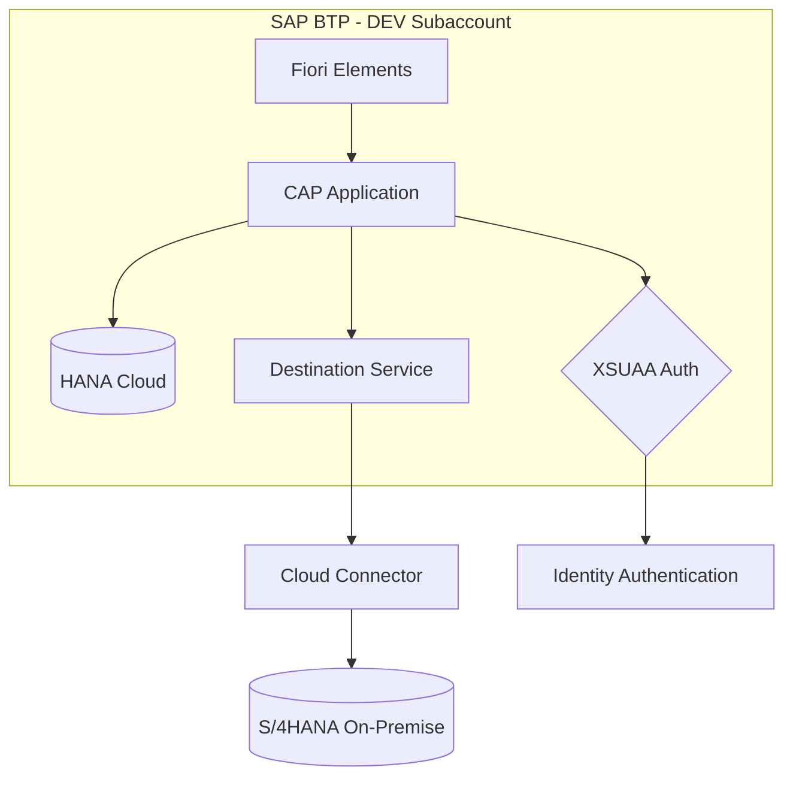
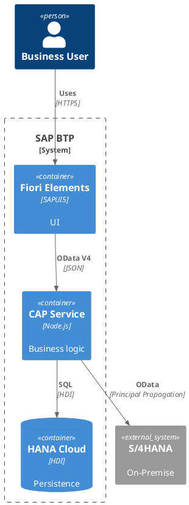

# SAP BTP Diagram Generator

Generate BTP architecture diagrams from structured specifications.

## Mermaid Output



## PlantUML Output



## JSON Specification

```json
{
  "solution": "Procurement Hub",
  "subaccount": "DEV",
  "nodes": [
    { "id": "cap", "type": "application", "runtime": "Node.js CAP",
      "name": "procurement-srv" },
    { "id": "hana", "type": "database", "service": "hana-cloud",
      "name": "Procurement HDI" },
    { "id": "s4", "type": "external", "system": "S/4HANA",
      "connection": "Cloud Connector" }
  ],
  "connections": [
    { "from": "cap", "to": "hana", "protocol": "SQL", "binding": true },
    { "from": "cap", "to": "s4", "protocol": "OData V2",
      "destination": "S4HANA_DEV" }
  ]
}
```

## Generating Diagrams

```bash
# Convert JSON spec to Mermaid
python scripts/btp_diagram.py --input landscape.json --format mermaid

# Convert JSON spec to PlantUML
python scripts/btp_diagram.py --input landscape.json --format plantuml

# Render PlantUML to PNG
plantuml landscape.puml
```

## Gotchas
- Mermaid rendering limited in some tools — PlantUML is more portable
- BTP landscape diagrams should include security boundaries (XSUAA, IAS)
- Service instance names should match CF naming (lowercase, no spaces)
