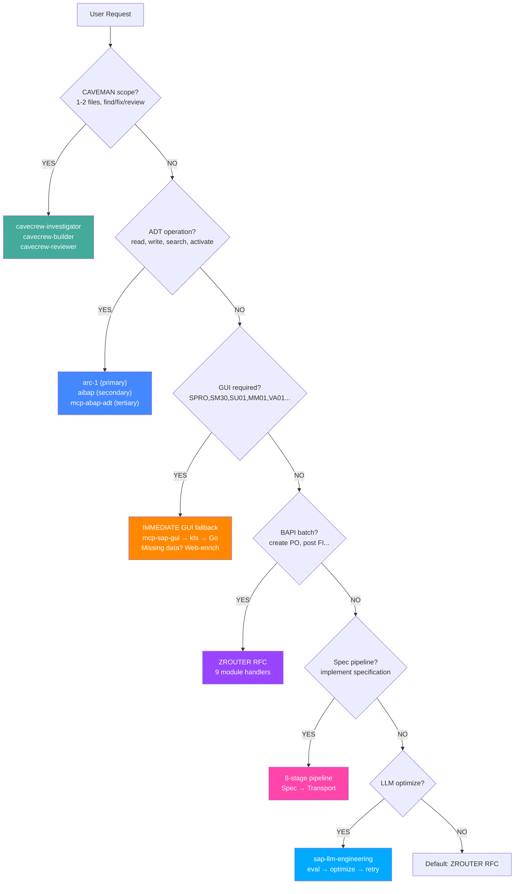
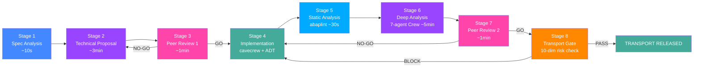

# SAP Router Orchestrator v4.2.0

> **Build SAP applications from your IDE. No SAP GUI required.**
>
> Talk to SAP in plain English. Read ABAP source, create materials, post documents,
> deploy iFlows, run transports — all from VS Code. Self-learning router picks the
> fastest path: ADT direct, SAP GUI fallback, or ZROUTER batch. Every action verified.
> Every route learned. Every response compressed.

---


## What It Does

You type **"create material FERT with these fields"** in VS Code chat. The router:

1. **Thinks** — surfaces assumptions, picks the best BAPI, checks authorizations
2. **Routes** — ADT? GUI? RFC? Picks fastest available path, learns from every call
3. **Executes** — calls the BAPI, checks BAPIRET2, commits the transaction
4. **Verifies** — confirms in MM03, logs to BAL, runs ABAP Unit tests
5. **Learns** — records MCP latency, adapts future routes to be faster

**No SAP GUI. No Eclipse. No SE80. No transaction codes to memorize.**

---


## Routing Decision Tree



---

## Quick Start

### Option A — Global Skill (Recommended)

```bash
# Install as global Claude Code skill
/plugin marketplace add forrestchang/andrej-karpathy-skills
# SAP Router auto-activates on any SAP task — skills trigger by file context + keywords
```

### Option B — Project Clone

```bash
git clone https://github.com/<your-username>/sap-router-orchestrator.git
cd sap-router-orchestrator/sap-router-skill
```

### Option C — Update Existing Installation

```bash
# Update to latest version
cd sap-router-skill
git pull origin main
python scripts/healthcheck.py          # Verify health after update
npm install                             # Update abaplint + deps
python scripts/self_learn.py persist   # Preserve learned context
```

### Post-Install — Healthcheck + .env Setup

```bash
# Run healthcheck — probes all 35 MCPs + verifies .env
npm run hc

# If .env missing, generate interactive prompt
npm run hc:prompt

# Copy template and fill credentials
cp .env.template .env
# Edit .env — fill ARC_SAP_URL, ARC_SAP_USER, ARC_SAP_PASSWORD, ARC_SAP_CLIENT
```

---

## Core Commands

| Category | Command | What It Does |
|---|---|---|
| **Install** | `git clone ... && python scripts/healthcheck.py` | Clone + verify everything works |
| **Update** | `git pull && npm install && npm run hc` | Pull latest + refresh deps + healthcheck |
| **Health** | `npm run hc` | Probes 35 MCPs + .env completeness |
| **Health** | `npm run hc:prompt` | Interactive setup wizard for missing vars |
| **Route** | `npm run router -- --action MM_CREATE_MATERIAL` | Route action: ADT → GUI → RFC |
| **Route** | `npm run router:gui -- --action SPRO_CONFIG` | Force SAP GUI fallback |
| **Route** | `npm run router:caveman -- --task "find all BAPI"` | Check caveman delegation |
| **Pipeline** | `npm run pipeline -- requirements.md` | Full spec-to-transport (8 stages) |
| **Pipeline** | `npm run pipeline:fast -- requirements.md` | Fast pipeline (skip deep analysis) |
| **Learn** | `npm run learn:mcp -- --mcp arc-1 --latency 245 --success true` | Record MCP call outcome |
| **Learn** | `npm run learn:route -- --action MM_CREATE --success true` | Track routing success |
| **Learn** | `npm run learn:ctx` | Inject learned context into routing |
| **Lint** | `npm run abap:lint` | Static ABAP code analysis |
| **Lint** | `npm run abap:review` | Full review: lint + security + clean |
| **Lint** | `npm run abap:review:ci` | CI mode: fails on CRITICAL |
| **GUI** | `npm run gui:enrich -- --tcode MM01` | Web-search enrich GUI nav data |
| **GUI** | `npm run gui:status` | Show GUI enrichment cache status |
| **Data** | `npm run template -- --module MM --action CREATE_MATERIAL` | Generate XLS template |
| **Data** | `npm run convert -- --input data.csv --module MM` | XLS/CSV → BAPI JSON |
| **Serialize** | `npm run serialize -- --source file.abap --name ZCL_FOO` | Package ABAP for abapGit/.nugg/XML |
| **CPI** | `python scripts/cpi_iflow_packager.py template --name my-flow` | Create CPI iFlow ZIP |

---

## Complete Skill Catalog (85 skills)

### Skill Categories

| Domain | Count | Skills |
|---|---|---|
| **ABAP Core** | 17 | `abap`, `abap-cloud`, `abap-cloud-migration`, `abap-code-patterns`, `abap-sql-amdp`, `abap-unit-testing`, `abapgit`, `atc-cloudification`, `authorization-iam`, `badi-enhancement`, `clean-abap`, `rap`, `rap-business-events`, `cds-view-entities`, `released-abap-classes` |
| **SAP BTP Platform** | 20 | `btp-abap-environment`, `btp-best-practices`, `btp-build-work-zone`, `btp-business-application-studio`, `btp-cias`, `btp-cloud-identity`, `btp-cloud-logging`, `btp-cloud-platform`, `btp-cloud-transport-management`, `btp-connectivity`, `btp-developer-guide`, `btp-diagram-generator`, `btp-integration-suite`, `btp-job-scheduling`, `btp-master-data-integration`, `btp-service-manager`, `sap-btp-audit-log`, `sap-btp-credential-store` |
| **UI5 / Fiori / CAP** | 8 | `sapui5-framework`, `sap-fiori-tools`, `sap-fiori-apps-reference`, `sap-cap`, `sap-build`, `odata`, `odata-abap` |
| **Integration** | 5 | `cpi-iflow-development`, `sap-bapi-integration`, `sap-code-search`, `sap-api-style` |
| **HANA / AI / Data** | 11 | `sap-hana-sqlscript`, `sap-hana-cli`, `sap-hana-ml`, `sap-ai-core`, `sap-cloud-sdk-ai`, `sap-datasphere`, `sap-hana-cloud-data-intelligence`, `sap-sac-scripting`, `sap-sac-planning`, `sap-sac-custom-widget` |
| **Security / Infra** | 8 | `sap-dependency-security`, `sap-btp-document-mgmt`, `sap-btp-feature-flags`, `sap-btp-html5-repo`, `sap-btp-kyma`, `sap-btp-launchpad`, `sap-btp-saas` |
| **Router / Tooling** | 9 | `run-sap-router-skill`, `sap-transport-management`, `sap-crew-analysis`, `sap-rap-gen`, `sap-rpt1`, `sap-sac-test-automation`, `sap-api-policy`, `sap-workflow-pipeline` |
| **v4.2.0 NEW** | 6 | **`karpathy-guidelines`**, **`sap-gui-scripting`**, **`sap-gui-web-enrich`**, **`sap-self-learn`**, **`sap-llm-engineering`** |
| **Shared** | 1 | `abap-code-review` (GitHub: `shrek-abaper/sap-engineering-skill`) |

---

## MCP Server Reference (35 servers)

### MCP Details

| # | MCP Server | Type | Tools/Entities | Criticality | Description |
|---|---|---|---|---|---|
| 1 | `arc-1` | stdio (npx) | 12 intent tools | **HIGH** | Enterprise ADT — SAPRead, SAPWrite, SAPSearch, SAPActivate, SAPTransport, SAPDiagnose |
| 2 | `aibap` | stdio (Go) | 69 tools | **HIGH** | ABAP dev — source, objects, testing, ST22, BAdI, DEBUG, transport |
| 3 | `mcp-abap-adt` | stdio (node) | 13 tools | MEDIUM | TypeScript ADT bridge — GetProgram, GetClass, GetTable, SearchObject |
| 4 | `mcp-sap-gui` | stdio (node) | GUI automation | MEDIUM | Primary GUI fallback — navigate, BDC, ALV read, popup handling |
| 5 | `mcp-sap-gui-kts` | stdio (python) | GUI automation | LOW | Secondary GUI (kts982) — broader transaction coverage |
| 6 | `sapgui-mcp-go` | stdio (Go) | GUI automation | LOW | Tertiary GUI (Hochfrequenz) — lightweight Go bridge |
| 7 | `sap-rfc-mcp-server` | stdio (python) | RFC dispatch | MEDIUM | ZROUTER dispatch — 9 module handlers via BAPI/RFC |
| 8 | `sf-mcp` | stdio (node) | OData V2 | LOW | SuccessFactors HCM — Employee, Org, Compensation, Time |
| 9 | `mcp-sap-notes` | stdio (node) | 2 tools | LOW | SAP Notes search + fetch from me.sap.com |
| 10 | `btp-mcp` | stdio (node) | 7 entities | LOW | BTP account management — GlobalAccount, Subaccounts, Entitlements |
| 11 | `odata-mcp-proxy` | stdio (node) | 32 entities | LOW | CPI admin OData bridge — config-driven |
| 12 | `btp-sap-odata-to-mcp` | stdio (node) | 3 tools | MEDIUM | Progressive discovery OData — discover → metadata → execute |
| 13 | `pinecone-rag` | stdio (node) | vector store | OPTIONAL | Pinecone vector DB — RAG pipeline for SAP knowledge |
| 14 | `supabase-rag` | stdio (node) | pgvector | OPTIONAL | Supabase pgvector — RAG pipeline alternative |
| 15 | `azure-ai-search` | stdio (node) | semantic search | OPTIONAL | Azure AI Search — enterprise semantic search |
| 16 | `ui5-mcp-server` | plugin | 10 tools | LOW | UI5/SAPUI5 app creation, linter, API reference |
| 17 | `fiori-mcp-server` | plugin | 8 tools | LOW | Fiori app generation (CAP/RAP), metadata, modification |
| 18 | `mdk-mcp-server` | plugin | 5 tools | LOW | MDK project creation, page/action generation, deploy |
| 19 | `cds-mcp-server` | plugin | 2 tools | LOW | CAP CDS model search, documentation |

---

## 8-Stage Spec-to-Transport Pipeline



### Pipeline Stages Detail

| Stage | Skill/Tool | Verification | Resumable |
|---|---|---|---|
| 1 — Spec Analysis | `sap_router.py analyze-spec` | Module identified, BAPIs listed | Yes |
| 2 — Technical Proposal | `sap-crew-analysis` (7 agents) | Architecture review pass | Yes |
| 3 — Peer Review 1 | `abap-code-review` (9 dimensions) | Score >= 70/100 | Yes |
| 4 — Implementation | `cavecrew-builder` + ADT MCP | Syntax OK, unit tests pass | Yes |
| 5 — Static Analysis | `npm run abap:review` (abaplint) | 0 CRITICAL, 0 HIGH | Yes |
| 6 — Deep Analysis | `sap-crew-analysis` (full mode) | Score >= 70/100 | Yes |
| 7 — Peer Review 2 | `abap-code-review` (GO/NO-GO) | All dimensions pass | No (restart from 4) |
| 8 — Transport Gate | `sap-transport-gate` (10 dims) | Transport released | No (restart from 4) |

---


## Functional Module Coverage

### Module BAPI/Transaction Reference

| Module | BAPIs Available | GUI Fallback T-codes | Config Tables |
|---|---|---|---|
| **MM** | BAPI_MATERIAL_SAVEDATA, BAPI_PO_CREATE1, BAPI_PO_CHANGE, BAPI_GOODSMVT_CREATE | MM01, MM02, ME21N, MIGO, MMBE | T134, T023, T161, T024, T001W, T156 |
| **SD** | BAPI_SALESORDER_CREATEFROMDAT2, BAPI_SALESORDER_CHANGE, BAPI_BILLINGDOC_CREATEMULTIPLE | VA01, VA02, VL01N, VF01 | TVAK, TVKO, TVFK, TVLK, TVSB, KNVV |
| **FI** | BAPI_ACC_DOCUMENT_POST, BAPI_ACC_DOCUMENT_REV_POST, BAPI_ACC_ACTIVITY_ALLOC_POST | FB01, FB02, FS00, F110 | T001, T004, T003, SKA1, SKB1, TABW |
| **QM** | BAPI_INSPLOT_CREATE, BAPI_INSRES_RECORD | QA01, QA02, QE01 | TQ01, TQ02, QALS, T156Q |
| **PP** | BAPI_PRODORD_CREATE, BAPI_PRODORDCONF_CREATE_HDR, CS_BOM_EXPL_MAT_V2 | CO01, CO02, CS01, CA01 | T003O, T399D, MARC, T024F |
| **WM** | BAPI_GOODSMVT_CREATE, L_TO_CREATE_MOVE_SU | MIGO, LT01, LT02, LS01 | T311, T312, T300, T301 |
| **CO** | BAPI_INTERNALORDER_CREATE, BAPI_ACC_ACTIVITY_ALLOC_POST | KO01, KS01, KA01 | TKA01, CSKS, CSKA, TKA02 |
| **HCM** | BAPI_EMPLOYEE_GETDATA, HR_INFOTYPE_OPERATION | PA20, PA30, PA40 | T500P, T001P, T503, T582A |
| **BASIS** | TR_INSERT_REQUEST_WITH_TASKS, TR_RELEASE_REQUEST, TH_GET_DUMP_LOG | SPRO, SU01, SU53, PFCG, SNOTE | E070, E071, SNAP, SNAPT |

---

## Project Structure

```
sap-router-skill/
├── README.md                    ← This file
├── SKILL.md                     ← Master dispatch (Karpathy wrapper)
├── COMPARISON.md                ← 72-repo cross-reference analysis
├── CHANGELOG.md                 ← Version history
├── .mcp.json                    ← 35 MCP servers (3 GUI + 3 RAG)
├── .env.template                ← 40+ env vars grouped by domain
├── .abaplint.json               ← 60+ ABAP lint rules
├── package.json                 ← 63 npm scripts
│
├── .claude/skills/              ← 85 skills (all IDE auto-load)
│   ├── karpathy-guidelines/     ← v4.0: Think→Simplify→Surgical→Verify
│   ├── sap-gui-scripting/       ← SAP GUI automation + BDC + ALV
│   ├── sap-gui-web-enrich/      ← Web-search fill missing nav data
│   ├── sap-self-learn/          ← Hermes-style environment adaptation
│   ├── sap-llm-engineering/     ← LLM eval harness + prompt optimizer
│   ├── sap-workflow-pipeline/   ← 8-stage spec-to-transport
│   ├── sap-api-policy/          ← API Management + OpenAPI specs
│   └── ... (68 more domain skills)
│
├── scripts/                     ← 15 Python CLIs
│   ├── sap_router.py            ← Routing engine (ADT→GUI→RFC→Pipeline)
│   ├── healthcheck.py           ← 35-MCP probe + .env guardian
│   ├── self_learn.py            ← Hermes-style context adaptation
│   ├── memory_manager.py        ← MEMORY.md session lifecycle + ABAPLINT
│   ├── xls_to_bapi.py           ← CSV/XLSX → BAPI JSON (29 actions)
│   ├── template_repo.py         ← ABAP template repository
│   ├── abap_serializer.py       ← .nugg / abapGit / XML packer
│   └── cpi_iflow_packager.py    ← CPI iFlow ZIP creator
│
├── scripts/abap-review-gate.js  ← CI gate (security/clean/transport)
│
├── templates/                   ← 4 ABAP templates
│   ├── ZROUTER_DISPATCH.abap    ← Full framework (1,349 lines)
│   ├── ZCL_ABAP_REPL_V2.abap    ← SICF HTTP REPL handler
│   ├── ZROUTER_DB_TABLES.abap   ← 5 DDIC tables
│   └── ZROUTER_CODE_SEARCH.abap ← ABAP code search integration
│
├── references/                  ← SAP knowledge base
│   ├── module_maps/             ← 10 module operation maps
│   └── trench_knowledge/        ← 14 domain references
│
└── packages/samples/            ← Export samples (.nugg, abapGit, XML, ZIP)
```

---

## Install + Update ZROUTER on SAP

### Fresh Install

```bash
# 1. Create package
aibap: create_object(type="DEVC", name="ZROUTER",
       description="SAP Router Orchestrator")

# 2. Create DDIC data elements (19) + tables (5)
aibap: create_object(type="DTEL", name="ZROUTER_TMPL_ID")
aibap: create_object(type="TABL", name="ZROUTER_TMPL_HD")

# 3. Deploy ABAP classes via abapGit or ADT
python scripts/abap_serializer.py package \
  --source templates/ZROUTER_DISPATCH.abap \
  --name ZCL_ZROUTER_DISPATCH --type CLAS --output deploy/
# Pull deploy/abapgit/ into SAP via abapGit or arc-1 SAPWrite

# 4. Create Function Module
aibap: create_object(type="FUGR", name="ZROUTER")
aibap: create_object(type="FUNC", name="ZROUTER_DISPATCH_FM",
       function_group="ZROUTER")

# 5. Activate + verify
aibap: activate_objects(["ZCL_ZROUTER_DISPATCH","CX_ZROUTER",
       "ZROUTER_DISPATCH_FM","ZROUTER_TMPL_HD","ZROUTER_TMPL_CD",
       "ZROUTER_TMPL_PL","ZROUTER_TMPL_PKG","ZROUTER_TMPL_PKG_T"])
aibap: syntax_check(["ZCL_ZROUTER_DISPATCH","ZROUTER_DISPATCH_FM"])
python scripts/sap_router.py route --action MM_CREATE_MATERIAL
```

### Update Existing Installation

```bash
# Pull latest from GitHub
cd sap-router-skill
git pull origin main

# Refresh dependencies
npm install
pip install --upgrade openpyxl  # if using XLSX features

# Verify health — probes all 35 MCPs
python scripts/healthcheck.py

# Preserve learned context through update
python scripts/self_learn.py persist

# Run linter on updated templates
npm run abap:review

# Update ZROUTER ABAP objects (if template changed)
python scripts/abap_serializer.py package \
  --source templates/ZROUTER_DISPATCH.abap \
  --name ZCL_ZROUTER_DISPATCH --type CLAS --output deploy/
# Re-deploy via abapGit or arc-1 SAPWrite

# Syntax check updated objects
aibap: syntax_check(["ZCL_ZROUTER_DISPATCH","ZROUTER_DISPATCH_FM"])

# Re-run smoke tests
python .claude/skills/run-sap-router-skill/driver.py
```

### Uninstall / Rollback

```bash
# Transport rollback — create return transport
aibap: create_transport(description="Rollback ZROUTER update")

# Or remove objects from transport
aibap: remove_from_transport(objects=["ZCL_ZROUTER_DISPATCH"])
```

---

## Related Repositories

Key integrations:
- [multica-ai/andrej-karpathy-skills](https://github.com/multica-ai/andrej-karpathy-skills) — Karpathy behavioral guidelines (adapted as command format)
- [arc-mcp/arc-1](https://github.com/arc-mcp/arc-1) — Enterprise ADT MCP (12 tools, 3,474 tests)
- [Hochfrequenz/aibap.mcp](https://github.com/Hochfrequenz/aibap.mcp) — 69-tool ABAP MCP (Go)
- [mario-andreschak/mcp-sap-gui](https://github.com/mario-andreschak/mcp-sap-gui) — Primary SAP GUI MCP
- [kts982/mcp-sap-gui](https://github.com/kts982/mcp-sap-gui) — Secondary SAP GUI (Python)
- [secondsky/sap-skills](https://github.com/secondsky/sap-skills) — 37 Claude Code SAP plugins
- [shrek-abaper/sap-engineering-skill](https://github.com/shrek-abaper/sap-engineering-skill) — 4 skills: ADT CLI, review, transport gate, RAP gen
- [JuliusBrussee/caveman](https://github.com/JuliusBrussee/caveman) — Caveman mode (integrated as default output)
- [abaplint/abaplint](https://github.com/abaplint/abaplint) — ABAP linter (60+ rules configured)

---

## Contributing

PRs and issues welcome. See [SKILL.md](SKILL.md) for the full dispatch table and
85-skill reference. MIT licensed — use freely.

--
