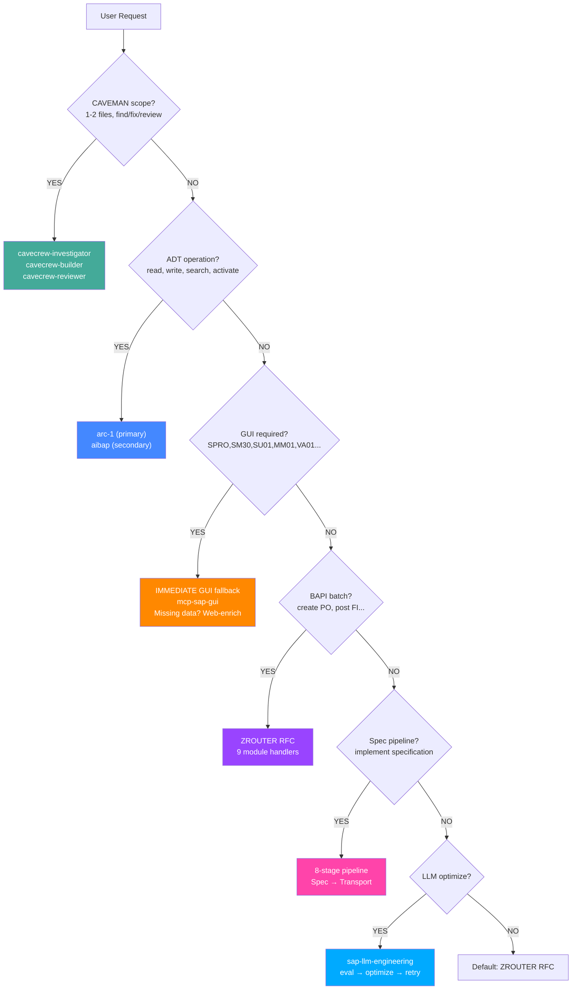
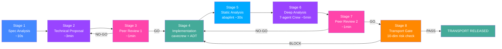

# SAP Harness v7.1.0

> **Build SAP applications from your IDE. No SAP GUI required.**
>
> Talk to SAP in plain English. Read ABAP source, create materials, post documents,
> deploy iFlows, run transports — all from VS Code. The router picks a path per
> action: ADT direct, SAP GUI fallback, SOAP RFC, or ZROUTER batch. Writes are
> gated behind an explicit `--functional` flag, so no BAPI fires by accident.
>
> **165 skills | 11 active MCPs + 63 fail-closed candidates | 44 CLIs | 8-stage pipeline | ZROUTER Remote FS**

> **Status, honestly.** 11 MCP servers launch from a clean clone. The other 63
> reviewed entries sit under `plannedServers` in `.mcp.json` because their entrypoint is
> not installed, or their upstream source was never vendored — `bundled/mcps/<id>/` holds a
> pointer README, not code. A server in `plannedServers` **never routes**: capability
> resolution is fail-closed, and `npm run hc` reports that split instead of counting an
> unprobed server as ready.
>
> **The harness plans; it does not dispatch.** `sap_harness run` resolves a task to a
> capability, an agent profile and a launchable server, and registers mutating work with
> the approval broker. There is no agent dispatcher wired in, so it prints the plan and
> says so — `--execute` is refused rather than reporting work it did not do.
>
> Self-learning records routing telemetry only when you invoke `npm run learn:*` by
> hand — nothing writes it automatically — and the fallback tiers return a
> `tool_call` for the calling agent to execute rather than executing it themselves.

---


## What It Does

You type **"create material FERT with these fields"** in VS Code chat. The router:

1. **Thinks** — surfaces assumptions, picks the BAPI, names the authorizations needed
2. **Gates** — a write is refused without `--functional`, so a BAPI never fires from a
   bare action token. This is the one rule the whole design rests on
3. **Routes** — ADT, GUI, SOAP RFC or ZROUTER, chosen per action from the routing table
4. **Hands back a `tool_call`** — the Python CLI builds the call; the agent holding the
   MCP session executes it. Python has no session of its own, so it cannot and does not
   execute the call itself
5. **Reports BAPIRET2** — `E` and `A` rows are flagged as failures so a COMMIT does not
   follow a rejected call

**No SAP GUI. No Eclipse. No SE80. No transaction codes to memorize.**

Two things this does *not* yet do, despite what earlier versions of this README claimed:
it does not verify the SAP-side side effect after the fact (`_verify_result` returns
`PENDING`), and it does not learn on its own — routing telemetry is written only when you
run `npm run learn:*` yourself.

---


## Routing Decision Tree

The router follows a prioritized decision chain: caveman scope, ADT, GUI, SOAP RFC (3.5 — no-JCo RFC calls via standard HTTPS, before GUI fallback), GUI fallback, BAPI batch/ZROUTER RFC, spec pipeline, LLM optimize, or default ZROUTER RFC.


```mermaid
flowchart TD
    REQ["User Request"] --> Q1{"CAVEMAN scope?<br/>1-2 files, find/fix/review"}
    Q1 -->|"YES"| CV["cavecrew-investigator<br/>cavecrew-builder<br/>cavecrew-reviewer"]
    Q1 -->|"NO"| Q2{"ADT operation?<br/>read, write, search, activate"}
    Q2 -->|"YES"| ADT["arc-1 (primary)<br/>aibap (secondary)"]
    Q2 -->|"NO"| Q3{"GUI required?<br/>SPRO,SM30,SU01,MM01,VA01..."}
    Q3 -->|"YES"| GUI["IMMEDIATE GUI fallback<br/>mcp-sap-gui<br/>Missing data? Web-enrich"]
    Q3 -->|"NO"| Q4{"BAPI batch?<br/>create PO, post FI..."}
    Q4 -->|"YES"| RFC["ZROUTER RFC<br/>9 module handlers"]
    Q4 -->|"NO"| Q5{"Spec pipeline?<br/>implement specification"}
    Q5 -->|"YES"| PL["8-stage pipeline<br/>Spec → Transport"]
    Q5 -->|"NO"| Q6{"LLM optimize?"}
    Q6 -->|"YES"| LLM["sap-llm-engineering<br/>eval → optimize → retry"]
    Q6 -->|"NO"| DEF["Default: ZROUTER RFC"]

    style CV fill:#4a9,color:#fff
    style ADT fill:#48f,color:#fff
    style GUI fill:#f80,color:#fff
    style RFC fill:#94f,color:#fff
    style PL fill:#f4a,color:#fff
    style LLM fill:#0af,color:#fff
```

---

## Quick Start

### Option A — Global Skill (Recommended)

```bash
# Install as global Claude Code skill
/plugin marketplace add forrestchang/andrej-karpathy-skills
# SAP Router auto-activates on any SAP task — skills trigger by file context + keywords
```

### Option B — Project Clone

```bash
git clone https://github.com/<your-username>/sap-router-orchestrator.git
cd sap-router-orchestrator/sap-router-skill
```

### Option C — Update Existing Installation

```bash
# Update to latest version
cd sap-router-skill
git pull origin main
python scripts/healthcheck.py          # Verify health after update
npm install                             # Update abaplint + deps
python scripts/self_learn.py persist   # Preserve learned context
```

### Post-Install — Healthcheck + .env Setup

```bash
# Run healthcheck — probes active MCPs, flags planned candidates, verifies .env
npm run hc

# If .env missing, generate interactive prompt
npm run hc:prompt

# Copy template and fill credentials
cp .env.template .env
# Edit .env — fill ARC_SAP_URL, ARC_SAP_USER, ARC_SAP_PASSWORD, ARC_SAP_CLIENT
```

---

## The Harness

`scripts/sap_harness.py` is the capability-routing, evaluation and distribution front end.

| Subcommand | What it does |
|---|---|
| `run` | Resolves a task to a capability, an agent profile and a launchable server. Registers mutating work with the approval broker. **Prints the plan; does not execute it** — `--execute` is refused with exit 2 |
| `eval` | Runs the evaluation scenarios. `--scenario` (repeatable), `--live`, `--json` |
| `benchmark` | Scenario metrics plus a safety gate read from the catalog validator |
| `mcp` | `list` / `probe` / `search` over the capability catalog |
| `agents` | Lists subagents and the real provider readiness of each capability they declare |
| `share` | Validates and packages a skill (`.zip` + Slack card) |
| `test-remote-fs` | Verifies the TypeScript↔ABAP contract of the ZROUTER Remote FS |

```bash
npm run harness:eval                 # 5 scenarios, 33 assertions, offline hermetic
npm run harness:benchmark            # metrics + catalog safety gate
npm run harness:mcp -- list          # which capability resolves to which server
npm run harness:agents               # subagents and provider readiness
npm run harness:share -- --skill sap-cpi-flowpilot
npm run harness:remote-fs:mock       # TS↔ABAP contract, never contacts SAP
```

### Evaluation suite

Offline is the default and hermetic: no network, no SAP system, no MCP subprocess.
`--live` adds the checks that need a real backend, and every result reports which mode
produced it.

Each scenario exercises code that ships in this repository. Where a property must hold,
the scenario also feeds a deliberately broken input and requires the check to reject it —
a scenario that cannot fail measures nothing.

| Scenario | Assertions | What it exercises |
|---|---|---|
| `catalog_fail_closed` | 5 | Validates the real catalog, then runs 4 mutations (open policy, unknown provider, unapproved mutation, catalogued-but-unwired source) and requires rejection of each |
| `capability_routing` | 6 | Selected provider must be in `.mcp.json`; a planned-only capability resolves to nothing; an unregistered capability resolves to `[]` |
| `approval_gate` | 7 | Real broker: consume before approval, wrong hash, missing hash, valid consume, replay |
| `zrouter_fs_contract` | 10 | Cross-checks the `FS_*` actions the TS client dispatches against the ABAP handler branches, plus SOAP envelope XML escaping |
| `skill_packaging` | 5 | Accepts a valid skill; rejects one with no frontmatter, no `SKILL.md`, or a missing directory |

The suite reports assertion counts, not a token figure — the harness does not measure
tokens, so it does not print one.

### Fail-closed capability catalog

Routing resolves through `.agents/registries/mcp-capabilities.json` (39 capabilities):

| Provider situation | Result |
|---|---|
| In `.mcp.json` `mcpServers` | Reachable |
| In `plannedServers` | Known but not launchable — **never** counts toward reachability |
| In neither | Validation error |
| Capability with no reachable provider | Error, unless it declares `status: "planned"` (then a visible gap) |

`npm run catalog:validate` runs two independent validators and merges their findings;
neither can mask the other. It also enforces reconciliation: every catalogued source of
`kind: mcp` must exist in `mcps.json` or `mcp-candidates.json`, so a repository cannot be
listed as integrated while being unreachable and unreviewed.

---

## ZROUTER Remote FileSystem

`packages/vscode-abap-remote-fs-zrouter/` adapts `vscode_abap_remote_fs` to run entirely on
ZROUTER, with no native ADT endpoint — so it works on ECC and on systems where ADT is
blocked.

**Dual transport**: HTTP POST JSON to SICF (`/sap/bc/zrouter`) with a cached CSRF token and
retry on 403; automatic fallback to SOAP RFC (`/sap/bc/soap/rfc` → `ZROUTER_DISPATCH_FM`).
Every interpolated value in the SOAP envelope is XML-escaped, and the response parser
tolerates namespace prefixes, CDATA and self-closing elements, treating a SOAP Fault as an
error rather than a success.

| VFS method | ZROUTER action | Backend |
|---|---|---|
| `stat(uri)` | `FS_STAT` | TADIR metadata |
| `readDirectory(uri)` | `FS_DIR` | TADIR package listing |
| `readFile(uri)` | `FS_READ` | `READ REPORT` (PROG/INCLUDE), `cl_oo_factory` (CLAS/INTF) |
| `writeFile(uri, content, transport)` | `FS_WRITE` | `RS_CORR_INSERT` + `INSERT REPORT` / `set_source` |
| `activate(uri, transport)` | `FS_ACTIVATE` | `RS_WORKING_OBJECTS_ACTIVATE` |
| `lock(uri)` / `unlock(uri)` | `FS_LOCK` / `FS_UNLOCK` | `RS_ACCESS_PERMISSION` |

Mutations are fail-closed: `FS_WRITE` and `FS_ACTIVATE` validate the transport against
`E070` and raise when it is absent or not modifiable. There is no local-object guessing.

The ABAP side is `ZCL_ZROUTER_HANDLER_FS` in `templates/zrouter_dispatch.prog.abap`,
reachable as module `FS`; the BASIS handler also delegates `FS_*` for older clients.
Not yet supported: Data Definitions (CDS/DDLS) — `normalize_type` rejects unsupported
types with an explicit message rather than failing quietly.

```bash
npm run harness:remote-fs:mock       # verify the contract against checked-in sources
cd packages/vscode-abap-remote-fs-zrouter && npm install && npm run typecheck
```

---

## Core Commands

| Category | Command | What It Does |
|---|---|---|
| **Install** | `git clone ... && python scripts/healthcheck.py` | Clone + verify everything works |
| **Harness** | `npm run harness:eval` | Evaluation suite — 5 scenarios, 33 assertions |
| **Harness** | `npm run harness:benchmark` | Metrics + catalog safety gate |
| **Harness** | `npm run harness:mcp -- list` | Capability → provider resolution |
| **Harness** | `npm run harness:share -- --skill <name>` | Validate + package a skill |
| **Harness** | `npm run harness:remote-fs:mock` | ZROUTER Remote FS contract check |
| **Catalog** | `npm run catalog:validate` | Fail-closed catalog validation (both validators) |
| **Skill** | `npm run skill:validate -- <name>` | Validate skill frontmatter and structure |
| **Update** | `git pull && npm install && npm run hc` | Pull latest + refresh deps + healthcheck |
| **Health** | `npm run hc` | Probes active MCPs + flags planned candidates + .env completeness |
| **Health** | `npm run hc:prompt` | Interactive setup wizard for missing vars |
| **Route** | `npm run router -- --action MM_CREATE_MATERIAL` | Route action: ADT → GUI → RFC |
| **Route** | `npm run router:gui -- --action SPRO_CONFIG` | Force SAP GUI fallback |
| **Route** | `npm run router:caveman -- --task "find all BAPI"` | Check caveman delegation |
| **Pipeline** | `npm run pipeline -- requirements.md` | Full spec-to-transport (8 stages) |
| **Pipeline** | `npm run pipeline:fast -- requirements.md` | Fast pipeline (skip deep analysis) |
| **Learn** | `npm run learn:mcp -- --mcp arc-1 --latency 245 --success true` | Record MCP call outcome |
| **Learn** | `npm run learn:route -- --action MM_CREATE --success true` | Track routing success |
| **Learn** | `npm run learn:ctx` | Inject learned context into routing |
| **Lint** | `npm run abap:lint` | Static ABAP code analysis |
| **Lint** | `npm run abap:review` | Full review: lint + security + clean |
| **Lint** | `npm run abap:review:ci` | CI mode: fails on CRITICAL |
| **GUI** | `npm run gui:enrich -- --tcode MM01` | Web-search enrich GUI nav data |
| **GUI** | `npm run gui:status` | Show GUI enrichment cache status |
| **Data** | `npm run template -- --module MM --action CREATE_MATERIAL` | Generate XLS template |
| **Data** | `npm run convert -- --input data.csv --module MM` | XLS/CSV → BAPI JSON |
| **Serialize** | `npm run serialize -- --source file.abap --name ZCL_FOO` | Package ABAP for abapGit/.nugg/XML |
| **CPI** | `python scripts/cpi_iflow_packager.py template --name my-flow` | Create CPI iFlow ZIP |
| **APIM** | `npm run apim:session` | Report which API Management channel is usable |
| **APIM** | `npm run apim:connect` | Start Chrome with remote debugging and wait for the tenant login (session channel only) |
| **APIM** | `npm run apim:template -- --kind echo --name ZROUTER_SMOKE` | Generate a ready-to-deploy API proxy bundle |
| **APIM** | `npm run apim:test` | Call a deployed proxy's runtime URL |

---

## SAP API Management — two channels

`apim-ui-mcp` reaches API Management over whichever channel is configured, and reports which one it used on every call.

| Channel | Auth | SAP-documented | Use for |
|---|---|---|---|
| **OAuth** (preferred) | `client_credentials` on an `apiportal-apiaccess` service key | Yes — [Accessing API Management APIs Programmatically](https://help.sap.com/docs/integration-suite/sap-integration-suite/api-access-plan-for-api-portal) | Everything, including gated configuration changes |
| **Session** (fallback) | The tenant login already in the user's Chrome, reached over CDP | No | Reads and tests when no service key is available |

The session channel runs `fetch()` inside the logged-in page, so cookies stay in the browser — the bridge never reads, stores or forwards them. It is a pragmatic fallback, not a supported SAP interface; prefer a service key wherever one can be created.

```bash
npm run apim:template -- --kind echo --name ZROUTER_SMOKE --output scratch/apim/echo.zip
```

Two starter models ship with the repo: `echo` targets a public echo service so a proxy can be smoke-tested with no backend, and `backend` is parameterised for a real backend with API key verification and a monthly quota. Policy XML follows the patterns published in [SAP/apibusinesshub-api-recipes](https://github.com/SAP/apibusinesshub-api-recipes) (Apache-2.0).

Configuration changes never happen in one step: `apim_configure_plan` writes a plan, `python scripts/approval_broker.py approve <action_id>` records the human decision, and `apim_configure_commit` applies it. The commit verifies the approval, applies the change, and only then spends it — a failed mutation leaves the approval usable rather than burning it, and the result's `approval` field says which happened.

Testing a proxy executes whatever sits behind it, so `apim_test_proxy` only issues `GET`/`HEAD`/`OPTIONS`, and only against hosts belonging to the tenant. Declare the proxy's virtual host in `APIM_RUNTIME_HOSTS`; loopback, link-local and private ranges are always refused.

**Scope.** This MCP is API lifecycle tooling — proxies, products, policies, key value maps and their tests. It is not a business-data channel. [SAP API Policy v.4.2026a](https://help.sap.com/doc/sap-api-policy/latest/en-US/API_Policy_latest.pdf) §2.2.2 restricts autonomous agents that plan and chain business-API calls; for that scenario SAP points at the Integration Suite **MCP Gateway**, which `apim_mcp_gateway_probe` checks your tenant for.

---

## Complete Skill Catalog (165 skills)

### Skill Categories

| Domain | Count | Skills |
|---|---|---|
| **ABAP Core** | 15 | `abap`, `abap-cloud`, `abap-cloud-migration`, `abap-code-patterns`, `abap-sql-amdp`, `abap-unit-testing`, `abapgit`, `atc-cloudification`, `authorization-iam`, `badi-enhancement`, `clean-abap`, `rap`, `rap-business-events`, `cds-view-entities`, `released-abap-classes` |
| **SAP BTP Platform** | 18 | `btp-abap-environment`, `btp-best-practices`, `btp-build-work-zone`, `btp-business-application-studio`, `btp-cias`, `btp-cloud-identity`, `btp-cloud-logging`, `btp-cloud-platform`, `btp-cloud-transport-management`, `btp-connectivity`, `btp-developer-guide`, `btp-diagram-generator`, `btp-integration-suite`, `btp-job-scheduling`, `btp-master-data-integration`, `btp-service-manager`, `sap-btp-audit-log`, `sap-btp-credential-store` |
| **UI5 / Fiori / CAP** | 7 | `sapui5-framework`, `sap-fiori-tools`, `sap-fiori-apps-reference`, `sap-cap`, `sap-build`, `odata`, `odata-abap` |
| **Integration** | 5 | `cpi-iflow-development`, `sap-bapi-integration`, `sap-code-search`, `sap-api-style`, `sap-commerce-skill` |
| **HANA / AI / Data** | 10 | `sap-hana-sqlscript`, `sap-hana-cli`, `sap-hana-ml`, `sap-ai-core`, `sap-cloud-sdk-ai`, `sap-datasphere`, `sap-hana-cloud-data-intelligence`, `sap-sac-scripting`, `sap-sac-planning`, `sap-sac-custom-widget` |
| **Security / Infra** | 7 | `sap-dependency-security`, `sap-btp-document-mgmt`, `sap-btp-feature-flags`, `sap-btp-html5-repo`, `sap-btp-kyma`, `sap-btp-launchpad`, `sap-btp-saas` |
| **Router / Tooling** | 8 | `run-sap-router-skill`, `sap-transport-management`, `sap-crew-analysis`, `sap-rap-gen`, `sap-rpt1`, `sap-sac-test-automation`, `sap-api-policy`, `sap-workflow-pipeline` |
| **v4.5.0 NEW** | 5 | **`karpathy-guidelines`**, **`sap-gui-scripting`**, **`sap-gui-web-enrich`**, **`sap-self-learn`**, **`sap-llm-engineering`** |
| **Shared** | 1 | `abap-code-review` (GitHub: `shrek-abaper/sap-engineering-skill`) |

---

## MCP Server Reference

### Active — 11 servers that launch from a clean clone

These are the entries in `.mcp.json` `mcpServers`. Only these can be selected by capability
routing.

| # | MCP Server | Type | Criticality | Description |
|---|---|---|---|---|
| 1 | `arc-1` | stdio (npx) | **HIGH** | Enterprise ADT — SAPRead, SAPWrite, SAPSearch, SAPActivate, SAPTransport, SAPDiagnose |
| 2 | `aibap` | stdio (Go) | **HIGH** | ABAP dev — source, objects, testing, ST22, BAdI, DEBUG, transport (69 tools) |
| 3 | `mcp-sap-gui` | stdio (python) | MEDIUM | GUI fallback — navigate, BDC, ALV read, popup handling |
| 4 | `sap-cpi-mcp` | stdio (python) | MEDIUM | Cloud Integration — content/runtime/MPL reads, plan→approve→commit deploys |
| 5 | `sap-apim-mcp` | stdio (python) | LOW | API Management — proxy reads, policy validation, gated deploys |
| 6 | `integration-suite-ui-mcp` | stdio (node) | LOW | Playwright web-UI fallback for Integration Suite/CPI |
| 7 | `apim-ui-mcp` | stdio (node) | LOW | API Management channel — OAuth service key (SAP-documented) or logged-in browser session; proxy list/test, action catalogue, MCP Gateway probe, gated configure, MCP app widgets |
| 8 | `ui5-mcp` | stdio (npx) | LOW | UI5 tooling — project validation, linter, Web Components |
| 9 | `fiori-mcp` | stdio (npx) | LOW | SAP Fiori tools — Fiori Elements generation, app modification |
| 10 | `cap-mcp` | stdio (npx) | LOW | SAP CAP — CDS model search, project build |
| 11 | `context-mode` | stdio (node) | LOW | Sandboxed execution + context compression |

### Planned — 63 reviewed candidates, none launchable

Listed under `plannedServers` in `.mcp.json` and described in
`.agents/registries/mcp-candidates.json`. Each carries an explicit `blockedBy` / `reason`.
Two distinct blockers:

- **Entrypoint not installed** — the package or binary is not present in this environment.
- **Source not vendored** — `bundled/mcps/<id>/` contains a pointer README with the upstream
  URL, not the code. Nothing can be started from it.

Promoting a candidate means vendoring (or pinning an installable package), passing runtime
and safety review, and moving it into `mcps.json`. Until then it is invisible to routing:
`resolve_servers_for_capability` returns nothing rather than picking a server that cannot
start.

```bash
npm run harness:mcp -- list                       # capability → selected provider
python scripts/mcp_launcher.py probe --server arc-1
```

---

## 8-Stage Spec-to-Transport Pipeline


```mermaid
flowchart LR
    S1["Stage 1<br/>Spec Analysis<br/>~10s"] --> S2["Stage 2<br/>Technical Proposal<br/>~3min"]
    S2 --> S3["Stage 3<br/>Peer Review 1<br/>~1min"]
    S3 -->|"GO"| S4["Stage 4<br/>Implementation<br/>cavecrew + ADT"]
    S3 -->|"NO-GO"| S2
    S4 --> S5["Stage 5<br/>Static Analysis<br/>abaplint ~30s"]
    S5 --> S6["Stage 6<br/>Deep Analysis<br/>7-agent Crew ~5min"]
    S6 --> S7["Stage 7<br/>Peer Review 2<br/>~1min"]
    S7 -->|"GO"| S8["Stage 8<br/>Transport Gate<br/>10-dim risk check"]
    S7 -->|"NO-GO"| S4
    S8 -->|"PASS"| TR["TRANSPORT RELEASED"]
    S8 -->|"BLOCK"| S4

    style S1 fill:#48f,color:#fff
    style S2 fill:#94f,color:#fff
    style S3 fill:#f4a,color:#fff
    style S4 fill:#4a9,color:#fff
    style S5 fill:#0af,color:#fff
    style S6 fill:#94f,color:#fff
    style S7 fill:#f4a,color:#fff
    style S8 fill:#f80,color:#fff
    style TR fill:#4a9,color:#fff
```

### Pipeline Stages Detail

| Stage | Skill/Tool | Verification | Resumable |
|---|---|---|---|
| 1 — Spec Analysis | `sap_router.py analyze-spec` | Module identified, BAPIs listed | Yes |
| 2 — Technical Proposal | `sap-crew-analysis` (7 agents) | Architecture review pass | Yes |
| 3 — Peer Review 1 | `abap-code-review` (9 dimensions) | Score >= 70/100 | Yes |
| 4 — Implementation | `cavecrew-builder` + ADT MCP | Syntax OK, unit tests pass | Yes |
| 5 — Static Analysis | `npm run abap:review` (abaplint) | 0 CRITICAL, 0 HIGH | Yes |
| 6 — Deep Analysis | `sap-crew-analysis` (full mode) | Score >= 70/100 | Yes |
| 7 — Peer Review 2 | `abap-code-review` (GO/NO-GO) | All dimensions pass | No (restart from 4) |
| 8 — Transport Gate | `sap-transport-gate` (10 dims) | Transport released | No (restart from 4) |

---


## Functional Module Coverage

### Module BAPI/Transaction Reference

| Module | BAPIs Available | GUI Fallback T-codes | Config Tables |
|---|---|---|---|
| **MM** | BAPI_MATERIAL_SAVEDATA, BAPI_PO_CREATE1, BAPI_PO_CHANGE, BAPI_GOODSMVT_CREATE | MM01, MM02, ME21N, MIGO, MMBE | T134, T023, T161, T024, T001W, T156 |
| **SD** | BAPI_SALESORDER_CREATEFROMDAT2, BAPI_SALESORDER_CHANGE, BAPI_BILLINGDOC_CREATEMULTIPLE | VA01, VA02, VL01N, VF01 | TVAK, TVKO, TVFK, TVLK, TVSB, KNVV |
| **FI** | BAPI_ACC_DOCUMENT_POST, BAPI_ACC_DOCUMENT_REV_POST, BAPI_ACC_ACTIVITY_ALLOC_POST | FB01, FB02, FS00, F110 | T001, T004, T003, SKA1, SKB1, TABW |
| **QM** | BAPI_INSPLOT_CREATE, BAPI_INSRES_RECORD | QA01, QA02, QE01 | TQ01, TQ02, QALS, T156Q |
| **PP** | BAPI_PRODORD_CREATE, BAPI_PRODORDCONF_CREATE_HDR, CS_BOM_EXPL_MAT_V2 | CO01, CO02, CS01, CA01 | T003O, T399D, MARC, T024F |
| **WM** | BAPI_GOODSMVT_CREATE, L_TO_CREATE_MOVE_SU | MIGO, LT01, LT02, LS01 | T311, T312, T300, T301 |
| **CO** | BAPI_INTERNALORDER_CREATE, BAPI_ACC_ACTIVITY_ALLOC_POST | KO01, KS01, KA01 | TKA01, CSKS, CSKA, TKA02 |
| **HCM** | BAPI_EMPLOYEE_GETDATA, HR_INFOTYPE_OPERATION | PA20, PA30, PA40 | T500P, T001P, T503, T582A |
| **BASIS** | TR_INSERT_REQUEST_WITH_TASKS, TR_RELEASE_REQUEST, TH_GET_DUMP_LOG | SPRO, SU01, SU53, PFCG, SNOTE | E070, E071, SNAP, SNAPT |

---

## Project Structure

```
sap-router-skill/
├── README.md                    ← This file
├── SKILL.md                     ← Master dispatch (Karpathy wrapper)
├── COMPARISON.md                ← 72-repo cross-reference analysis
├── CHANGELOG.md                 ← Version history
├── .mcp.json                    ← 11 active servers + 63 under plannedServers
├── .env.template                ← 40+ env vars grouped by domain
├── .abaplint.json               ← 60+ ABAP lint rules
├── package.json                 ← 90 npm scripts
│
├── .claude/skills/              ← 165 skills (generated from .agents/skills)
│   ├── karpathy-guidelines/     ← v4.0: Think→Simplify→Surgical→Verify
│   ├── sap-gui-scripting/       ← SAP GUI automation + BDC + ALV
│   ├── sap-gui-web-enrich/      ← Web-search fill missing nav data
│   ├── sap-self-learn/          ← Hermes-style environment adaptation
│   ├── sap-llm-engineering/     ← LLM eval harness + prompt optimizer
│   ├── sap-workflow-pipeline/   ← 8-stage spec-to-transport
│   ├── sap-api-policy/          ← API Management + OpenAPI specs
│   └── ... (157 more domain skills)
│
├── scripts/                     ← 44 Python CLIs
│   ├── sap_router.py            ← Routing engine (ADT→GUI→RFC→Pipeline)
│   ├── healthcheck.py           ← MCP entrypoint + .env guardian
│   ├── self_learn.py            ← Hermes-style context adaptation
│   ├── memory_manager.py        ← MEMORY.md session lifecycle + ABAPLINT
│   ├── xls_to_bapi.py           ← CSV/XLSX → BAPI JSON (29 actions)
│   ├── template_repo.py         ← ABAP template repository
│   ├── abap_serializer.py       ← .nugg / abapGit / XML packer
│   └── cpi_iflow_packager.py    ← CPI iFlow ZIP creator
│
├── scripts/abap-review-gate.js  ← CI gate (security/clean/transport)
│
├── templates/                   ← 4 ABAP templates
│   ├── ZROUTER_DISPATCH.abap    ← Full framework (1,349 lines)
│   ├── ZCL_ABAP_REPL_V2.abap    ← SICF HTTP REPL handler
│   ├── ZROUTER_DB_TABLES.abap   ← 5 DDIC tables
│   └── ZROUTER_CODE_SEARCH.abap ← ABAP code search integration
│
├── references/                  ← SAP knowledge base
│   ├── module_maps/             ← 10 module operation maps
│   └── trench_knowledge/        ← 14 domain references
│
└── packages/samples/            ← Export samples (.nugg, abapGit, XML, ZIP)
```

---

## Install + Update ZROUTER on SAP

### Fresh Install

```bash
# 1. Create package
aibap: create_object(type="DEVC", name="ZROUTER",
       description="SAP Router Orchestrator")

# 2. Create DDIC data elements (19) + tables (5)
aibap: create_object(type="DTEL", name="ZROUTER_TMPL_ID")
aibap: create_object(type="TABL", name="ZROUTER_TMPL_HD")

# 3. Deploy ABAP classes via abapGit or ADT
python scripts/abap_serializer.py package \
  --source templates/ZROUTER_DISPATCH.abap \
  --name ZCL_ZROUTER_DISPATCH --type CLAS --output deploy/
# Pull deploy/abapgit/ into SAP via abapGit or arc-1 SAPWrite

# 4. Create Function Module
aibap: create_object(type="FUGR", name="ZROUTER")
aibap: create_object(type="FUNC", name="ZROUTER_DISPATCH_FM",
       function_group="ZROUTER")

# 5. Activate + verify
aibap: activate_objects(["ZCL_ZROUTER_DISPATCH","CX_ZROUTER",
       "ZROUTER_DISPATCH_FM","ZROUTER_TMPL_HD","ZROUTER_TMPL_CD",
       "ZROUTER_TMPL_PL","ZROUTER_TMPL_PKG","ZROUTER_TMPL_PKG_T"])
aibap: syntax_check(["ZCL_ZROUTER_DISPATCH","ZROUTER_DISPATCH_FM"])
python scripts/sap_router.py route --action MM_CREATE_MATERIAL
```

### Update Existing Installation

```bash
# Pull latest from GitHub
cd sap-router-skill
git pull origin main

# Refresh dependencies
npm install
pip install --upgrade openpyxl  # if using XLSX features

# Verify health — probes active MCPs, reports planned ones
python scripts/healthcheck.py

# Preserve learned context through update
python scripts/self_learn.py persist

# Run linter on updated templates
npm run abap:review

# Update ZROUTER ABAP objects (if template changed)
python scripts/abap_serializer.py package \
  --source templates/ZROUTER_DISPATCH.abap \
  --name ZCL_ZROUTER_DISPATCH --type CLAS --output deploy/
# Re-deploy via abapGit or arc-1 SAPWrite

# Syntax check updated objects
aibap: syntax_check(["ZCL_ZROUTER_DISPATCH","ZROUTER_DISPATCH_FM"])

# Re-run smoke tests
python .claude/skills/run-sap-router-skill/driver.py
```

### Uninstall / Rollback

```bash
# Transport rollback — create return transport
aibap: create_transport(description="Rollback ZROUTER update")

# Or remove objects from transport
aibap: remove_from_transport(objects=["ZCL_ZROUTER_DISPATCH"])
```

---

## Integrated Sources

`.agents/registries/bundled-sources.json` catalogues 76 upstream repositories across
CPI/Integration Suite, OData, UI5/Fiori, BDC and SRE/incident domains, plus
[marcellourbani/vscode_abap_remote_fs](https://github.com/marcellourbani/vscode_abap_remote_fs),
whose backend was reimplemented on ZROUTER (see above).

**What "catalogued" means here.** A source in that registry is known, classified and
searchable via `python scripts/source_catalog.py search`. It is **not** necessarily
runnable. For MCP sources, `bundled/mcps/<id>/` currently holds a pointer README with the
upstream URL rather than vendored code, so those are registered as `disabled_candidate` in
`mcp-candidates.json` with an explicit reason and listed under `plannedServers`.

Capabilities motivated by a catalogued repository but served today by an
already-configured server carry `contributed_by` and `provider_note` in
`mcp-capabilities.json`, so the substitution is explicit rather than implied. For example
`sap.odata.service.query` credits the two GutjahrAI OData MCPs while routing to `arc-1`.

The catalog validator enforces this: every `kind: mcp` source must resolve to a record in
`mcps.json` or `mcp-candidates.json`, so nothing can sit in the catalog looking integrated
while being unreachable and unreviewed.

```bash
python scripts/source_catalog.py search --query "cpi message monitoring"
npm run catalog:validate
```

---

## Related Repositories

Key integrations:
- [multica-ai/andrej-karpathy-skills](https://github.com/multica-ai/andrej-karpathy-skills) — Karpathy behavioral guidelines (adapted as command format)
- [arc-mcp/arc-1](https://github.com/arc-mcp/arc-1) — Enterprise ADT MCP (12 tools, 3,474 tests)
- [Hochfrequenz/aibap.mcp](https://github.com/Hochfrequenz/aibap.mcp) — 69-tool ABAP MCP (Go)
- [mario-andreschak/mcp-sap-gui](https://github.com/mario-andreschak/mcp-sap-gui) — Primary SAP GUI MCP
- [kts982/mcp-sap-gui](https://github.com/kts982/mcp-sap-gui) — Secondary SAP GUI (Python)
- [secondsky/sap-skills](https://github.com/secondsky/sap-skills) — 37 Claude Code SAP plugins
- [shrek-abaper/sap-engineering-skill](https://github.com/shrek-abaper/sap-engineering-skill) — 4 skills: ADT CLI, review, transport gate, RAP gen
- [JuliusBrussee/caveman](https://github.com/JuliusBrussee/caveman) — Caveman mode (integrated as default output)
- [abaplint/abaplint](https://github.com/abaplint/abaplint) — ABAP linter (60+ rules configured)
- [oisee/vibing-steampunk](https://github.com/oisee/vibing-steampunk) — ADT-to-MCP bridge, Go, 257+ stars, 147 MCP tools
- [datazoode/erpl-adt](https://github.com/datazoode/erpl-adt) — Zero-dependency ADT CLI, Go, transport CRUD
- [Lomtech/sap-transport-mcp](https://github.com/Lomtech/sap-transport-mcp) — Dedicated transport management MCP
- [eduardoddddddd/sapmcp](https://github.com/eduardoddddddd/sapmcp) — Multi-protocol MCP (OData + IDoc + RFC/BAPI), 918 tests

---

## Contributing

PRs and issues welcome. See [SKILL.md](SKILL.md) for the full dispatch table and
full skill reference. MIT licensed — use freely.

--
