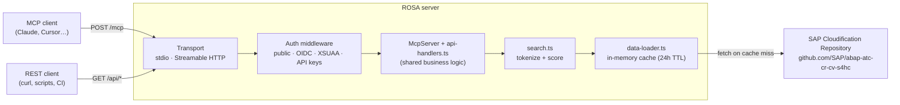

# Architecture

ROSA (Released Objects Search Assistant) is a single TypeScript codebase that
exposes the [SAP Cloudification Repository](https://github.com/SAP/abap-atc-cr-cv-s4hc)
two ways — an **MCP server** and a **REST API** — over two transports and four
config-driven authentication modes. There are no separate builds and no feature
gaps: the same `dist/index.js` runs everywhere.

- [Server types (transports)](#server-types-transports)
- [Authentication modes](#authentication-modes)
- [Auth × deployment matrix](#auth--deployment-matrix)
- [System diagram](#system-diagram)
- [Data flow & caching](#data-flow--caching)
- [MCP tools](#mcp-tools)
- [Key design decisions](#key-design-decisions)

## Server types (transports)

The transport is chosen at startup. **stdio is the default** because that is
what local MCP clients expect.

| Transport | When to use | How it is enabled |
| --- | --- | --- |
| **stdio** | Local MCP clients (Claude Desktop, Claude Code, Cursor). One process per client, spoken over stdin/stdout. No HTTP server, no auth, no rate limiting. | Default. `npx @clementringot/rosa`, or `node dist/index.js`. |
| **HTTP (Streamable)** | Remote / self-hosted server shared by many clients; also serves the REST API. | `--http` flag **or** `TRANSPORT=http`. Port from `--port <n>` **or** `PORT` (default `3001`). |

The HTTP Express middleware stack, in order: Helmet security headers → JSON body
parser → `/health` (always public) → auth middleware (when configured) → rate
limiting → route handlers.

```bash
# stdio (default)
npx @clementringot/rosa

# HTTP on port 3000
npx @clementringot/rosa --http --port 3000
TRANSPORT=http PORT=3000 node dist/index.js   # equivalent via env
```

## Authentication modes

Authentication applies to the **HTTP transport only** and is auto-detected from
the environment at startup. Detection priority: **XSUAA → OIDC → public**;
**API keys** layer on top of any mode.

| Mode | Trigger | Typical use |
| --- | --- | --- |
| **Public** | No auth env vars set | Local dev, public read-only instances, behind a VPN |
| **OIDC / OAuth 2.1** | `OAUTH_ISSUER` + `OAUTH_AUDIENCE` | Self-hosted private (Keycloak, Entra ID, Auth0, Okta, Google) |
| **XSUAA** | `VCAP_SERVICES` contains an `xsuaa` binding | SAP BTP Cloud Foundry |
| **API keys** | `API_KEYS` set (alongside any mode) | Scripts / CI that can't do OAuth |

```
1. VCAP_SERVICES has an xsuaa binding?  → XSUAA mode
2. OAUTH_ISSUER set?                     → OIDC mode
3. Neither?                              → Public mode
   (+ API_KEYS may be added to any of the above)
```

### Public

Default. All routes open. Suitable for local development and public-facing
instances serving read-only public data.

### OIDC / OAuth 2.1

Set `OAUTH_ISSUER` and `OAUTH_AUDIENCE`. The server validates Bearer JWTs on
`/mcp` and `/api`:

1. Client hits `/mcp` without a token → `401` with `WWW-Authenticate: Bearer`.
2. An OAuth 2.1-capable MCP client runs the authorization flow with the IdP.
3. The client sends `Authorization: Bearer <token>`; the server validates
   signature, issuer, audience and expiry.

Compatible with any OIDC provider exposing `.well-known/openid-configuration`
(Keycloak, Microsoft Entra ID, Auth0, Okta, Google Identity Platform).

### XSUAA (SAP BTP)

Auto-detected when the app runs on Cloud Foundry with an XSUAA service binding
(`VCAP_SERVICES`). Backed by [`@arc-mcp/xsuaa-auth`](https://www.npmjs.com/package/@arc-mcp/xsuaa-auth),
which implements the full MCP OAuth 2.1 proxy: Protected Resource Metadata,
stateless Dynamic Client Registration (DCR), an OAuth callback proxy, and JWT
verification against the XSUAA JWKS. The `xs-security.json` ships redirect-URI
patterns for common MCP clients (localhost, `*.hana.ondemand.com`, Claude,
Cursor, VS Code).

> XSUAA requires SAP BTP's managed `xsuaa` service. It is **not** available on a
> classic (non-BTP) Cloud Foundry foundation — see
> [cloud-foundry-classic.md](./cloud-foundry-classic.md).

To call the REST API non-interactively on BTP (script / CI), use an API key or an
XSUAA client-credentials token — see
[DEPLOYMENT.md → Calling the REST API on BTP](./DEPLOYMENT.md#calling-the-rest-api-on-btp-machine-to-machine).

### API keys

Layer on top of any mode for non-interactive callers:

```bash
API_KEYS="ci-key:viewer,admin-key:admin"
curl -H "Authorization: Bearer ci-key" http://localhost:3001/api/search?query=mara
```

### Route protection

| Route | Auth required |
| --- | --- |
| `GET /health` | Never (load balancers, orchestrators) |
| `GET /.well-known/oauth-protected-resource` | Never — served only when auth is enabled |
| `GET /authorize`, `GET /oauth/callback` | XSUAA proxy routes (only when XSUAA) |
| `POST /mcp`, `GET /api/*` | When auth is enabled |

Rate limiting is always on regardless of auth mode: `/mcp` and `/api` default to
600 req/min (`MCP_RATE_LIMIT` / `API_RATE_LIMIT`); OAuth endpoints are capped at
20 req/min by the auth library. Full variable reference:
[DEPLOYMENT.md → Configuration reference](./DEPLOYMENT.md#configuration-reference).

## Auth × deployment matrix

| Deployment | Public | OIDC | XSUAA | API keys |
| --- | :---: | :---: | :---: | :---: |
| **npx / local (stdio)** | n/a¹ | n/a¹ | n/a¹ | n/a¹ |
| **Docker / self-host (HTTP)** | ✅ | ✅ | ✖² | ✅ |
| **Node PaaS** (Railway, Render, Heroku, Fly…) | ✅ | ✅ | ✖² | ✅ |
| **SAP BTP Cloud Foundry** (MTA) | ✅ | ✅ | ✅ | ✅ |
| **Classic Cloud Foundry** (non-BTP) | ✅ | ✅ | ✖³ | ✅ |

¹ stdio starts no HTTP server, so no auth layer runs — the client owns the process.
² No `VCAP_SERVICES` XSUAA binding outside Cloud Foundry.
³ Classic CF has no managed `xsuaa` service; `loadXsuaaCredentials()` finds no
binding and the server falls back to OIDC or public.

## System diagram



## Data flow & caching

1. Request arrives (`search "purchase order"`).
2. `api-handlers.ts` validates input with Zod schemas.
3. `data-loader.ts` checks the in-memory cache (`Map`, 24h TTL):
   - **hit (< 24h)** → use cached data;
   - **miss** → fetch the relevant JSON from SAP's GitHub repo
     (`objectReleaseInfoLatest.json` for public_cloud, `objectReleaseInfo_BTPLatest.json`
     for btp, `objectReleaseInfo_PCE*.json` for private_cloud/on_premise, plus
     `objectClassifications*.json` for Level B).
4. `search.ts` tokenizes the query and scores all objects.
5. Results are sorted by relevance, paginated and returned.

No SAP system connection and no external cache (Redis) are needed — the data is
small (~2–5 MB per system type), public and read-only.

## MCP tools

Exposed on `POST /mcp`; each has an identical REST counterpart under `/api`.

| Tool | Purpose |
| --- | --- |
| `sap_search_objects` | Search objects by exact name or natural language, ranked by relevance, with Clean Core / system / component filters. |
| `sap_get_object_details` | Full details for one object: Clean Core assessment, release state, successor info. |
| `sap_find_successor` | Find the successor(s) of a deprecated / non-released object. |
| `sap_check_clean_core_compliance` | Assess a list of objects and return an overall compliance rate. |
| `sap_list_versions` | List available S/4HANA PCE versions (discovered dynamically). |
| `sap_list_object_types` | List TADIR object types with counts per Clean Core level. |
| `sap_get_statistics` | Repository statistics — totals and breakdowns by level, type, component. |

## Key design decisions

- **Shared business logic** — MCP tools and REST endpoints call the same
  handlers (`api-handlers.ts`); no protocol feature gap.
- **Config-driven auth** — mode detected from env vars at startup; one image
  serves public and private deployments, no feature flags or config files.
- **In-memory cache** — `Map<string, CacheEntry>` with 24h TTL; the dataset is
  small and read-only.
- **No app router** — OAuth proxy routes are served directly via
  `@arc-mcp/xsuaa-auth`, keeping the MTA to a single module.
- **Stateless DCR** — Dynamic Client Registration uses signed tokens as client
  IDs (no database), enabling horizontal scaling without shared state.

## Source layout

```
src/
├── index.ts                 # Entry point (transport + CLI flag selection)
├── constants.ts             # URLs, mappings, cache TTL
├── types.ts                 # Type definitions
├── middleware/oauth.ts      # Auth mode detection + wiring
├── handlers/api-handlers.ts # Shared business logic (MCP + REST)
├── routes/api-routes.ts     # Express REST endpoints
├── services/
│   ├── data-loader.ts       # GitHub fetch + 24h cache
│   ├── search.ts            # Tokenized search + scoring
│   └── abbreviation-dictionary.ts  # SAP abbreviation expansion
├── tools/register-tools.ts  # MCP tool registration
└── schemas/common.ts        # Zod validation schemas
```
