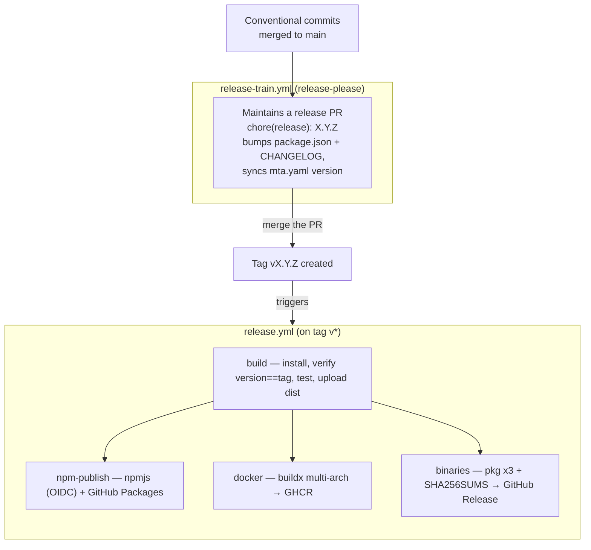

# Release guide (maintainers)

ROSA ships **one release per version, multi-artifact**: a single tag produces the
npm package (npmjs + GitHub Packages mirror), a multi-arch Docker image on GHCR,
and native executables on the GitHub Release. There is no per-target release —
one codebase, zero functional gap between modes.

- [Pipeline overview](#pipeline-overview)
- [The normal flow: the release train](#the-normal-flow-the-release-train)
- [What the release workflow does](#what-the-release-workflow-does)
- [One-time setup (bootstrap)](#one-time-setup-bootstrap)
- [Manual fallback](#manual-fallback)
- [If a job fails mid-release](#if-a-job-fails-mid-release)

## Pipeline overview



## The normal flow: the release train

A release is **a merged PR, no local commands.**

1. Merge conventional-commit PRs into `main` (`feat:` → minor, `fix:` → patch,
   `feat!:`/`BREAKING CHANGE` → major).
2. [`release-train.yml`](../.github/workflows/release-train.yml) runs
   [release-please](https://github.com/googleapis/release-please) on each push to
   `main` and maintains a rolling **`chore(release): X.Y.Z`** PR that bumps
   `package.json`, updates `CHANGELOG.md`, and syncs the version in `mta.yaml`
   (via the `# x-release-please-version` annotation on its `version:` line).
3. **Merge that PR.** release-please tags `vX.Y.Z` and publishes a GitHub Release
   entry.
4. The tag triggers [`release.yml`](../.github/workflows/release.yml) — the four
   jobs below run and attach all artifacts.

Config lives in [`release-please-config.json`](../release-please-config.json) and
[`.release-please-manifest.json`](../.release-please-manifest.json).

> **Tag-triggers-workflow caveat.** A tag created with the default `GITHUB_TOKEN`
> does **not** trigger other workflows. So `release-train.yml` uses
> `RELEASE_PLEASE_TOKEN` (a fine-grained PAT) when present, and the tag it pushes
> then fires `release.yml`. Without the PAT the release is still tagged, but you
> must start `release.yml` manually — see [Manual fallback](#manual-fallback).

### `sync-version.js` (manual bumps)

The train keeps `mta.yaml` in sync itself. For an exceptional **manual** bump,
`npm version <patch|minor|major>` runs [`scripts/sync-version.js`](../scripts/sync-version.js)
via the npm `version` hook, propagating the new version to `mta.yaml`, the README
`_X.Y.Z.mtar` references, and the compiled-in fallback in `src/index.ts`.

## What the release workflow does

`release.yml` (trigger: tags `v*`) has four jobs:

1. **build** (gate) — `npm ci`, then **fail if `package.json` version ≠ tag**
   (anti-drift), `npm run build`, `npm test`, upload `dist/`. Nothing publishes
   unless this passes.
2. **npm-publish** — publishes to **npmjs** via **Trusted Publishing (OIDC)** —
   no npm token; needs `id-token: write` and npm ≥ 11.5 (the job upgrades npm),
   and provenance is attached automatically. Then mirrors to **GitHub Packages**
   (`npm.pkg.github.com`) using `GITHUB_TOKEN`.
3. **docker** — buildx + QEMU multi-arch (`linux/amd64`, `linux/arm64`) push to
   `ghcr.io/clementringot/rosa`, tagged `{version}`, `{major}.{minor}`, `latest`.
4. **binaries** — cross-compiles the three native executables, writes
   `SHA256SUMS.txt`, and creates the GitHub Release with auto-generated notes.

## One-time setup (bootstrap)

These are needed once, before or around the first automated release.

### 1. First npm publish + Trusted Publisher

npmjs can only configure a Trusted Publisher for a package that **already
exists**, so the very first publish is manual:

```bash
# with a short-lived, granular npm automation token (delete it right after)
npm publish --access public
```

Then on npmjs.com → the package → **Settings → Trusted Publisher** → add a
**GitHub Actions** publisher:

- Repository: `ClementRingot/ROSA`
- Workflow: `release.yml`

Delete the temporary token. From then on `release.yml` publishes with **no
token** (OIDC). The `@clementringot` scope is created automatically on that first
scoped publish.

### 2. Package visibility

Both GitHub-hosted packages are **private by default** — make them public:

- **GHCR image** — org/user **Packages → `rosa` (container) → Package settings →
  Change visibility → Public.**
- **GitHub Packages npm mirror** — same, for the `rosa` (npm) package.

(The primary npmjs package is public via `publishConfig.access=public`.)

### 3. Release-train PAT (recommended)

Create a **fine-grained PAT** with `contents: write` + `pull-requests: write` on
this repo and add it as the **`RELEASE_PLEASE_TOKEN`** repository secret, so the
tag the train creates triggers `release.yml`. Without it, trigger `release.yml`
manually after each release PR merge.

## Manual fallback

If you're not using the train (or the PAT), cut a release by hand:

```bash
npm version patch        # bumps package.json, runs sync-version.js, commits, tags
git push origin main --follow-tags
```

Pushing the `vX.Y.Z` tag triggers `release.yml`. If the tag already exists (train
created it but didn't trigger the workflow), re-push it or start the workflow
from the Actions tab.

## If a job fails mid-release

The four jobs are independent after the `build` gate, so a partial release is
possible (e.g. npm published but Docker failed).

- **Re-run** the failed job from the Actions run — `docker` and `binaries` are
  idempotent (same tags / release assets get overwritten).
- **npm** is **not** re-publishable at the same version — npmjs rejects a
  duplicate. To re-release, cut a new patch version.
- **Wrong version tagged** — delete the tag and Release, fix `package.json`
  (the `build` gate would otherwise fail on the mismatch), and re-tag:
  ```bash
  git push --delete origin vX.Y.Z
  # fix, re-tag, push
  ```
