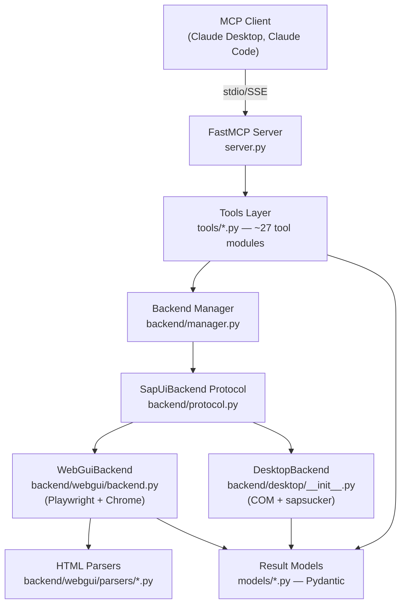
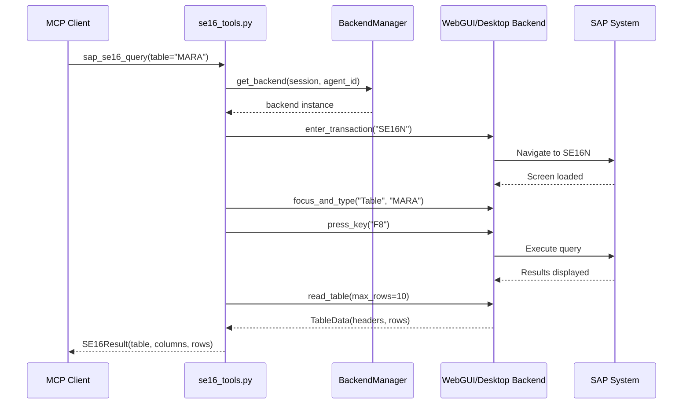

# Architecture

This document explains how the SAP MCP Server is structured so you can navigate the codebase, understand the request flow, and add new features without reading every file first.

## SAP in 30 Seconds

SAP GUI is a desktop application for interacting with SAP ERP systems. Users navigate by entering **transaction codes** (tcodes like `SE16`, `VA01`, `SM37`) into the **OK-Code field** and pressing Enter. Each transaction shows a different screen with fields, tables, and buttons. The **status bar** at the bottom shows success/error messages after each action.

This MCP server automates that interaction — it enters tcodes, fills fields, reads tables, and returns structured results. It works through two backends: browser automation (WebGUI) or direct COM scripting (Desktop).

## Layers



### Layer Responsibilities

| Layer | Key Files | What It Does |
|-------|-----------|-------------|
| **Server** | `server.py` | Creates the FastMCP app, registers all tools/resources/prompts, manages lifecycle |
| **Tools** | `tools/sap_tools.py`, `tools/se16_tools.py`, ... | Define MCP tools the LLM can call. Each tool gets a backend via `get_backend()`, calls protocol methods, returns a Pydantic result model |
| **Backend Manager** | `backend/manager.py` | Singleton that creates/caches the right backend based on `BACKEND_TYPE`. Routes session IDs to backend instances |
| **Protocol** | `backend/protocol.py` | Structural typing protocol (`SapUiBackend`) with 5 sub-protocols: Navigation, Primitives, Inspection, Editor, Popup. Both backends implement this — tools never import a concrete backend |
| **WebGUI Backend** | `backend/webgui/backend.py`, `browser.py` | Implements protocol via Playwright page automation. Fills fields with JavaScript, reads screens with ARIA snapshots |
| **Desktop Backend** | `backend/desktop/__init__.py` | Implements protocol via COM scripting through [sapsucker](https://github.com/Hochfrequenz/sapsucker). Dispatches all COM calls to a dedicated thread (`_com_thread.py`) for apartment-threading safety |
| **Parsers** | `backend/webgui/parsers/*.py` | WebGUI-specific HTML-to-structured-data extraction. One parser per transaction (e.g., `se16_parser.py`, `se24_parser.py`) |
| **Models** | `models/*.py` | Pydantic models for tool results, screen state, and config. Shared by both backends. Result models never import from backend or tools |

## Request Flow

What happens when the LLM calls `sap_se16_query(table="MARA", max_hits=10)`:



## File Organization

Core packages only — helper packages (`catalog/`, `classcatalog/`, `fmcatalog/`, `tables/`) provide offline SAP metadata search; `middleware/`, `resources/`, `prompts/`, `workflows/`, `loghandlers/` handle cross-cutting concerns.

```
src/sapguimcp/
  server.py                    # FastMCP app, tool registration, lifecycle
  models/
    config.py                  # SapGuiSettings (all env vars)
    base.py                    # ToolResult base class, TCode type, PopupInfo
    sap_results.py             # Shared results (LoginResult, ScreenInfo, ...)
    se16_models.py             # SE16-specific result models
    se24_models.py             # SE24-specific result models
    ...                        # One model file per transaction
  backend/
    protocol.py                # SapUiBackend protocol definition
    manager.py                 # Backend factory + session routing
    types.py                   # ScreenSnapshot, AriaSnapshot, ComTreeSnapshot aliases
    webgui/
      backend.py               # WebGuiBackend implementation
      browser.py               # Chrome/Playwright lifecycle management
      chrome_finder.py         # Auto-detect Chrome installation
      js_helpers.py            # JavaScript helper loader
      js/*.js                  # Injected JS for field filling, screen reading
      parsers/                 # HTML → structured data (one per transaction)
    desktop/
      __init__.py              # DesktopBackend implementation
      _com_thread.py           # Dedicated COM thread (apartment-threading)
      _session_registry.py     # Multi-session tracking
      _element_finder.py       # COM tree traversal helpers
      _key_mapping.py          # Key name → SAP VKey mapping
      _landscape.py            # SAP Logon XML parsing
      _discovery.py            # Client/system discovery via SE16N
  tools/
    sap_tools.py               # Core tools: login, transaction, screen, keyboard, ...
    se16_tools.py              # SE16N data browser (query tables)
    se24_tools.py              # SE24 class lookup
    se24_edit_tools.py         # SE24 class source editing
    se37_tools.py              # SE37 function module lookup
    se37_edit_tools.py         # SE37 function module editing
    se38_edit_tools.py         # SE38 report editing
    ...                        # More transaction tools (se09, se11, se93, sm30, sm37, slg1, spro, st22)
    _backend_utils.py          # _is_desktop_backend() helper
    field_helpers.py           # Shared field-filling logic
    table_helpers.py           # Shared table-reading logic
    session_tools.py           # Multi-session management
    feedback_tools.py          # LLM feedback logging → GitHub issues
```

## How to Add a New Transaction Tool

Follow the SE16 pattern. For a new transaction `SE99`:

### 1. Create the result model

`src/sapguimcp/models/se99_models.py`:

```python
from pydantic import Field
from sapguimcp.models.base import ToolResult

class SE99Result(ToolResult):
    """Result from sap_se99_query tool."""
    data: list[dict[str, str]] = Field(default_factory=list)
    # Add transaction-specific fields
```

Export it from `models/__init__.py`.

### 2. Create the tool file

`src/sapguimcp/tools/se99_tools.py`:

```python
from fastmcp import FastMCP
from sapguimcp.backend.manager import get_backend
from sapguimcp.models.se99_models import SE99Result

def register_se99_tools(mcp: FastMCP) -> None:
    @mcp.tool(description="Query SE99 data")
    async def sap_se99_query(
        param: str,
        session: str | None = None,
        agent_id: str | None = None,
    ) -> SE99Result:
        backend = await get_backend(session=session, agent_id=agent_id, tool_name="sap_se99_query")

        # Navigate
        tx = await backend.enter_transaction("SE99")
        if not tx.success:
            return SE99Result.failure(f"Navigation failed: {tx.error}")

        # Fill fields, execute, read results
        await backend.fill_field("Field Label", param)
        await backend.press_key("F8")
        # ... parse results ...

        return SE99Result(data=[...])
```

### 3. Add desktop-specific path (if needed)

If the desktop backend needs different logic (e.g., COM table reading instead of HTML parsing), add a helper:

```python
from sapguimcp.tools._backend_utils import _is_desktop_backend

if _is_desktop_backend(backend):
    result = await _query_se99_desktop(backend, param)
else:
    result = await _query_se99_webgui(backend, param)
```

### 4. Add a WebGUI parser (if needed)

`src/sapguimcp/backend/webgui/parsers/se99_parser.py` — for extracting structured data from HTML/ARIA snapshots. Only needed for WebGUI; desktop reads data via COM.

### 5. Register the tool

In `server.py`, add the import and call `register_se99_tools(mcp)` alongside the existing registrations. Also export the registration function from `tools/__init__.py`.

### 6. Add tests

- `unittests/test_se99_models.py` — model validation (offline)
- `unittests/desktop/test_se99_integration.py` — desktop integration (needs SAP, auto-skipped)
- `unittests/webgui/test_se99_integration.py` — webgui integration (needs SAP, auto-skipped)

## Tests

### Categories

| Category | Examples | Needs SAP? | How to run |
|----------|----------|-----------|------------|
| **Root unit tests** | `unittests/test_models.py`, `test_config.py`, `test_catalog.py`, ... | No | `tox -e unit_tests` |
| **Desktop unit tests** | `unittests/desktop/test_desktop_backend.py`, `test_com_thread.py`, `test_element_finder.py`, `test_key_mapping.py`, ... | No (mocked) | `tox -e unit_tests` |
| **Desktop integration** | `unittests/desktop/test_se16_integration.py`, `test_se24_integration.py`, ... | Yes (SAP GUI) | `tox -e integration_tests` |
| **WebGUI integration** | `unittests/webgui/test_se16_integration.py`, `test_*_exploration.py`, ... | Yes (SAP WebGUI) | `tox -e integration_tests` |

### Skip Mechanism

Integration tests auto-skip based on **credential detection** — no hardcoded hostnames or machine lists.

- **Desktop tests** use `skip_no_sap` (defined in `unittests/desktop/conftest.py`): skips when SAP credentials are not configured in `~/.config/sap-mcp/systems.json`
- **WebGUI tests** use `has_sap_webgui_creds()` (defined in `unittests/conftest.py`): skips when SAP credentials are not configured in `~/.config/sap-mcp/systems.json` or SAP URL is missing
- Both check functions are in `unittests/conftest.py` — configure your `systems.json` file and tests run automatically

Desktop test files include `pytestmark = pytest.mark.skipif(sys.platform != "win32", reason="Windows only")` to skip on Linux/macOS CI.

### Running Tests

```bash
tox -e tests               # Full suite (integration auto-skips without SAP)
tox -e unit_tests          # All offline tests (no SAP needed)
tox -e integration_tests   # SAP integration tests only
tox -e linting             # pylint
tox -e type_check          # mypy --strict
tox -e formatting          # black + isort check
```

## Configuration

All settings are in `src/sapguimcp/models/config.py` and loaded from environment variables or `.env` files.

### Core (have defaults, but needed for SAP operations)

| Variable | Description | Default |
|----------|-------------|---------|
| `BACKEND_TYPE` | `desktop` or `webgui` | `webgui` |
| `SAP_LANGUAGE` | `DE` or `EN` | `EN` |

**Desktop-only:** Connection name is configured in `~/.config/sap-mcp/systems.json`

**WebGUI-only:** `SAP_URL` — Web GUI URL (e.g., `https://server/sap/bc/gui/sap/its/webgui`)

SAP credentials (user, password, mandant) are loaded from `~/.config/sap-mcp/systems.json` (or the path set via `SAP_CONFIG_FILE`). See the [sap-mcp-config](https://github.com/Hochfrequenz/sap-mcp-config) package.

### Optional

| Group | Variables | Purpose |
|-------|-----------|---------|
| **Browser** | `BROWSER_MODE`, `BROWSER_TYPE`, `CDP_URL`, `CHROME_PATH`, `CHROME_USER_DATA_DIR`, `BROWSER_HEADLESS` | Chrome/Playwright configuration |
| **COM timing** | `COM_MIN_INTERVAL_MS` | Minimum ms between COM calls (desktop, prevents overload) |
| **GitHub** | `GITHUB_PAT`, `GITHUB_USER`, `GITHUB_REPO`, `ABAPGIT_PAT` | Feedback issue creation, abapGit operations |
| **Logging** | `PAPERTRAIL_HOST`, `PAPERTRAIL_PORT` | Remote syslog (optional) |

See `.env.example` for a complete template with descriptions.
