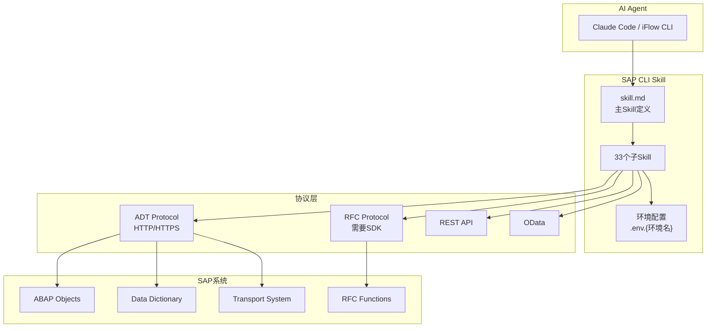
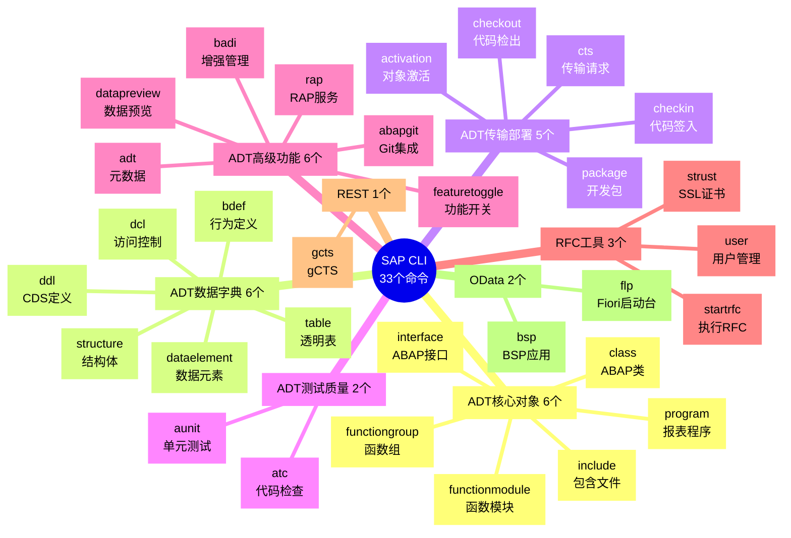
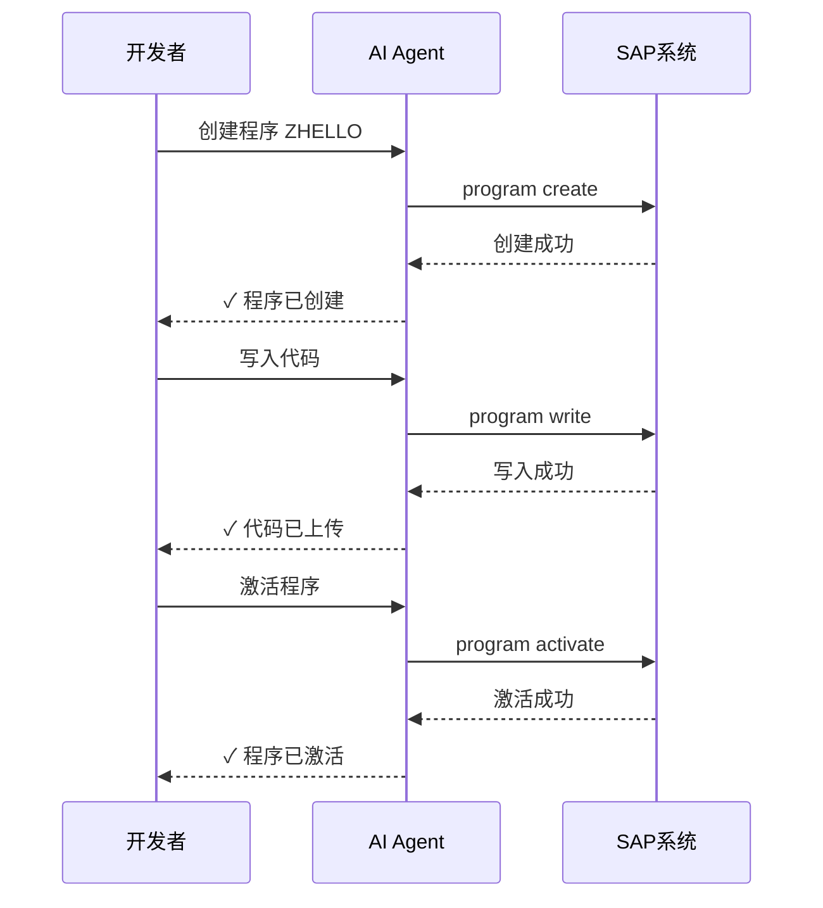
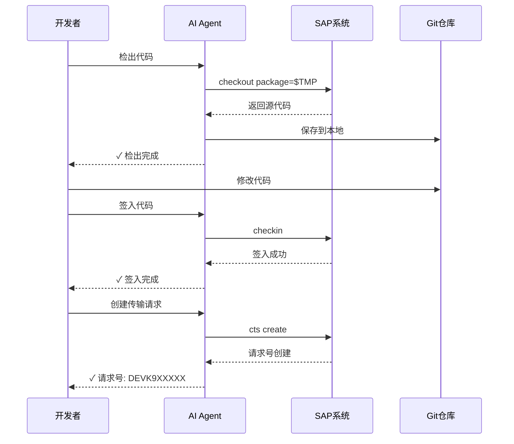
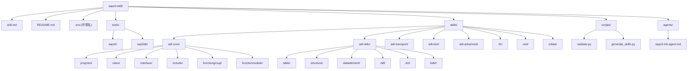
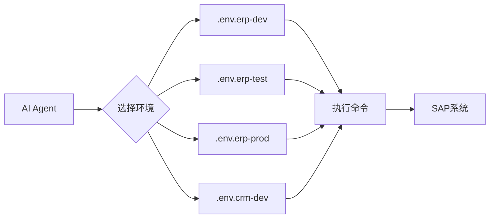
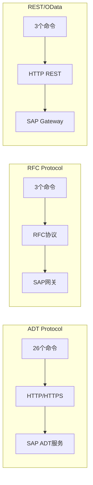

# SAP CLI Skill

[](https://claude.ai/code)
[]()
[](LICENSE)

**创造者：** miki

通过 AI Agent（如 Claude Code、iFlow CLI）调用 sapcli 工具管理 SAP 系统。

## 架构概览



## 命令体系



## 功能概览

| 分类 | 数量 | 命令 |
|------|------|------|
| **ADT 核心对象** | 6 | program, include, functiongroup, functionmodule, class, interface |
| **ADT 数据字典** | 6 | table, structure, dataelement, ddl, dcl, bdef |
| **ADT 传输部署** | 5 | package, cts, checkout, checkin, activation |
| **ADT 测试质量** | 2 | aunit, atc |
| **ADT 高级功能** | 6 | abapgit, rap, badi, featuretoggle, datapreview, adt |
| **RFC 工具** | 3 | startrfc, strust, user |
| **REST 命令** | 1 | gcts |
| **OData 命令** | 2 | bsp, flp |

## 快速开始

### 1. 安装

```bash
cd E:\code
git clone <repository-url> sapcli-skill
cd sapcli-skill
```

### 2. 初始化配置

**方式一：交互式初始化（推荐）**

```bash
# 在 AI Agent 中输入
sap初始化
```

**方式二：手动配置**

```powershell
# 复制示例配置文件并修改
copy .env.example .env
notepad .env
```

### 3. 验证安装

```bash
python scripts/validate.py
```

### 4. 测试连接

```bash
python tools/sapcli/bin/sapcli --help
```

## 典型工作流程

### 开发工作流



### 传输工作流



## 目录结构



## 使用示例

### 创建 ABAP 程序

```bash
python tools/sapcli/bin/sapcli program create ZHELLO \
    --description "Hello World" \
    --package $TMP
```

### 读取程序代码

```bash
python tools/sapcli/bin/sapcli program read ZHELLO --save-to ./ZHELLO.abap
```

### 上传并激活

```bash
python tools/sapcli/bin/sapcli program write ZHELLO ./ZHELLO.abap --activate
```

### 执行 RFC 函数

```bash
# 需要配置 SAPNWRFC_HOME
python tools/sapcli/bin/sapcli startrfc STFC_CONNECTION '{"REQUTEXT":"Hello"}'
```

## 环境变量

### 必需变量

| 变量 | 说明 | 示例 |
|------|------|------|
| `SAP_ASHOST` | SAP 服务器地址 | `127.0.0.1` |
| `SAP_CLIENT` | 客户端编号 | `001` |
| `SAP_USER` | 用户名 | `DEVELOPER` |
| `SAP_PASSWORD` | 密码 | `your-password` |

### 可选变量

| 变量 | 说明 | 默认值 |
|------|------|--------|
| `SAP_SYSNR` | 系统编号 | `00` |
| `SAP_PORT` | HTTP 端口 | `8000` |
| `SAP_SSL` | 使用 SSL | `no` |
| `SAP_SSL_VERIFY` | 验证 SSL 证书 | `no` |
| `SAP_LANGUAGE` | 登录语言 | `zh` |
| `SAPNWRFC_HOME` | RFC SDK 路径 | - |

### RFC 命令配置

如果使用 RFC 命令（startrfc, strust, user），需要额外配置：

```powershell
# 设置 RFC SDK 路径
$env:SAPNWRFC_HOME = "E:\code\sapcli-skill\tools\sapSdk\nwrfcsdk\nwrfcsdk"

# 添加到 PATH
$env:PATH = "$env:PATH;$env:SAPNWRFC_HOME\lib"

# 安装 PyRFC
pip install pynwrfc
```

## Skill 规范

本项目遵循 Claude Code Skill 规范：

- **主 Skill 文件**: `skill.md` - 包含所有工具定义和环境变量
- **子 Skill 文件**: `skills/<category>/<command>/skill.md` - 具体命令的详细定义
- **环境配置**: `.env.{环境名}` - 环境变量配置

### 多环境管理



### 在 Claude Code 中使用

1. 在 Claude Code 中加载此 Skill：
   ```
   /load skill E:\code\sapcli-skill\skill.md
   ```

2. 使用 Skill 管理 SAP：
   ```
   "创建程序 ZTEST001"
   "激活类 ZCL_HELLO"
   "运行 RFC STFC_CONNECTION"
   ```

### 在 iFlow CLI 中使用

将项目路径添加到 iFlow CLI 配置中：

```json
{
  "skills": [
    "E:\\code\\sapcli-skill"
  ]
}
```

## 协议说明

| 协议 | 命令数 | 通信方式 | 需要 SDK |
|------|--------|----------|----------|
| **ADT** | 26 | HTTP/HTTPS REST API | 否 |
| **RFC** | 3 | RFC 协议 | 是 (sapSdk + PyRFC) |
| **REST** | 1 | HTTP REST API | 否 |
| **OData** | 2 | OData 协议 | 否 |



## 常见问题

### Q: 连接失败怎么办？

A: 检查以下几点：
1. SAP_ASHOST 是否正确
2. SAP_CLIENT 是否带前导零（如 `112` 不是 `001`）
3. 用户名和密码是否正确
4. SAP_SSL 设置是否与服务器匹配
5. 网络是否可达

### Q: RFC 命令报错 "sapnwrfc not found"？

A: 需要安装 PyRFC 并配置 SDK：
```bash
pip install pynwrfc
$env:SAPNWRFC_HOME = "E:\code\sapcli-skill\tools\sapSdk\nwrfcsdk\nwrfcsdk"
```

### Q: 如何查看详细日志？

A: 设置日志级别：
```powershell
$env:SAPCLI_LOG_LEVEL = 10  # DEBUG
```

## 贡献指南

1. Fork 项目
2. 创建分支 (`git checkout -b feature/amazing-feature`)
3. 提交更改 (`git commit -m 'Add amazing feature'`)
4. 推送分支 (`git push origin feature/amazing-feature`)
5. 创建 Pull Request

## 许可证

MIT License - 详见 [LICENSE](LICENSE) 文件

## 相关链接

- [SAP CLI 官方文档](doc/commands/)
- [PyRFC 文档](doc/pyrfc-reference.md)
- [SAP NW RFC SDK](https://support.sap.com/en/product/connectors/nwrfcsdk.html)

---

**维护者**: iFlow Agent  
**最后更新**: 2026-03-18