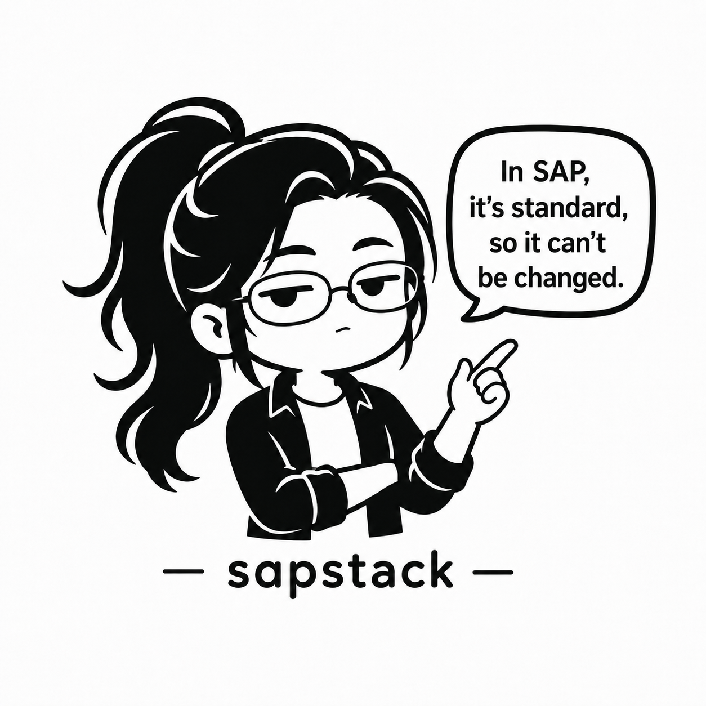

<div align="center">

# 🏛 sapstack



_「SAPでは標準なので変更できません。」 — 標準さん ([ブランドガイド](MASCOT.md))_

### AI コーディング アシスタント向け SAP 企業運用プラットフォーム

[](https://www.npmjs.com/package/@boxlogodev/sapstack-mcp)
[](https://github.com/BoxLogoDev/sapstack/releases)
[](LICENSE)
[](#)

**24 プラグイン · 20 エージェント · 22 コマンド · MCP 23 ツール (npm) · VS Code 拡張 v2.4.0 · 8 AI ツール対応 · 6 か国 · 6 言語 · コンプライアンス対応**

🌐 [🇰🇷 한국어](README.md) · [🇬🇧 English](README.en.md) · [🇨🇳 中文](README.zh.md) · [🇯🇵 日本語](README.ja.md) · [🇩🇪 Deutsch](README.de.md) · [🇻🇳 Tiếng Việt](README.vi.md)

</div>

---

## sapstack とは？

**sapstack** は Claude、Copilot、Cursor などの AI ツールに **SAP 専門知識を注入**するオープンソースプラットフォームです。SAP 運用の全ライフサイクル — **Configure → Implement → Operate → Diagnose → Optimize** — をカバーします。

```
┌──────────────────────────────────────────────────────────────┐
│ SAP 運用担当 ─┐                                               │
│              ├─→ [AI Tool] ←── sapstack ──→ SAP 知識         │
│ 新人教育者 ───┤      ↓                       + IMG ガイド      │
│              ├── Evidence Loop               + ベストプラクティス │
│ コンサル ─────┘   (4ターン診断)              + コンプライアンス │
└──────────────────────────────────────────────────────────────┘
```

> 意思決定の原則は [**ETHOS.md**](ETHOS.md) — 実証優先 · 証拠ファースト · ハードコード禁止 · ECC≠S/4 · 現場用語 · 運用者が決める。

---

## 👥 こんな方へ

| あなたは… | sapstack はこうします |
|---|---|
| **SAP 運用担当**（現場、締めに追われる） | 障害を **Evidence Loop（4ターン）** で診断 — 仮説→証拠→検証→ロールバック、ライブ接続不要。症状コマンド（`/sap-migo-debug`、`/sap-payment-run-debug` …）ですぐ開始。 |
| **新人教育者 / 新規入社者** | `sap-tutor` が質問を分類してモジュール専門家に委任し、答えを初心者向けに翻訳。T-code + メニューパスを常に併記。 |
| **SAP コンサル / パートナー** | 24 モジュールの知識 + IMG 構成 + 3層ベストプラクティス + コンプライアンスを AI ツールに注入し、顧客環境ごとに素早く適用。 |

---

## 🧭 Golden Path — いつ何を使うか

バラバラのツールではなく、**一本の道**です。完全ガイド: **[docs/workflow.md](docs/workflow.md)** · 完成度ギャップ分析: [docs/gstack-gap-analysis.md](docs/gstack-gap-analysis.md)

| やりたいこと | 進む道 |
|---|---|
| 手早く事実回答 | **Quick Advisory** — そのまま質問 |
| 障害診断 | **Evidence Loop**（4ターン）→ モジュール consultant / 症状コマンド |
| モジュールが不明 | `sap-tutor`（分類して専門家に委任） |
| 設定（IMG）の問題 | `/sap-img-guide` |
| 期末決算 | `/sap-fi-closing` → `/sap-quarter-close` → `/sap-year-end` |
| プロジェクトに貢献 | メンテナ Golden Path |

> 詰まったら一段上（Evidence Loop）へ、分からなければ `sap-tutor` から。

---

## ✅ 実際の動き (See it work)

**シナリオ**：_「MIGO で入庫を転記しようとしても失敗し続けます。」_ — Evidence Loop は断定せず証拠で絞り込みます。

```
Turn 1 · INTAKE      まず環境：ECC(EhP?) / S/4(リリース?)、移動タイプ (MvT)、
                     エラーメッセージ全文 (M7 xxx)。
Turn 2 · HYPOTHESIS  A：転記期間が未オープン — 確認：MMRV で現在期間が転記日と一致するか？
                     （反証：一致すれば A を棄却）
                     B：移動タイプ / 勘定決定 (OBYC) — 確認：…
Turn 3 · COLLECT     （運用者が MMRV を実行 → 結果を報告）
Turn 4 · VERIFY      期間不一致を確認 → Fix：MMPV で期間を繰り越し（先にシミュレーション、
                     Transport 経由）。ロールバック計画 + 関連 SAP Note ポインタを同梱。
```

> 各仮説には**反証基準**、各修正には**ロールバック計画**。本番への直接書き込みなし — 運用者が決定します。(→ [ETHOS](ETHOS.md))

---

## 主要機能

### 🎯 SAP 全モジュール対応
FI · CO · TR · MM · SD · PP · HCM · PM · QM · WM · EWM · ABAP · BASIS · BTP · SFSF · S4Mig · GTS · BC · **Cloud PE** · Session

### 🤖 19 の専門エージェント + 1 SAP チューター
16 モジュールコンサルタント (FI·CO·TR·MM·SD·PP·PM·QM·EWM·HCM·IBP·SAC·Ariba·Integration-Cloud·Cloud·BASIS) + ABAP developer + Integration advisor + S4 migration advisor + **SAP tutor**（新人教育）

### 🔁 Evidence Loop (v1.5+)
ライブ SAP 接続なしで診断 — **INTAKE → HYPOTHESIS → COLLECT → VERIFY** 4ターン構造、反証条件必須、ロールバックペア必須

### 🏗 IMG 構成フレームワーク (v1.6+)
76 の SPRO ベース構成ガイド — 構成手順、ECC と S/4 の差異、検証方法

### 📋 3層ベストプラクティス
**Operational**（日常）· **Period-End**（期末）· **Governance**（ガバナンス）— 23 モジュールに体系適用

### 🌐 6言語対応 (v1.7+)
한국어 · English · 中文 · 日本語 · Deutsch · Tiếng Việt — 24 モジュール × 5 言語 = 120 quick-guide

### ☁️ S/4HANA Cloud PE 対応
Clean Core · Key User Extensibility · 3-Tier Extension · Fit-to-Standard · Cloud ALM

### 🚀 MCP Runtime (v2.0+)
`@boxlogodev/sapstack-mcp` — Claude Desktop で Evidence Loop をフル実行。**23 ツール + 12 プロンプト + 9 リソース**。

### 💻 VS Code Extension (v2.4.0)
セッション管理サイドバー · YAML 検証 · Webview レンダリング · File Watcher

### 🛡 コンプライアンス対応 (v2.0+)
K-SOX · SOC 2 · ISO 27001 · GDPR · 分離ネットワーク展開 · PII 自動マスキング

---

## クイック スタート

### ⚡ 5分オンボーディング（推奨スタート）
非開発者でもインストールから初回診断までコマンド1つ。詳細: [docs/quickstart-5min.md](docs/quickstart-5min.md)
```bash
git clone https://github.com/BoxLogoDev/sapstack.git && cd sapstack
./setup.sh        # Windows: ./setup.ps1   ·   点検のみ: ./setup.sh --check
```

### Claude Code
```bash
/plugin marketplace add https://github.com/BoxLogoDev/sapstack
/plugin install sap-fi@sapstack sap-session@sapstack
```

### NPM (MCP サーバー)
```bash
npm install -g @boxlogodev/sapstack-mcp
sapstack-mcp --sessions-dir ~/.sapstack/sessions
```

### VS Code Extension
VS Code Marketplace で "sapstack" を検索 → Install ·（または [GitHub Release](https://github.com/BoxLogoDev/sapstack/releases) の `.vsix` を直接インストール）

### Amazon Kiro IDE
```bash
git submodule add https://github.com/BoxLogoDev/sapstack sapstack
cp sapstack/.kiro/settings/mcp.json .kiro/settings/
cp sapstack/.kiro/steering/*.md .kiro/steering/
```

### その他 (Codex / Copilot / Cursor / Continue.dev / Aider)
リポジトリを clone → 自動認識。詳細：[docs/multi-ai-compatibility.md](docs/multi-ai-compatibility.md)

---

## Universal Rules

1. **ハードコード厳禁** — 会社コード・GL 勘定・組織単位の固定値禁止
2. **環境インテーク優先** — SAP リリース・展開モデル・会社コードを先に確認
3. **ECC と S/4HANA を明示区別** — バージョン別の動作差を明確に
4. **Transport 必須** — 本番変更は常に Transport 経由
5. **シミュレーション先行** — AFAB、F.13、FAGL_FC_VAL、MR11、F110 など
6. **SE16N 編集禁止** — 本番データの直接編集を推奨しない
7. **T-code + SPRO パス** — すべての操作に両方を提供
8. **韓国語は現場用語優先** — 二重表記 "코스트 센터 (원가센터, KOSTL)"

> これらのルールの*なぜ*は [**ETHOS.md**](ETHOS.md)、全運用ルールは [CLAUDE.md](CLAUDE.md) を参照。

---

## 学習パス

| レベル | パス |
|------|------|
| 🆕 **入門** | [チュートリアル (15分)](docs/tutorial.md) → [FAQ](docs/faq.md) |
| 📘 **実践** | [シナリオ 5本](docs/scenarios/) → [用語集](docs/glossary.md) |
| 🧭 **ワークフロー** | [Golden Path](docs/workflow.md) → [ギャップ分析](docs/gstack-gap-analysis.md) |
| 🏗 **深掘り** | [アーキテクチャ](docs/architecture.md) → [Multi-AI ガイド](docs/multi-ai-compatibility.md) |
| 🔒 **セキュリティ** | [SECURITY.md](SECURITY.md) → [コンプライアンス](docs/compliance/) |
| 🤝 **貢献** | [CONTRIBUTING](CONTRIBUTING.md) → [ロードマップ](docs/roadmap.md) |

---

## データ資産

| 資産 | 数量 | ファイル |
|------|------|------|
| 確定 T-code | 361 | [`data/tcodes.yaml`](data/tcodes.yaml) |
| 自然言語 症状インデックス | 90（6言語） | [`data/symptom-index.yaml`](data/symptom-index.yaml) |
| 確定 SAP Note/KBA | 112 | [`data/sap-notes.yaml`](data/sap-notes.yaml) |
| 多言語 Synonyms | 80+ terms × 6 langs | [`data/synonyms.yaml`](data/synonyms.yaml) |
| 期末シーケンス | 24 ステップ | [`data/period-end-sequence.yaml`](data/period-end-sequence.yaml) |
| 業種マトリクス | 7 industries | [`data/industry-matrix.yaml`](data/industry-matrix.yaml) |

---

## プラグイン カタログ

| 領域 | プラグイン |
|------|----------|
| 💰 **財務** | [sap-fi](plugins/sap-fi/) · [sap-co](plugins/sap-co/) · [sap-tr](plugins/sap-tr/) |
| 📦 **ロジスティクス** | [sap-mm](plugins/sap-mm/) · [sap-sd](plugins/sap-sd/) · [sap-pp](plugins/sap-pp/) · [sap-pm](plugins/sap-pm/) · [sap-qm](plugins/sap-qm/) · [sap-wm](plugins/sap-wm/) · [sap-ewm](plugins/sap-ewm/) |
| 👥 **人事** | [sap-hcm](plugins/sap-hcm/) · [sap-sfsf](plugins/sap-sfsf/) |
| 💻 **技術** | [sap-abap](plugins/sap-abap/) · [sap-s4-migration](plugins/sap-s4-migration/) · [sap-btp](plugins/sap-btp/) · [sap-basis](plugins/sap-basis/) · [sap-cloud](plugins/sap-cloud/) |
| ☁️ **クラウド/統合** | [sap-ibp](plugins/sap-ibp/) · [sap-sac](plugins/sap-sac/) · [sap-ariba](plugins/sap-ariba/) · [sap-integration-cloud](plugins/sap-integration-cloud/) |
| 🇰🇷 **韓国/グローバル** | [sap-bc](plugins/sap-bc/) · [sap-gts](plugins/sap-gts/) |
| 🔁 **メタ** | [sap-session](plugins/sap-session/) (Evidence Loop) |

---

## 多言語レビュー — 貢献歓迎

5言語（en/zh/ja/de/vi）の quick-guide は **Claude 作成のドラフト**です。各言語のネイティブ + SAP ドメイン専門家のレビューを歓迎します。

- 手順 · 評価基準 · PR 形式：**[docs/TRANSLATION-REVIEW.md](docs/TRANSLATION-REVIEW.md)**
- フィードバック：[Translation Feedback issue](https://github.com/BoxLogoDev/sapstack/issues/new?template=translation-feedback.md)
- T-code/Note 番号は翻訳対象外（原形維持）

---

## ライセンス & 貢献

**MIT License** — 商用・非商用ともに自由。著作権表示を保持。

- 🐛 [バグ報告](https://github.com/BoxLogoDev/sapstack/issues/new?template=bug_report.md)
- ✨ [機能リクエスト](https://github.com/BoxLogoDev/sapstack/issues/new?template=feature_request.md)
- 💬 [ディスカッション](https://github.com/BoxLogoDev/sapstack/discussions)
- 📖 [貢献ガイド](CONTRIBUTING.md)

---

<div align="center">

**Made with 🇰🇷 by [@BoxLogoDev](https://github.com/BoxLogoDev)**
Built for Korean SAP consultants · Shared with the global community

</div>
