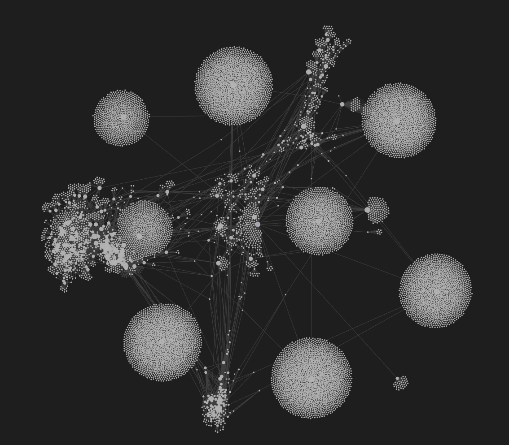
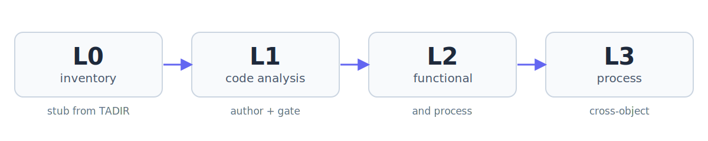
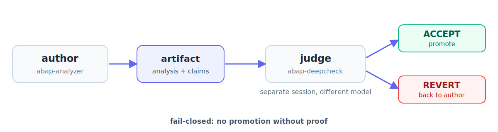
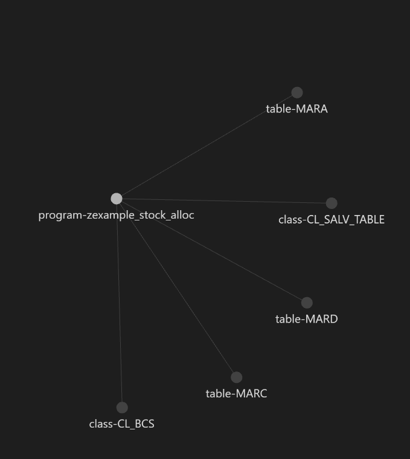

<p align="center">
  
</p>

<p align="center">
  <em>An agent-driven engine that turns your SAP system into a verifiable, AI-native knowledge base.</em>
</p>

<p align="center">
  
</p>

<p align="center">
  <a href="https://github.com/Gixsy95/abap_wiki/actions/workflows/ci.yml"></a>
  
  
  <a href="https://github.com/astral-sh/ruff"></a>
  
  
</p>

**Contents**

- [The problem](#the-problem)
- [What abap_wiki does](#what-abap_wiki-does)
- [What makes it different](#what-makes-it-different)
- [What a page looks like](#what-a-page-looks-like)
- [Why not just RAG?](#why-not-just-rag)
- [Measurable value](#measurable-value)
- [Choosing the models](#choosing-the-models-a-measured-benchmark)
- [What abap_wiki on Obsidian looks like](#what-abap_wiki-on-obsidian-looks-like)
- [Query the knowledge base](#query-the-knowledge-base)
- [Getting started](#getting-started)
- [How it works](#how-it-works)
- [Documentation](#documentation-coredocs)
- [Agents](#agents)
- [Structure](#structure)
- [Live SAP via MCP](#optional-live-sap-via-mcp)
- [Why I built this](#why-i-built-this)
- [Inspirations](#inspirations)
- [What is not included](#what-is-not-included)
- [License](#license)

## The problem

In a real SAP system, documentation is fragmented, or simply absent.

How a flow works, how a program was built, and above all *why* one design choice was made
over another, all of it lives in one place: the head of the developer who wrote that SAP
object or flow. And guess what? That person left five years ago.

Every developer since inherited the same pain and coped the only way they could: trial and
error. So today the code is a maze: twenty commented-out blocks, twenty-five inline tags
from a dozen different hands. *What a mess.*

And even when you finally decode it, it's not enough. **Code tells you *what* happens, not
*why*.** The business need behind it, the reason for a magic number, the process a job
actually serves: none of that is in the ABAP. Point an AI agent at it and it's worse off
still: re-reading scattered raw ABAP on every turn, with no memory, no citations, no way to
know what's true. And generic SAP documentation won't save you. It describes standard SAP
in the abstract, not how *your* system really uses it.

## What abap_wiki does

`abap_wiki` is a **local, agent-driven engine** that turns an SAP S/4HANA system into a
navigable, versioned, verifiable knowledge base. It starts where your system is unique, at
the custom objects (`Z*`/`Y*`), and follows their dependencies outward into the standard
objects they touch, documenting each in the context of real usage. The result isn't a `Z*`
catalog; it's a map of how your enterprise system *actually works*, built layer by layer
(L0 inventory → L1 code analysis → L2 functional & process), structured for both engineers
and AI agents.

<p align="center">
  
</p>

## What makes it different

**🧠 From the code to the *why*.** Code never lies, but it won't explain itself. L2 closes
that gap with a human-in-the-loop process: the agent reads the code, marks the functional
gaps, auto-researches what it can, and routes the rest to the real process owner. The owner
defines a *slice* (a functional view of a process), and the engine raises the documentation
level only after reconciling every answer against the code. *(The shape of that
auto-research loop comes from Karpathy's [autoresearch](https://github.com/karpathy/autoresearch).)*

**🔒 Verifiable, not just plausible.** Every claim is anchored to the lines that prove it
(`[VERIFIED: path:N-M]`); an independent adversarial agent re-reads the code and rejects
anything it can't confirm. Fail-closed: no promotion without proof. What can't be proven is
labelled, not hidden.

<p align="center">
  
</p>

**🏠 100% local. Your data never leaves your machine.** No external connections, no
third-party services, nothing phoned home. Run it with Claude, Codex, or a fully local
open-source agent: pull the network cable and still build your complete technical,
functional and process knowledge base. For an enterprise SAP landscape that's not a
nice-to-have; it's the difference between *can* and *can't*.

**⚙️ A real harness, not a prompt.** This isn't "ask Claude to document my code." It's a
tight agentic harness (gates, contracts, a state machine, citations) built on years of
hands-on SAP S/4HANA work, driving an almost-deterministic process to a result you can trust.

## What a page looks like

A real page, generated end-to-end by the pipeline against a real 153k-line ABAP
program: abapGit's own official, public standalone distribution, downloaded from
[GitHub](https://raw.githubusercontent.com/abapGit/build/main/zabapgit_standalone.prog.abap).
This is the very start of that page, verbatim
([full page](demo/model-comparison/runs/fable-fable/wiki-page.md)):

```
---
type: sap-object
sap_type: program
sap_name: ZABAPGIT_STANDALONE
tadir_object: PROG
pgmid: R3TR
devclass: ZABAPGIT
namespace: Z
custom: true
doc_level: L2
author: ABAPGIT
created_on: ''
changed_on: ''
ingest_date: '2026-07-02'
updated: '2026-07-03'
source_hash: 15fe0137
raw_source_path: raw/system-library/ZABAPGIT/Source Code Library/Programs/ZABAPGIT_STANDALONE/ZABAPGIT_STANDALONE.prog.abap
raw_source_status: available
depends_on:
- class-CL_GUI_CONTAINER
- class-CL_GUI_HTML_VIEWER
...
```

The page continues for another 500+ lines: the rest of the dependency list,
functional scope, input/output mapping, form analysis, external dependencies,
performance, error handling, bug candidates, and (this object reached L2) the
full functional and process analysis, every claim pinned to the exact source
lines or expert/research evidence that proves it.

## Why not just RAG?

RAG retrieves raw code at query time and re-derives understanding on every single
question, paying the tokens, the latency and the hallucination risk again each time, and
keeping nothing. abap_wiki compiles understanding **once**: the analysis is verified by a
fail-closed adversarial gate, every claim is anchored to source lines, and what agents
consume afterwards are pre-verified, citable pages. Retrieval stops being similarity search
over raw ABAP and becomes navigation of a trusted graph. Honestly: for a small codebase and
one-off questions, plain RAG (or just pasting the source) is enough. This engine earns its
keep on systems that get interrogated for years.

## Measurable value

The token saving is not just claimed: it is **measurable**. A bundled example KB
demonstrates it without real data:

```powershell
.venv\Scripts\python core/src/tools/pipeline.py token-metrics demo
```

For the example (`examples/token-saving/`), a curated wiki page costs **~68% fewer**
tokens than the raw source plus the context of the tables it uses (~3.1x more compact).
On a real KB the same measurement is taken from the DB with
`token-metrics measure --object <slug>` / `token-metrics all`. Method and honesty of the
estimate: `examples/token-saving/README.md`.

### What to expect on real data

The ~68% of the demo is the **potential at steady state on a mature KB**, not a per-page
guarantee. Measured on a real production system (first gated L1 batch, 2026-07): a
1,450-line program compressed **1.7x** (−39.7% tokens); seven DDIC structures of 7-21
lines came out slightly **larger** than their DDL (−1.4% net across the batch), because the
analysis *adds* knowledge the raw code does not contain (field dictionary, bug catalogue,
input/output mapping), each fact anchored to `[VERIFIED: path:N-M]`. Large multi-include
objects compress clearly (measured ~2x on a real 15-file program); at L2/L3 compression
dominates again. And even where the token count does not drop, the **value per token
grows**: the verification has been done once, by an adversarial gate, so the next agent
neither re-reads nor re-validates the source.

## Choosing the models: a measured benchmark

Which Claude models should run the pipeline? Instead of guessing, this
repository ships the measurement: the full L0→L1→L2 ingest of the 153k-line
abapGit standalone program, executed seven times with different author/judge
pairings, with every token, retry, gate verdict and final page committed as
evidence ([`demo/model-comparison/`](demo/model-comparison/README.md)).

Tokens are the runner's per-subagent totals (estimates, include tool traffic).
"tokens" = every author pass + every judge round until ACCEPT.

| config | L1 tokens | wall | author attempts | format retries | judge rounds | final claims (supported/partial) | deps confirmed |
|---|---|---|---|---|---|---|---|
| haiku-haiku | ~344k¹ | 26 min | 2 | 1 | 3 (REVERT, BLOCKED, ACCEPT) | 20 (20/0) | 33/33² |
| sonnet-sonnet | ~1,043k | 77 min | 3 | 2 | 3 (REVERT, REVERT, ACCEPT) | 27 (26/1) | 33/33 |
| sonnet-haiku | ~423k | 38 min | 1 | 1 | 2 (BLOCKED, ACCEPT) | 21 (21/0) | 21/21 |
| opus-opus | ~267k | 25 min | 1 | 1 | 1 (ACCEPT) | 19 (18/1) | 14/14 |
| opus-sonnet | ~311k | 25 min | 1 | 1 | 1 (ACCEPT) | 29 (23/6) | 13/13 |
| **fable-fable** | **~252k** | 26 min | 1 | **0** | 1 (ACCEPT) | **38 (34/4)** | 17/17 |
| **fable-opus** | **~249k** | 26 min | 1 | **0** | 1 (ACCEPT) | 33 (31/1+1 medium-rejected) | 27/27 |

Headline findings:

- **The strongest author is the cheapest author.** First-try artifacts avoid
  the retry loop that dominates cost: the frontier authors landed first-round
  gate ACCEPTs while the mid-tier same-model pair burned 2.5x the frontier
  authors' total on REVERT churn.
- **The judge belongs one tier below the author.** Cross-model independence
  is preserved, cost drops, and in these runs no real error slipped through.
- **A weak pair is a weaker guarantee, not just a cheaper run.** The
  haiku-haiku config completed, but its gate let a real classification defect
  reach the page.

Full tables, per-run artifacts, the metrics glossary and the critical limits
of a one-run-per-config benchmark:
[`demo/model-comparison/README.md`](demo/model-comparison/README.md).

## What abap_wiki on Obsidian looks like

The knowledge base is pure **Markdown** with wikilinks `[[...]]`: it can be read with any
editor or directly on GitHub. For **graphical** navigation (dependency graph, backlinks,
interactive search) the **recommended viewer is [Obsidian](https://obsidian.md)**. Note
that `abap_wiki/` does not exist on a fresh clone: it is created by your first `ingest-l0`
run. To see a vault immediately, open the bundled example `examples/token-saving/abap_wiki/`
in Obsidian. Alternatives compatible with wikilinks: VS Code + Foam, Logseq.



## Query the knowledge base

Once the wiki exists, at any level, you point an agent at it and ask. The `/query` command
pulls the wiki pages relevant to your question and answers in detail, every claim backed by
the engine's verification across all phases. It can optionally extend the answer to the
live SAP system through an MCP connector (strongly recommended:
[vscode_abap_remote_fs](https://github.com/marcellourbani/vscode_abap_remote_fs), used here
read-only by agent contract, not by a limitation of the connector itself), always
citing wiki vs. system.

## Getting started

**Prerequisites:**

- **Python >= 3.11** (required and verified by `doctor.py`; the lockfile assumes it).
- **Git**. On Windows, the pre-commit hook is a `/bin/sh` script: a POSIX `sh` shell is
  required, included in **Git for Windows / Git Bash** (or WSL), for it to run (it is
  fail-open anyway: if absent, it does not block raw commits).
- **An agentic coding runner** (Claude Code or Codex CLI) with LLM access, to drive
  L1/L2. L0 is deterministic and free: no LLM touches it. L1/L2 consume LLM tokens, and
  the adversarial judge intentionally runs on a **different model** than the author.
  Canonical reference for models and costs: `core/docs/11-agent-runtime-and-cost.md`.
- **Windows + MAX_PATH**: clone the repo into a **short** path (e.g. `C:\src\abap_wiki`)
  and run `git config core.longpaths true` to avoid the MAX_PATH error (~260 characters);
  the slug warns beyond `SLUG_WARN_LENGTH=120` (`core/src/tools/slugs.py`).
  Details: `core/docs/05-runbook.md` §7.
- **Obsidian (optional)**: the recommended graphical viewer for the wiki once it exists,
  download it from [obsidian.md](https://obsidian.md/). See
  [What abap_wiki on Obsidian looks like](#what-abap_wiki-on-obsidian-looks-like). Not
  required to run L0/L1/L2: the vault is plain Markdown, readable with any editor or
  directly on GitHub.

**1. Bootstrap.** From the repository root.

On Windows:

```powershell
.\scripts\bootstrap.ps1
```

On Linux/macOS:

```sh
sh scripts/bootstrap.sh
```

The bootstrap creates `.venv`, installs dependencies from `core/src/requirements.lock.txt`,
configures `git config core.hooksPath core/githooks`, prepares `raw/tadir/`,
`raw/system-library/`, and the `abap_wiki/` vault, and verifies encoding, agent sync,
slice registry, lint, and tests.
`.venv`, the runtime DB, and outputs remain local and are ignored by Git.

**Try it first: no SAP system needed.** One command runs the whole deterministic
pipeline on a bundled synthetic package and generates a browsable vault in an isolated
workspace (`output/demo/workspace/`, nothing of yours is touched):

```powershell
.\scripts\demo.ps1     # Windows
```

```sh
sh scripts/demo.sh     # Linux/macOS
```

What it builds and why the dataset looks like a real export: `examples/demo-system/README.md`.

**2. Export your SAP data.** After the bootstrap, copy your SAP exports into the immutable
inbox `raw/` (do not place credentials, tokens, or local config in tracked data; the
`.gitattributes` rule `raw/** -text` preserves bytes, hashes, and line numbers):

1. Extract the TADIR from SAP GUI with `SE16N`, table `TADIR`, filter `OBJ_NAME = Z*`,
   then export to `.xlsx` and save to `raw/tadir/`.
2. Download the custom ABAP sources with `marcellourbani/vscode_abap_remote_fs`,
   configuring the SAP system connection in VS Code and using `right-click -> download`
   on the custom package.
3. Copy the downloaded content to `raw/system-library/`, preserving the folder structure
   produced by the tool.

The source files must follow the object-as-file naming convention born with
[abapGit](https://github.com/abapGit/abapGit) (`ZFOO.prog.abap`, `.clas.abap`,
`.fugr.abap`, ...): ABAP FS produces it automatically, and the engine relies on it to bind
each TADIR object to its source. Because the engine never talks to SAP directly, any system
that can provide these two inputs works, S/4HANA or ECC alike: ABAP FS needs the ADT
services (NetWeaver 7.31+, so most ECC 6.0 EhP6+ landscapes qualify), and on older kernels
abapGit or a manual download with the same naming convention works too.

Driving these two downloads directly from ABAP FS (tools `abap_download` and
`execute_data_query`) is documented in `core/docs/14-abap-fs-integration.md`.

Complete guide for obtaining SAP inputs: `core/docs/09-first-clone-and-sap-input-guide.md`.

**3. Run the pipeline (L0 data bootstrap).** Run after copying TADIR and sources.

On Windows:

```powershell
.venv\Scripts\python core/src/tools/pipeline.py init-db
.venv\Scripts\python core/src/tools/pipeline.py import-tadir --file raw/tadir/<TADIR>.xlsx
.venv\Scripts\python core/src/tools/pipeline.py resolve-sources
.venv\Scripts\python core/src/tools/pipeline.py ingest-l0
.venv\Scripts\python core/src/tools/pipeline.py enqueue-l1
.venv\Scripts\python core/src/tools/pipeline.py progress
```

On Linux/macOS:

```sh
.venv/bin/python core/src/tools/pipeline.py init-db
.venv/bin/python core/src/tools/pipeline.py import-tadir --file raw/tadir/<TADIR>.xlsx
.venv/bin/python core/src/tools/pipeline.py resolve-sources
.venv/bin/python core/src/tools/pipeline.py ingest-l0
.venv/bin/python core/src/tools/pipeline.py enqueue-l1
.venv/bin/python core/src/tools/pipeline.py progress
```

Or run the whole L0 sequence as a single deterministic command:

```powershell
.venv\Scripts\python core/src/tools/pipeline.py l0-run
```

```sh
.venv/bin/python core/src/tools/pipeline.py l0-run
```

`l0-run` picks the newest TADIR export in `raw/tadir/` (or takes `--file`) and
stops at the first failing step. No LLM is involved: L0 stays fully
deterministic end to end.

**4. Run L1 and beyond.** `abap_wiki/` now exists: open it as an Obsidian vault. Drive L1 and
L2 with the agent skills in `.agents/skills/` and `.claude/skills/` (the autonomous loop
is documented in `core/docs/07-autonomous-loop.md`), and query with `/query`. The L1/L2
gate is fail-closed: no promotion without an ACCEPT verdict.

### Template verification

The template stays downloadable, readable, and verifiable by a new user. Canonical checks:

```powershell
.venv\Scripts\python core/src/tools/check_encoding.py --check
.venv\Scripts\python core/src/tools/check_headers.py --check
.venv\Scripts\python core/src/tools/doctor.py
.venv\Scripts\python core/src/tools/sync_agents.py --check
.venv\Scripts\python core/src/tools/pipeline.py slices-registry --check
.venv\Scripts\python core/src/tools/lint_wiki.py --check
.venv\Scripts\python -m pytest core/src/test/unit_tests -q
```

`check_headers.py` enforces on **every engine code file** (excluding `raw/`) a three-part
context header (`What it does:` / `How it works:` / `Connections:`) that gives an AI agent
the full context of the file; `--fix` creates any missing headers. On a fresh clone
`doctor.py` reports the missing DB as WARN: normal until `pipeline.py init-db` has run.

## How it works

- **Levels:** L0 (inventory) → L1 (verified code analysis) → L2 (functional & process); one page per object.
- **Adversarial gate:** an independent agent re-reads the code; fail-closed, no promotion without proof.
- **Slice:** the unit of L2 work, a functional view of a process, owned by a real person.
- **Graph as source of truth:** dependencies live in the DB; indexes/backlinks are projections, so they never drift.

Full architecture: `core/docs/00-architecture.md` (also `02-adversarial-gate.md`, `03-l2-process.md`).

## Documentation (core/docs)

- `00-architecture.md`: the two planes (data/engine), SQLite as source of truth.
- `01-pipeline-l0-l1.md`: the L0/L1 pipeline (states, concurrency, loop resume).
- `02-adversarial-gate.md`: L1 fail-closed adversarial gate plus retroactive audit.
- `03-l2-process.md`: the L2 process (functional auto-research per slice, real owner).
- `04-lessons-learned.md`: design principles and inviolable engine guardrails.
- `05-runbook.md`: operational runbook covering setup, L1 loop, monitoring, roadmap, risks.
- `06-testing-and-quality.md`: engine tests and quality (unit tests, regression, invariants).
- `07-autonomous-loop.md`: autonomous L1 loop with operational instructions for the agent.
- `08-structured-vs-narrative-sections.md`: structural vs narrative L1 sections.
- `09-first-clone-and-sap-input-guide.md`: first-clone guide and SAP input.
- `10-roadmap.md`: roadmap and future directions (L3, rebuild-from-wiki).
- `11-agent-runtime-and-cost.md`: agent runners, the author/judge model split, and per-object/per-batch cost measured on a real batch, not estimated.
- `12-faq-and-troubleshooting.md`: first-hour failures a newcomer actually hits (bootstrap, TADIR import, agent-runner setup) with the fix for each, all observed on a real fresh-clone onboarding.
- `13-improving-the-engine.md`: the observe-then-fix loop for engine work: run on real cases end to end, log problems without fixing mid-run, then fix and reprocess with full regression checks.
- `14-abap-fs-integration.md`: provisioning and feeding an instance from ABAP FS
  (release-zip wizard, TADIR/source download via ABAP FS tools, `l0-run`, runner
  setup including Copilot), per issue #473.
- `15-headless-l1-runner.md`: the `l1-run` headless L1 loop (direct LLM API
  calls, no chat runner, cron/CI-friendly), configuration and exit codes.

## Agents

- Codex: `AGENTS.md`, `.agents/agents/`, `.agents/skills/`.
- Claude: `CLAUDE.md`, `.claude/agents/`, `.claude/skills/`, `.claude/commands/`.
- Copilot (VS Code): `.github/agents/*.agent.md` (custom agents projected from the
  same canonical contracts; set each agent's `model:` line to the VS Code model of
  your choice; it is the only hand-editable line, and the drift check ignores it).
  Copilot agent mode reads the skills from `.agents/skills/` natively and loads
  `AGENTS.md` via the `chat.useAgentsMdFile` setting.
- Headless (`l1-run`): no agentic runner required, direct LLM API calls
  instead - schedulable from cron/CI. See `core/docs/15-headless-l1-runner.md`.

The canonical contracts live in `core/src/agentic/programs/` and are synchronised with:

```powershell
.venv\Scripts\python core/src/tools/sync_agents.py
.venv\Scripts\python core/src/tools/sync_agents.py --check
```

Do not manually edit the copies in `.agents/agents/` or `.claude/agents/`.

## Structure

```text
raw/          immutable inbox: TADIR, ABAP sources, functional documents
abap_wiki/    Markdown/Obsidian vault generated by the pipeline (created at runtime)
slices/       L2 functional process working area
state/        local pipeline state; regenerable exports (created at runtime)
output/       ephemeral artefacts ignored by Git (created at runtime)
core/         engine: Python CLI, agents, DB schema, tests, docs
templates/    analysis templates per object type
scripts/      bootstrap and onboarding checks
```

## Optional: live SAP via MCP

The engine works locally on the files in `raw/`; no connection to SAP is required to build
the knowledge base from the sources you provide. But starting from custom code, the engine
inevitably reaches the standard SAP objects your code calls, extends, or depends on, and
L1 analysis of a standard object needs its source. If you downloaded only the custom
packages into `raw/system-library/`, two options:

1. Find out which standard packages are touched, download their sources into
   `raw/system-library/` as well, and run L1 on them like any other object.
2. Use an MCP connector
   ([marcellourbani/vscode_abap_remote_fs](https://github.com/marcellourbani/vscode_abap_remote_fs))
   so an agent can retrieve what it needs from the live system (the source to analyse, a
   where-used, a current value), always citing "wiki vs. system". The connector itself also
   supports writing; abap_wiki's agents never do, by contract (see the agent files' MCP tool
   whitelist). Set it up following the official documentation:
   <https://marcellourbani.github.io/vscode_abap_remote_fs/>. Keep your local MCP configuration
   out of version control, and never commit credentials, internal hosts, or tokens.

## Why I built this

I've worked on SAP, writing ABAP, for years, across many different systems. Missing
documentation wasn't the exception; it was the pattern. Every single time.

I started abap_wiki because I was tired of that pattern, and because this agentic wave of
AI genuinely energizes me: honestly, it feels like it handed me superpowers. I spent months
building it on my own, for the sheer excitement of seeing how far the idea could go.

Today it earns its keep: it lets me close that documentation gap fast and navigate sprawling
programs that a dozen different developers have touched over the years.

There's a bigger reason too. The SAP ecosystem is closed, and we ABAP developers have often
worked with our hands tied compared to colleagues in other languages: Git workflows, modern
IDEs, the tooling everyone else takes for granted. Very few fully open-source projects have
tried to close that gap; [abapGit](https://abapgit.org/) broke that ground first. Now the
agentic phase has brought a massive new wave of energy to ABAP: a surge of MCP servers
(including, recently, SAP's official one; though I genuinely recommend Marcello Urbani's
open-source [vscode_abap_remote_fs](https://github.com/marcellourbani/vscode_abap_remote_fs);
it's simply better, with far more features). I want to ride that wave, hard. abap_wiki is
how.

## Inspirations

- **Andrej Karpathy's llm-wiki** ([gist](https://gist.github.com/karpathy/442a6bf555914893e9891c11519de94f)):
  repository/wiki as persistent memory for agents, instead of rebuilding context every turn.
- **Andrej Karpathy's [autoresearch](https://github.com/karpathy/autoresearch):** an
  autonomous research loop (the agent plans experiments, runs them, iterates on the
  results) that inspired the shape of L2's auto-research loop.
- **Marcello Urbani's [vscode_abap_remote_fs](https://github.com/marcellourbani/vscode_abap_remote_fs):**
  navigable access to SAP objects via the ABAP remote filesystem, VS Code, and MCP.
- **[abapGit](https://github.com/abapGit/abapGit):** the project that first made ABAP
  objects live as files. Its serializers did the heavy lifting of mapping every TADIR
  object type to a file representation with its own extension (`.prog.abap`,
  `.clas.abap`, `.fugr.abap`, ...); ABAP FS extracts sources in that same convention,
  and this engine consumes them. Three layers of open source, each standing on the
  previous one.

## What is not included

Real SAP data; the runtime DB `state/abap_wiki.db`; real exports/dumps in
`state/exports/`; run outputs and reports in `output/`; local MCP config `.mcp.json`;
`.venv`; the Git history of the source repository.

## License

Distributed under the MIT License. See [`LICENSE`](LICENSE). © 2026 Luigi Venturino.
