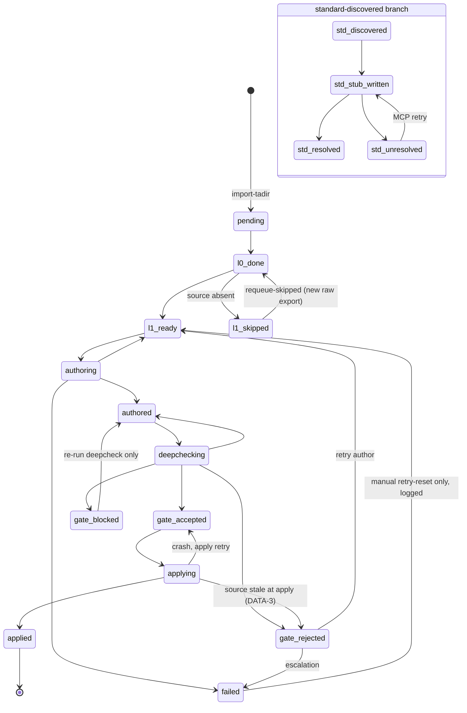

# L0/L1 pipeline: state, concurrency, resume

The mechanics of the ingest engine: the SQLite state that is the pipeline's source of
truth, the object state machine, the concurrency and lease model, exact resume, and the
per-batch L1 cycle.

> **Scope.** How L0 and L1 run: state schema and machine, claims/leases, one-writer-per-file
> concurrency, crash recovery and idempotency, the per-batch cycle (concept), the
> deterministic DDIC-metadata path, and the Python module map.
> **Prerequisites.** [00-architecture](00-architecture.md) (planes, levels, graph-as-truth).
> **See also.** Gate semantics in [02-adversarial-gate](02-adversarial-gate.md); runnable commands in
> [05-runbook](05-runbook.md); unattended runs in [07-autonomous-loop](07-autonomous-loop.md); first bootstrap in
> [09-first-clone-and-sap-input-guide](09-first-clone-and-sap-input-guide.md).

## 1. State lives in SQLite

File: `state/abap_wiki.db`, WAL mode. It is the **transactional source of truth**
of the pipeline. Centralized PRAGMAs in `core/src/tools/db.py`:
`journal_mode=WAL`, `synchronous=NORMAL`, `busy_timeout=5000`, `foreign_keys=ON`,
`isolation_level=None` (autocommit: the `db.transaction()` context manager with
`BEGIN IMMEDIATE` is the only transactional boundary).

Only Python tools write to the DB; LLM sub-agents never touch it. Transactions
are short (a few ms): no file I/O inside a transaction.

The rationale for choosing SQLite is in [00-architecture](00-architecture.md) §3.

The full schema is in `core/src/db/schema.sql`. Tables by category
(`core/src/db/schema.sql:31,98,107,119,146,165,183,196,213,225,238,247,262,273,286,297,306,323,329,341`):

**Core pipeline:**
- `objects` (`schema.sql:31`): one row per SAP object, **global key `UNIQUE(sap_type, sap_name)`**. The page path (`slug`, `wiki_page_path`) is a projection, never the key.

**L1 loop:**
- `runs` (`schema.sql:98`): execution run tracking.
- `batches` (`schema.sql:107`): batch grouping within a run.
- `tasks` (`schema.sql:119`): claimable units of work with a **time-bound lease** (`lease_expires_at`).

**Graph:**
- `dependencies` (`schema.sql:146`): graph edges only; `used_by` is the inverse view `v_used_by`.

**Gate:**
- `verdicts` (`schema.sql:165`): gate outcomes (provenance).
- `gate_decisions` (`schema.sql:247`): gate decision records (ACCEPT/REVERT/BLOCKED).
- `gate_overrides` (`schema.sql:273`): operator-approved S3 threshold overrides.

**Auxiliary:**
- `standard_lookup` (`schema.sql:183`): accumulator of standard objects discovered during MCP resolution.
- `artifacts` (`schema.sql:196`): registry of on-disk artifacts (author.yaml, verdicts) with sha256.
- `events` (`schema.sql:213`): append-only log of every transition (audit trail).
- `dep_warnings` (`schema.sql:225`): dependency guardrail warnings.
- `dirty_pages` (`schema.sql:238`): pages to be regenerated at the next `project` run.
- `spot_checks` (`schema.sql:262`): retrospective gate audit records.

**L2 functional process:**
- `slices` (`schema.sql:286`): slice registry.
- `slice_membership` (`schema.sql:297`): object membership per slice.
- `gaps` (`schema.sql:306`): functional gaps per slice.
- `gap_entities` (`schema.sql:323`): entities linked to gaps.
- `questions` (`schema.sql:329`): expert-interview questions.
- `evidence` (`schema.sql:341`): research evidence linked to gaps.

## 2. Object state machine

The diagram below is derived 1:1 from `ALLOWED_TRANSITIONS` in
`core/src/tools/sap_types.py` - **the code is the authority**; if they ever disagree,
trust the code. Edge labels quote the inline comments on the transition map.

**Full state set** (`OBJECT_STATES`, `core/src/tools/sap_types.py:151-171`):
`pending`, `l0_done`, `l1_ready`, `l1_skipped`, `authoring`, `authored`, `deepchecking`,
`gate_accepted`, `gate_rejected`, `gate_blocked`, `applying`, `applied`, `failed`,
`std_discovered`, `std_stub_written`, `std_resolved`, `std_unresolved`.

Allowed transitions are defined in `ALLOWED_TRANSITIONS` at `sap_types.py:175-198`
and validated by `db.set_state()` (`db.py:199`), which records every transition in
`events`. `doc_level` is a separate field on `objects` that can only increase
(`doc_level_rank` at `sap_types.py:247`); it is not a state.

The three gate outcome states are `gate_accepted`, `gate_rejected`, and `gate_blocked`
(`sap_types.py:160-162`). What each outcome means and how re-runs differ: [02-adversarial-gate](02-adversarial-gate.md) §5-6.

## 3. Lease and claim: no zombies

Task claiming (`core/src/tools/claims_queue.py`) is atomic
(`UPDATE ... RETURNING` inside `BEGIN IMMEDIATE`): two concurrent orchestrator
sessions never obtain the same task. The claim increments `attempt`,
sets `worker_id`, `claimed_at`, `lease_expires_at = now + lease` (45 min for
author/deepcheck), and moves the object into the "in processing" state for its
kind (`authoring`/`deepchecking`/`applying`).

A `claimed` task with an **expired** lease is automatically re-claimable: the
claim query includes expired leases. When `attempt >= max_attempts` the task
moves to `failed` (no infinite loop). The "eternally running" state no longer
exists.

## 4. Concurrency: one writer per file

| Actor | Writes DB | Writes wiki | Writes artifacts |
|---|---|---|---|
| Orchestrator (Claude main) | yes, via CLI | no | no |
| `abap-analyzer` (author, parallel) | no | no | only `output/runs/<run>/<task>/author.yaml` |
| `abap-deepcheck` (parallel, separate session) | no | no | only `.../deepcheck.json` |
| `apply` step | yes | only the object's own page | no |
| `project` step | yes | only managed shared sections (backlinks, indexes) | no |

Principle: **every file has a single writer class**. Sub-agents write only
files whose path is derived from their own `task_id` (collision impossible).
`apply` writes only the (unique) object page with inline analysis; other pages
(backlinks) are touched only by `project`. This is why the compute steps
(author, deepcheck) run in parallel without contention, and `apply` is also
partitionable by devclass.

## 5. Exact resume and idempotency

Write rules:
1. **Write-then-rename**: every file is written to `.tmp` and then `os.replace`
   (atomic). No partial files ever visible.
2. **Done only after verification**: first the filesystem is written and the
   parse verified, then the state is advanced in the DB. An advanced DB state
   always implies the artifact is present and valid.
3. **Persistent LLM artifacts**: `author.yaml` stays on disk; a downstream
   retry (gate, apply, crash) reuses it: the LLM is re-launched only on
   `gate_rejected`.

`recover` (`core/src/tools/cli_loop.py`, command `pipeline.py recover`)
runs at the start of every iteration and on post-interruption resume:

| State + expired lease | Action |
|---|---|
| `authoring` | requeue the author task, object to `l1_ready` |
| `deepchecking` | requeue only the deepcheck (author.yaml remains valid), object to `authored` |
| `gate_blocked` | requeue the deepcheck (fail-closed: no promotion without a verdict) |
| `applying`, page present and hash matches | mark `applied` (already finished) |
| `applying`, page absent or hash mismatch | re-enqueue the apply (idempotent) |

On resume, no operation is repeated if its outcome is already verifiable on
disk; at most the deterministic step (apply) is re-executed, or the single LLM
task whose artifact is missing is re-claimed.

## 6. Bootstrap from scratch: what each step does internally

For the runnable bootstrap command sequence, see [09-first-clone-and-sap-input-guide](09-first-clone-and-sap-input-guide.md) §6.
This section describes what each step does internally.

- **`import-tadir`**: reads the export with `dtype=str` (numeric names such as `00`
  remain strings), normalizes names to UPPER, excludes from the queue objects
  flagged as "already deleted" (but still catalogs them), maps types via
  `sap_types.py` (unknown types produce a `tadir-<x>` placeholder and a report,
  never a crash), and uses `INSERT OR IGNORE` on the global key so duplicate TADIR
  entries reuse the existing row.
- **`resolve-sources`**: builds a unique in-memory index of `raw/system-library/`
  (single scan), resolves path + status + deterministic `source_hash` for each
  custom object, and classifies each as `available/partial/stub/missing` by byte
  count and lines of code (comments excluded).
- **`ingest-l0`**: creates L0 stubs deterministically (parallelizable by devclass)
  and regenerates the package indexes and the global index.
- **`enqueue-l1`**: enqueues `l1_author` tasks for `l1_ready` objects of an
  analyzable type.

## 7. Per-batch cycle (L1 loop)

Driven by Claude Code or another agent (see the `ingest-l1` skill). One iteration:

1. `recover`: resumes any interrupted tasks.
2. `claim --kind l1_author --limit 12`: atomic claim.
3. **Parallel** fan-out of `abap-analyzer`: each agent writes its `author.yaml`;
   `submit-author` validates, computes the hash, applies the dependency
   guardrail, prepares the deepcheck prompt and meta, enqueues `l1_deepcheck`.
4. `claim --kind l1_deepcheck` + **parallel** fan-out of `abap-deepcheck`
   (separate session): `submit-verdict` evaluates (fail-closed) and decides.
5. `apply`: ACCEPT only, idempotent; populates the graph, archives the verdict.
6. `project`: regenerates backlinks and indexes from queries.
7. `export-excel` + `git-commit`: snapshot and automatic batch commit.
8. `progress`: decides whether to continue.

Recommended batch size: 10-15 objects (approximately one turn's token budget).
Automatic per-batch commit avoids accumulating unversioned work.

Exact commands for each step: [05-runbook](05-runbook.md) §2. Unattended loop operation: [07-autonomous-loop](07-autonomous-loop.md).

## 7b. DDIC metadata (deterministic, no LLM, stays L0)

`data-element` (`DTEL`) and `message-class` (`MSAG`) are **DDIC metadata**, not
executable code: they carry declared structure (type/length/labels, message texts),
not behaviour. Because the content is declared structure rather than logic, it does
not fit the LLM author, adversarial-gate, and apply L1 path. The deterministic
`ingest-metadata` command handles these objects instead.

`pipeline.py ingest-metadata` (`core/src/tools/ddic_metadata.py`) handles these types:

- Selects objects of those types with a resolved `raw_source_path` (XML present).
- Parses the ADT XML with stdlib `xml.etree.ElementTree`, extracting **only**
  values present in the export (missing fields become `""`; rule #13: never invent).
  The `source_hash` remains the `md5(bytes)` computed by `sources.py` (rule #4);
  it is never recomputed by an LLM.
- Renders a single-page body with a structured section (`field_dictionary` for
  data-element, `message_catalog` for message-class), a single inline
  `[VERIFIED: <raw xml path>]` citation (the whole XML export is the evidence, §8),
  the protected `## User notes` block (preserved across re-runs), `## Sources`, and
  the append-only history.
- **Keeps `doc_level` at L0.** This is a no-LLM, no-gate path, so promoting to L1
  would violate **rule #7** (never promote without an ACCEPT gate). A deterministic
  metadata page at L0 is fully rule-compliant; a gated L1 page is a different,
  LLM-driven path reserved for code types. The command only persists
  `wiki_page_path`/`page_sha256`; it never advances state or `doc_level`.

Per-object, deterministic and idempotent: re-running produces a byte-identical page.

## 8. Python modules

All modules are in `core/src/tools/`. Sources: the module docstrings in
`core/src/tools/`; each entry is verified against the file on disk.

| Module | Responsibility |
|---|---|
| `apply_l1.py` | Renders the single object page from L1 artefacts and promotes to L1 on gate ACCEPT. |
| `apply_l2.py` | Materialises L2 functional sections inline in the page and promotes doc_level L1->L2. |
| `author_io.py` | Validates author (abap-analyzer) output and applies deterministic dependency guardrails before the gate. |
| `check_encoding.py` | Encoding guardrail: fails CI if a tracked file is not UTF-8 or contains CP1252 regressions. |
| `check_headers.py` | Context-header guardrail: enforces a structured three-part header on every engine code file. |
| `claims_queue.py` | Manages the pipeline task queue with expiring leases: atomic claim, recovery, retry. |
| `cli_l2.py` | CLI commands for the L2 process (slice-init through apply-l2), orchestrated per slice. |
| `cli_loop.py` | L1 loop commands (submit-author, submit-verdict, apply, project, etc.) that advance objects through the gate. |
| `dashboard.py` | Produces the Markdown progress report from DB state (totals, gate outcomes, expired leases). |
| `db.py` | Sole access point to the pipeline's SQLite DB: connection, transactions, validated state transitions, log_event, migrations. |
| `ddic_metadata.py` | Parses ADT XML exports for DDIC data elements and message classes into deterministic L0 pages (no LLM, no gate). |
| `deepcheck_io.py` | Implements the L1 adversarial gate: prompt preparation, anti-stale binding, `decide()` returning ACCEPT/REVERT/BLOCKED. |
| `doctor.py` | Non-mutating diagnostics: checks prerequisites and operational risks without fixing anything. |
| `export_excel.py` | Exports KB state to `.xlsx` (objects, standard lookup, gate decisions) for human review. |
| `freeze_lock.py` | Regenerates `core/src/requirements.lock.txt` deterministically (sorted, UTF-8 no-BOM, LF). |
| `functional_io.py` | Validates L2 functional-synthesis artefacts (`functional.yaml`/`process.yaml`) and implements the Phase 4 fidelity gate. |
| `gitops.py` | Performs the automatic git commit at end of each batch with a hard guard preventing `raw/` staging. |
| `graph_project.py` | Projects the dependency graph (DB) onto wiki pages: used_by/backlinks, package indexes, stubs. |
| `lint_wiki.py` | Integrity lint of the vault: YAML frontmatter, broken wikilinks, citation resolution, confidence markers, wiki-DB drift. |
| `mcp_standards.py` | Resolves standard SAP objects discovered via dependencies, moving stubs to their real packages. |
| `oplog.py` | Rebuilds `log.md` as an append-only view from DB events (never edited by hand). |
| `pipeline.py` | Single CLI entry point: registers and dispatches all subcommands (Phase 1 bootstrap + Phase 2 L1 + L2). |
| `render.py` | Wiki page rendering: frontmatter (YAML-only via `safe_dump`), atomic write, managed blocks. |
| `render_l1.py` | Builds the single-page L1 markdown body from validated author_data (narrative, structured sections, deps, inline citations). |
| `research_l2.py` | Gap discovery, multi-source auto-research, and L2 questionnaire generation (Phases 1-3). |
| `sap_types.py` | Single source of truth for TADIR-to-sap_type mapping, namespaces, `ALLOWED_TRANSITIONS`, and shared enumerations. |
| `section_schema.py` | Single source of truth for L1 analysis sections: catalog, render order, required sections per sap_type. |
| `slice_membership.py` | Registers L2 slices and derives membership from the dependency graph via BFS (never hand-curated). |
| `slugs.py` | Single point for slug computation: `make_slug` converts SAP names (with `/` slashes) to file-safe identifiers. |
| `sources.py` | Resolves and classifies sources in `raw/`; single point for deterministic `source_hash` (md5 of bytes). |
| `spot_check.py` | Retrospective audit of the L1 gate: sample/record/report to calibrate S3 threshold and measure judge-FP-rate. |
| `sync_agents.py` | Synchronises canonical agent contracts to `.claude/agents/` and `.agents/agents/`; `--check` verifies without writing. |
| `token_metrics.py` | Measures the token-saving of the wiki vs raw source to demonstrate the project's central value. |
