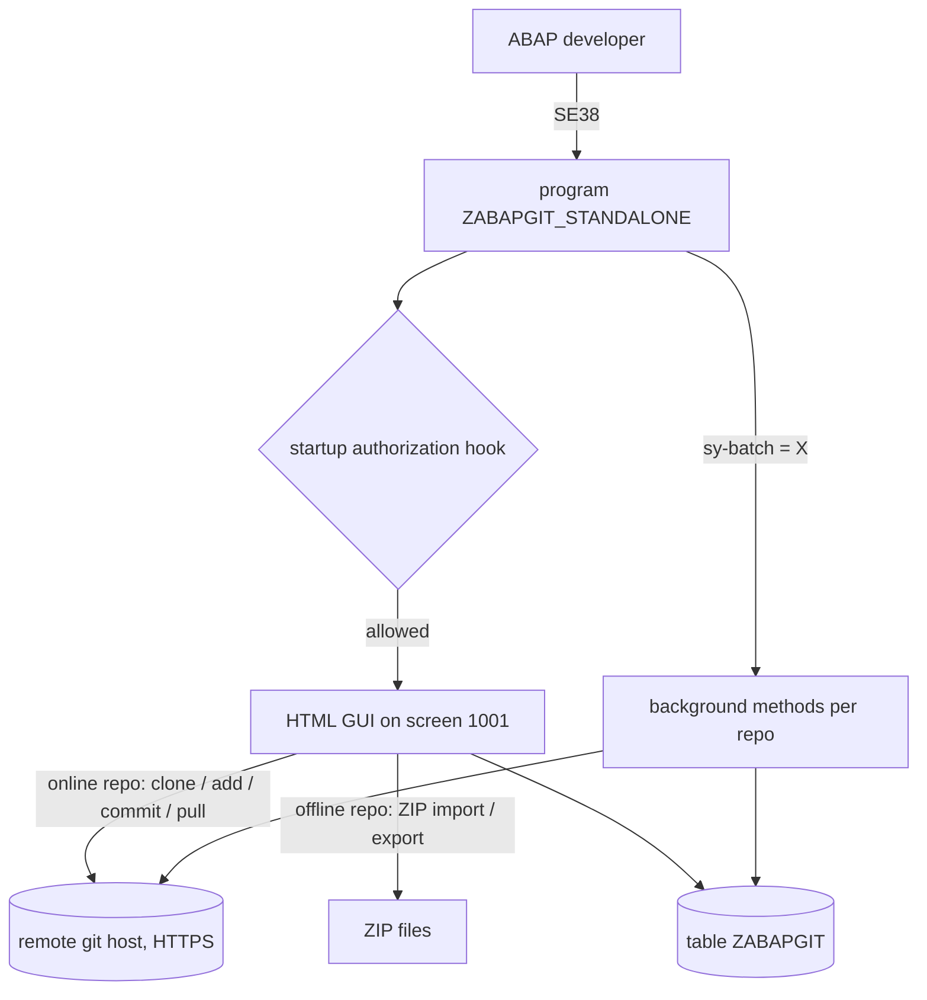

# Process - abapGit standalone - offline installation and usage of the ABAP git client

## Process summary

The process is git-based version control of ABAP development objects: abapGit links
SAP packages to git repositories, serializes objects to plain-text files and back, and
distributes them across systems with review before import - a development /
change-management process, not an FI/MM/SD business flow
[VERIFIED: slices/abapgit-standalone-demo/research/2026-07-03-what-is-abapgit.md:15-29].
Scope of the slice: the single-file standalone distribution ZABAPGIT_STANDALONE and
its persistence/exit surface in package ZABAPGIT. Owner: gixsy95github@gmail.com.
Actors: ABAP developers with system access
[VERIFIED: slices/abapgit-standalone-demo/research/2026-07-03-what-is-abapgit.md:20-24].
What comes in: source objects of an SAP package, or repository content from a git host
/ ZIP file; what goes out: serialized plain-text objects pushed/exported, or ABAP
objects created/updated by a pull. In this workspace the process is dormant: the
program is a demo/benchmark fixture, never executed, with no users and no jobs
[VERIFIED: slices/abapgit-standalone-demo/research/2026-07-03-owner-deployment-context.md:16-35].

## End-to-end flow

1. Trigger: an ABAP developer runs the report [[program-ZABAPGIT_STANDALONE]] via SE38
(the standalone version has no transaction of its own)
[VERIFIED: slices/abapgit-standalone-demo/research/2026-07-03-standalone-trigger-se38.md:14-24].
2. Startup: authorization hook, persistence migrations, then the HTML GUI (L1 code
analysis of the anchor page); optional local policies would come from the user-exit
includes, which do not exist in this system
[VERIFIED: slices/abapgit-standalone-demo/research/2026-07-03-owner-deployment-context.md:36-41].
3. Online workflow: create the repository on the git host, clone it in abapGit, then
add objects (committed to the repository), commit local changes and pull remote ones
[VERIFIED: slices/abapgit-standalone-demo/research/2026-07-03-repo-workflows.md:15-25].
4. Offline workflow: for landscapes without internet/SSL, objects move as ZIP uploads
and ZIP exports of the repository content
[VERIFIED: slices/abapgit-standalone-demo/research/2026-07-03-repo-workflows.md:27-40].
5. Persistence: every repository definition, setting and background configuration is
written by the tool itself to [[table-ZABAPGIT]]
[VERIFIED: slices/abapgit-standalone-demo/research/2026-07-03-repo-workflows.md:42-45].
6. Background variant: when the report runs as a job (sy-batch), it executes the
configured background methods (e.g. automatic pull/push) per repository and writes a
classic list log
[VERIFIED: raw/system-library/ZABAPGIT/Source Code Library/Programs/ZABAPGIT_STANDALONE/ZABAPGIT_STANDALONE.prog.abap:152822-152848].
Final outcome: ABAP objects and git repositories kept in sync, with plain-text review
before import into target systems
[VERIFIED: slices/abapgit-standalone-demo/research/2026-07-03-what-is-abapgit.md:15-29].
In this workspace the flow has never been exercised (steps 3-6 never ran)
[VERIFIED: slices/abapgit-standalone-demo/research/2026-07-03-owner-deployment-context.md:30-35].

## Object chain

Package members (anchor + members of the membership, in flow order):

| Step | Object | Role in the flow | Trigger |
|---|---|---|---|
| 1 | [[program-ZABAPGIT_STANDALONE]] | entry-point (single-file abapGit distribution, HTML GUI + background mode) | manual SE38 run; batch job for background mode (none scheduled here) |
| 2 | [[program-ZABAPGIT_AUTHORIZATIONS_EXIT]] | optional authorization hook (INCLUDE IF FOUND; absent in this system) | included at startup if it exists |
| 3 | [[program-ZABAPGIT_USER_EXIT]] | optional general user exit (INCLUDE IF FOUND; absent in this system) | included if it exists |
| 4 | [[program-ZABAPGIT_GUI_PAGES_USEREXIT]] | optional GUI-pages hook (INCLUDE IF FOUND; absent in this system) | included if it exists |
| 5 | [[program-ZABAPGIT_BACKGROUND_USER_EXIT]] | optional background hook (INCLUDE IF FOUND; absent in this system) | included if it exists |
| 6 | [[table-ZABAPGIT]] | persistence (key-value store of repos, settings, background config; empty here) | written by the program during use |

The absence of the four exit includes in this system is stated by the owner
[VERIFIED: slices/abapgit-standalone-demo/research/2026-07-03-owner-deployment-context.md:36-41];
the never-populated persistence likewise
[VERIFIED: slices/abapgit-standalone-demo/research/2026-07-03-owner-deployment-context.md:42-43].
The 16 remaining membership objects (hop 1, role context) are standard SAP touchpoints
of the anchor and are listed in the next section.

## Standard SAP touchpoints

Entry/exit points into the SAP standard (the 16 context objects of the membership,
grouped by function as classified in the L1 dependency analysis of the anchor page):

- Launch and report runtime: transaction SE38 starts the report
  [VERIFIED: slices/abapgit-standalone-demo/research/2026-07-03-standalone-trigger-se38.md:14-24];
  [[program-RSDBRUNT]] and [[program-RSPFPAR]] lend the selection-screen PF-status,
  [[function-module-RS_SET_SELSCREEN_STATUS]] adjusts it, [[structure-SSCRFIELDS]]
  carries the user commands, [[function-module-RPY_DYNPRO_READ]] /
  [[function-module-RPY_DYNPRO_INSERT]] re-generate the dynpro toolbar.
- UI: [[class-CL_GUI_HTML_VIEWER]] (in [[class-CL_GUI_CONTAINER]]) hosts the HTML GUI;
  [[class-CL_SALV_TABLE]] renders OO ALV popups.
- Git transport: [[class-CL_HTTP_CLIENT]] performs the HTTP(S) git protocol (SSL via
  STRUST needed only for online features
  [VERIFIED: slices/abapgit-standalone-demo/research/2026-07-03-standalone-trigger-se38.md:38-48]);
  [[class-CL_HTTP_UTILITY]] parses ADT context parameters.
- Locking/commit: [[function-module-ENQUEUE_EZABAPGIT]] locks the persistence;
  [[function-module-CALL_V1_PING]] / [[function-module-BANK_OBJ_WORKL_RELEASE_LOCKS]]
  are borrowed as dummy update-task calls to release the locks at COMMIT - not a
  functional integration with the banking/V1 modules [INFERRED].
- Repository metadata reads: [[table-TADIR]] (object directory) and [[table-TDEVC]]
  (package attributes).

No standard business transaction, BAPI, IDoc or module customizing is part of the
flow: abapGit operates at development-infrastructure level
[VERIFIED: slices/abapgit-standalone-demo/research/2026-07-03-what-is-abapgit.md:26-29].
Transaction ZABAPGIT exists only when the separate developer version is installed
(not the case here)
[VERIFIED: slices/abapgit-standalone-demo/research/2026-07-03-standalone-trigger-se38.md:26-36]
[VERIFIED: slices/abapgit-standalone-demo/research/2026-07-03-owner-deployment-context.md:36-41].

## Variants and exceptions

- Online vs offline repositories: the online workflow talks HTTPS to a git host
  (clone/add/commit/pull)
  [VERIFIED: slices/abapgit-standalone-demo/research/2026-07-03-repo-workflows.md:15-25];
  the offline workflow exchanges ZIP files for air-gapped or SSL-less landscapes
  [VERIFIED: slices/abapgit-standalone-demo/research/2026-07-03-repo-workflows.md:27-40].
- Interactive vs background: run as a job, the report processes the configured
  background methods per repository instead of opening the GUI, logging to the classic
  list; when another instance holds the lock it writes a conflict message and stops,
  and with no configuration it writes 'Nothing configured'
  [VERIFIED: raw/system-library/ZABAPGIT/Source Code Library/Programs/ZABAPGIT_STANDALONE/ZABAPGIT_STANDALONE.prog.abap:151583-151633].
- Emergency database-utility mode: SPA/GPA parameter DBT = 'ZABAPGIT' opens the GUI
  directly on the persistence-repair page
  [VERIFIED: raw/system-library/ZABAPGIT/Source Code Library/Programs/ZABAPGIT_STANDALONE/ZABAPGIT_STANDALONE.prog.abap:152822-152848].
- Error handling (L1 anchor page): startup exceptions become type-E messages;
  background per-repo exceptions are logged and listed instead of aborting the job.

## Open points (process)

None open: all 13 gaps of the slice are auto-answered (no expert questionnaire was
needed). Three background topics remain [INFERRED] pending a read-only system check
(MCP unavailable in this benchmark): ZABAPGIT TYPE-value catalog, update-task
lock-release rationale, upstream default startup authorization. They do not block the
understanding of the flow.

## Process sources

Slice manifest: slices/abapgit-standalone-demo/manifest.yaml (owner
gixsy95github@gmail.com); membership: slices/abapgit-standalone-demo/membership.md
(22 objects, 1 rich target). Evidence used (slices/abapgit-standalone-demo/research/,
dated 2026-07-03): what-is-abapgit, standalone-trigger-se38, repo-workflows,
owner-deployment-context (verbatim owner statement of 2026-07-02),
wiki-version-and-persistence, abapgit-standard-knowledge ([INFERRED] only). No expert
answers (inputs/expert-answers/ empty). Functional doc of the member:
output/l2/abapgit-standalone-demo/functional/program-ZABAPGIT_STANDALONE.yaml.
L2 gate verdict (Check C): pending, abap-functional-gate in a separate session.
Owner sign-off: pending the slice L2-complete declaration.

## User notes

<!-- Manual notes: never overwritten by the agent. -->

<!-- user-notes-end -->

<!-- ingest-history -->
- 2026-07-03 | L2 | process doc + gate ACCEPT (slice abapgit-standalone-demo)
