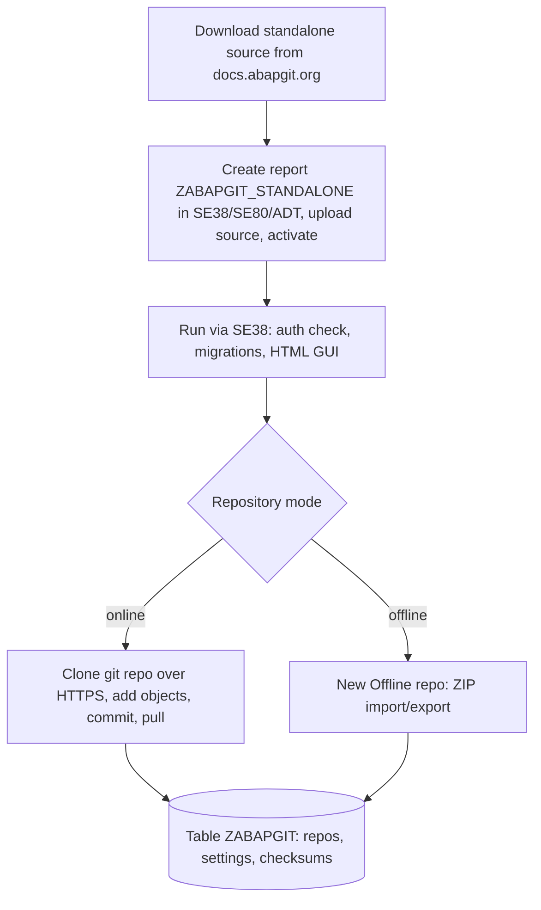

# Process - abapGit standalone - offline installation and usage of the ABAP git client

## Process summary

The slice documents "abapGit standalone - offline installation and usage of
the ABAP git client": how a development team obtains the single-file abapGit
report, installs it via an SE38 source upload, and uses it to manage ABAP
packages as git repositories, with focus on the offline (ZIP) mode
[VERIFIED: raw/docs/02-install-standalone.md:29-34]
[VERIFIED: raw/docs/04-offline-projects.md:14-16]. The actors are ABAP
developers with system access; there is no business-department end user
[VERIFIED: raw/docs/01-what-is-abapgit.md:19-20]. Owner of the slice:
gixsy95github@gmail.com (slice manifest). What comes in: the upstream source
file and, in real use, git repositories or ZIP archives; what goes out:
serialized ABAP objects under version control and ZIP exports
[VERIFIED: raw/docs/04-offline-projects.md:37-39]. In this installation the
process was never exercised beyond the download step: the snapshot is the
input of a public demo/benchmark of the wiki pipeline, never executed or
scheduled
[VERIFIED: slices/abapgit-standalone-demo/inputs/expert-answers/2026-07-03-owner-demo-context.md:17-21].

## End-to-end flow

Documented flow by design (in this installation it stops after step 1 - see
"Variants and exceptions"):

1. A developer downloads the standalone ABAP source from the official site /
   GitHub repository [VERIFIED: raw/docs/02-install-standalone.md:29-34]. In
   this installation this is the only step that ever happened: the owner
   downloaded the snapshot (abapGit 1.133.0) on 2026-07-02 as the input of a
   public demo/benchmark
   [VERIFIED: slices/abapgit-standalone-demo/inputs/expert-answers/2026-07-03-owner-demo-context.md:17].
2. Installation: create report [[program-ZABAPGIT_STANDALONE]] with
   SE38/SE80/ADT, upload the downloaded file, activate, then run it via
   transaction SE38 [VERIFIED: raw/docs/02-install-standalone.md:29-34].
3. First run: the report checks startup authorization, runs the data
   migrations - which auto-create DB table [[table-ZABAPGIT]] - and opens the
   HTML GUI
   [VERIFIED: slices/abapgit-standalone-demo/research/2026-07-03-wiki-functional-semantics.md:26-30].
   At startup the four optional user-exit includes would be picked up via
   INCLUDE ... IF FOUND; none exists in this snapshot, so no customer exit
   logic is active
   [VERIFIED: slices/abapgit-standalone-demo/research/2026-07-03-workspace-fixture-inventory.md:28-32].
4. Online repository work: create the repository on GitHub, clone it into
   abapGit [VERIFIED: raw/docs/03-first-online-project.md:14-17]; added
   objects are committed to the repository
   [VERIFIED: raw/docs/03-first-online-project.md:21-23]; when the remote
   receives updates, the changes must be pulled before new objects can be
   changed or added [VERIFIED: raw/docs/03-first-online-project.md:32-35].
5. Offline repository work: create a "New Offline" repository on a dedicated
   SAP package (best practice: one new package per repository), import
   objects through ZIP uploads and export repository content as ZIP files
   for distribution or backup [VERIFIED: raw/docs/04-offline-projects.md:27-33]
   [VERIFIED: raw/docs/04-offline-projects.md:37-39].
6. All repository state (repo metadata, settings, checksums, user
   preferences) persists in table [[table-ZABAPGIT]] in the seven TYPE
   categories
   [VERIFIED: slices/abapgit-standalone-demo/research/2026-07-03-wiki-functional-semantics.md:16-21].
7. Optional paths of the same report: sy-batch background mode for scheduled
   pull/push jobs and the SPA/GPA 'DBT' emergency DB-utility mode
   [VERIFIED: slices/abapgit-standalone-demo/research/2026-07-03-trigger-standalone-se38.md:30-35]
   [VERIFIED: slices/abapgit-standalone-demo/research/2026-07-03-wiki-functional-semantics.md:22-25].

## Object chain

Slice members in flow order (consistent with
slices/abapgit-standalone-demo/membership.md: 1 anchor + 5 members; the
standard context objects of hop 1 are covered under "Standard SAP
touchpoints"):

| Step | Object | Role in the flow | Trigger |
|---|---|---|---|
| 1 | [[program-ZABAPGIT_STANDALONE]] | entry-point - the whole abapGit client merged into one report (anchor, rich target) | Interactive SE38 launch by a developer [VERIFIED: raw/docs/02-install-standalone.md:20-21]; never executed in this installation [VERIFIED: slices/abapgit-standalone-demo/inputs/expert-answers/2026-07-03-owner-demo-context.md:21] |
| 2 | [[program-ZABAPGIT_AUTHORIZATIONS_EXIT]] | optional startup-authorization exit include (absent in this snapshot) | INCLUDE ... IF FOUND at startup [VERIFIED: slices/abapgit-standalone-demo/research/2026-07-03-workspace-fixture-inventory.md:28-32] |
| 3 | [[program-ZABAPGIT_USER_EXIT]] | optional general user-exit include (absent in this snapshot) | INCLUDE ... IF FOUND [VERIFIED: slices/abapgit-standalone-demo/research/2026-07-03-workspace-fixture-inventory.md:28-32] |
| 4 | [[program-ZABAPGIT_BACKGROUND_USER_EXIT]] | optional background-mode exit include (absent in this snapshot) | INCLUDE ... IF FOUND [VERIFIED: slices/abapgit-standalone-demo/research/2026-07-03-workspace-fixture-inventory.md:28-32] |
| 5 | [[program-ZABAPGIT_GUI_PAGES_USEREXIT]] | optional GUI-pages exit include (absent in this snapshot) | INCLUDE ... IF FOUND [VERIFIED: slices/abapgit-standalone-demo/research/2026-07-03-workspace-fixture-inventory.md:28-32] |
| 6 | [[table-ZABAPGIT]] | persistence table (repos, settings, checksums, user preferences); does not exist in this snapshot | Auto-created by the first-run migration; only read/written by the report itself [VERIFIED: slices/abapgit-standalone-demo/research/2026-07-03-wiki-functional-semantics.md:42-47] [VERIFIED: slices/abapgit-standalone-demo/research/2026-07-03-workspace-fixture-inventory.md:37-41] |

## Standard SAP touchpoints

- **Launch and UI**: transaction SE38 starts the report
  [VERIFIED: raw/docs/02-install-standalone.md:20-21]; the tool works best
  with SAP GUI for Windows [VERIFIED: raw/docs/02-install-standalone.md:14-16].
  The UI is rendered as HTML in CL_GUI_HTML_VIEWER hosted on a dummy
  selection screen (from the L1 code analysis of the anchor page, sections
  "Modes" and "External dependencies"). [INFERRED]
- **Transport system (CTS)**: abapGit is a complement, not a replacement -
  plain-text repositories allow code review unlike transport files, and
  inside transportable packages the merged code still registers changes with
  CTS via RS_CORR_INSERT
  [VERIFIED: slices/abapgit-standalone-demo/research/2026-07-03-purpose-what-is-abapgit.md:36-40].
- **Git transport**: online repositories use HTTP(S) via the standard HTTP
  client; SSL setup (Basis/STRUST) is needed for the online features, and
  SAP BASIS 702 or higher is required
  [VERIFIED: raw/docs/02-install-standalone.md:14-16]. The HTTP client
  classes (CL_HTTP_CLIENT / IF_HTTP_CLIENT) come from the L1 dependency
  analysis of the anchor page. [INFERRED]
- **DDIC runtime creation**: the first-run migration auto-creates table
  ZABAPGIT
  [VERIFIED: slices/abapgit-standalone-demo/research/2026-07-03-wiki-functional-semantics.md:26-30];
  the L1 page anchors this on DDIF_TABL_PUT / DDIF_TABL_ACTIVATE. [INFERRED]
- **Dictionary and directory reads**: the merged library reads standard
  tables TADIR, TDEVC, REPOSRC, E070, DD02L, T100, CVERS and TSTC for object
  directory, package and metadata lookups (from the L1 section "External
  dependencies" of the anchor page). [INFERRED]
- **Locking and LUW**: persistence writes are guarded by the generated
  enqueue FM ENQUEUE_EZABAPGIT plus a dummy update-task FM that binds the
  lock lifetime to the caller's LUW
  [VERIFIED: slices/abapgit-standalone-demo/research/2026-07-03-wiki-lock-update-task-rule.md:30-33].

## Variants and exceptions

- **Online vs offline repositories**: online git over HTTP(S) requires
  connectivity and SSL; offline ZIP-based repositories serve systems without
  internet access, environments without SSL, air-gapped landscapes and
  strict network security policies
  [VERIFIED: slices/abapgit-standalone-demo/research/2026-07-03-usage-online-offline-projects.md:37-41]
  [VERIFIED: raw/docs/04-offline-projects.md:20-23].
- **Background mode**: with sy-batch set, the report delegates to the
  background processing class for scheduled pull/push jobs (optional mode of
  the same report)
  [VERIFIED: slices/abapgit-standalone-demo/research/2026-07-03-trigger-standalone-se38.md:30-35].
- **Emergency DB mode**: SPA/GPA parameter 'DBT' = 'ZABAPGIT' opens the
  persistence DB utility directly, bypassing the HTML GUI, for repair of
  abapGit's own persistence
  [VERIFIED: slices/abapgit-standalone-demo/research/2026-07-03-wiki-functional-semantics.md:36-40].
- **In this installation**: none of the branches was ever exercised - the
  program was never executed or scheduled
  [VERIFIED: slices/abapgit-standalone-demo/inputs/expert-answers/2026-07-03-owner-demo-context.md:21];
  the snapshot is refreshed manually by the owner, with no scheduled upgrade
  policy
  [VERIFIED: slices/abapgit-standalone-demo/inputs/expert-answers/2026-07-03-owner-demo-context.md:25].

## Open points (process)

- Which git server(s), proxy or SSL identity a real installation would
  connect to is a runtime setting not visible in the code or in the docs
  snapshots [UNVERIFIABLE]; moot in this installation (never executed, no
  connectivity configured - owner answer of 2026-07-03).
- The direct job-table proof (TBTCO/TBTCP query via MCP) for "never
  scheduled" is not available in this environment; the statement rests on
  the owner's expert answer of 2026-07-03. [INFERRED]

## Process sources

- Slice manifest: slices/abapgit-standalone-demo/manifest.yaml (owner
  gixsy95github@gmail.com); membership:
  slices/abapgit-standalone-demo/membership.md (32 objects, 1 rich target).
- Expert answer (repository owner, 2026-07-03):
  slices/abapgit-standalone-demo/inputs/expert-answers/2026-07-03-owner-demo-context.md.
- Owner statement of 2026-07-02 recorded by the L2 researcher:
  slices/abapgit-standalone-demo/research/2026-07-02-owner-deployment-context.md.
- Auto-research evidence of 2026-07-03 under
  slices/abapgit-standalone-demo/research/ (purpose, trigger, usage modes,
  version identity, functional semantics, lock rule, fixture inventory).
- Official abapGit documentation snapshots (docs.abapgit.org, fetched
  2026-07-02, MIT license): raw/docs/01-what-is-abapgit.md through
  raw/docs/04-offline-projects.md.
- Functional synthesis of the anchor object:
  output/l2/abapgit-standalone-demo/functional/program-ZABAPGIT_STANDALONE.yaml
  (the slice's only rich target); L1 page of the anchor as non-citable code
  anchor. L2 gate verdict (Check C): pending, produced by
  abap-functional-gate in a separate session.

## User notes

<!-- Manual notes: never overwritten by the agent. -->

<!-- user-notes-end -->

<!-- ingest-history -->
- 2026-07-03 | L2 | process doc + gate ACCEPT (slice abapgit-standalone-demo)
