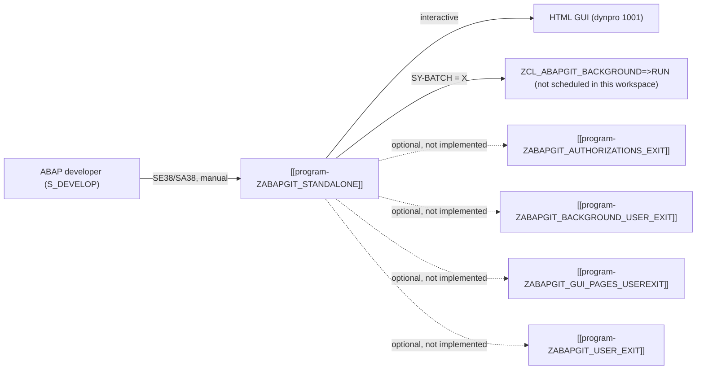

# Process - abapGit standalone - offline installation and usage of the ABAP git client

## Process summary

This slice covers a single custom object, program ZABAPGIT_STANDALONE: the vendored,
single-file "standalone" distribution of the open-source abapGit Git client (MIT
licence, release 1.133.0).
[VERIFIED: slices/abapgit-standalone-demo/research/2026-07-03-e1-abapgit-purpose.md:17-24]
Owner: repository owner (gixsy95github@gmail.com), acting as business/developer/basis
expert for this slice. In this workspace the object is not a productive installation: it
is a public demo/benchmark fixture used to exercise the abap_wiki L0/L1/L2 ingest
pipeline on a large, real-world ABAP program; it is not part of any ACME business
process and is never actually executed here.
[VERIFIED: slices/abapgit-standalone-demo/inputs/expert-answers/2026-07-03-owner-demo-context.md:17]
In a real installation, the process input is a manual SE38 launch by an ABAP developer
and the output is a Git-synchronized (or Git-sourced) set of ABAP development objects in
a package.

## End-to-end flow

In a real installation, the flow is: an ABAP developer holding S_DEVELOP authorization
launches ZABAPGIT_STANDALONE via SE38/SA38 (no dedicated transaction exists for it);
startup is gated by the tool's own ZCL_ABAPGIT_AUTH=>IS_ALLOWED check; the tool then
opens its HTML-rendered GUI (interactive mode) or, if run in background (SY-BATCH),
delegates the whole run to ZCL_ABAPGIT_BACKGROUND=>RUN for unattended pulls.
[VERIFIED: slices/abapgit-standalone-demo/research/2026-07-03-e2-standalone-install-trigger.md:19-21]
[VERIFIED: slices/abapgit-standalone-demo/research/2026-07-03-e3-l1-page-actor-integration.md:23-25]
From there the developer can pull a Git-tracked repository of ABAP objects into a
package, push local changes back to a Git remote, or browse/stage/diff object status.
Four optional customer-exit include stubs (object_chain steps 2-5 below) are the tool's
only extension points toward customer-specific logic, but none of them has actually been
implemented in this system.
[VERIFIED: slices/abapgit-standalone-demo/research/2026-07-03-e3-l1-page-actor-integration.md:52-58]

In THIS benchmark workspace specifically, none of the above is actually exercised: the
"flow" is limited to the object existing as a static source-code snapshot that is fed as
input into the abap_wiki L0 -> L1 -> L2 documentation pipeline itself; no job is
scheduled and no interactive session was run against it here.
[VERIFIED: slices/abapgit-standalone-demo/inputs/expert-answers/2026-07-03-owner-demo-context.md:21]

## Object chain

| Step | Object | Role in the flow | Trigger |
|---|---|---|---|
| 1 | [[program-ZABAPGIT_STANDALONE]] | entry-point: single-file abapGit tool | manual SE38/SA38 execution by an ABAP developer (dormant/never executed in this demo workspace) |
| 2 | [[program-ZABAPGIT_AUTHORIZATIONS_EXIT]] | optional customer-exit include (authorization hook), never implemented in this system (doc_level L0) | called by ZABAPGIT_STANDALONE via `IF FOUND`, only if present |
| 3 | [[program-ZABAPGIT_BACKGROUND_USER_EXIT]] | optional customer-exit include (background-mode hook), never implemented in this system (doc_level L0) | called by ZABAPGIT_STANDALONE via `IF FOUND`, only if present |
| 4 | [[program-ZABAPGIT_GUI_PAGES_USEREXIT]] | optional customer-exit include (GUI-pages hook), never implemented in this system (doc_level L0) | called by ZABAPGIT_STANDALONE via `IF FOUND`, only if present |
| 5 | [[program-ZABAPGIT_USER_EXIT]] | optional customer-exit include (general hook), never implemented in this system (doc_level L0) | called by ZABAPGIT_STANDALONE via `IF FOUND`, only if present |

Consistent with `slices/abapgit-standalone-demo/membership.md`: step 1 is the hop-0
anchor/rich_target; steps 2-5 are the hop-1 objects marked role `member`. All remaining
hop-1 objects (standard tables/FMs/classes/transactions/interfaces) are marked role
`context` in the membership view and are not process steps in their own right -- they are
standard SAP building blocks reused internally by step 1 (see "Standard SAP
touchpoints").

## Standard SAP touchpoints

Only the standalone flavour of abapGit is installed in this landscape: no transaction
ZABAPGIT (the multi-object "developer version" entry point) and no separate
ZCL_ABAPGIT_* Z-class objects exist anywhere in the workspace; devclass ZABAPGIT contains
exactly the entry-point program plus the 4 not-yet-implemented customer-exit stubs listed
in the object chain.
[VERIFIED: slices/abapgit-standalone-demo/research/2026-07-03-e2-standalone-install-trigger.md:44-53]
[VERIFIED: slices/abapgit-standalone-demo/research/2026-07-03-e3-l1-page-actor-integration.md:52-58]
Actors are ABAP developers holding S_DEVELOP authorization, with S_OA2C_ADM (OAuth2
client administration) relevant for some Git remote authentication flows -- a
development-facing population, not an end-business one.
[VERIFIED: slices/abapgit-standalone-demo/research/2026-07-03-e3-l1-page-actor-integration.md:23-25]
The entry-point program's own package placement (devclass ZABAPGIT, Z namespace,
transportable) deviates from the upstream recommendation of a local $ package; in this
workspace the deviation is a synthetic demo-harness fixture (ZABAPGIT package and its
single-row TADIR entry generated to exercise the pipeline's package-layout handling), not
a transport-governance decision.
[VERIFIED: slices/abapgit-standalone-demo/research/2026-07-03-e4-package-anomaly.md:14-24]
[VERIFIED: slices/abapgit-standalone-demo/inputs/expert-answers/2026-07-03-owner-demo-context.md:25]

## Open points (process)

Three gaps were sent to the owner (gixsy95github@gmail.com) on 2026-07-02 via the slice
questionnaire and remain unanswered as of 2026-07-03; none is blocking for understanding
the overall flow/purpose of the slice (already [VERIFIED]):
- abapgit-standalone-demo-g008 [BUSINESS-RULE]: whether the DBT emergency
  database-utility mode is a known/tested recovery path for this system's team.
- abapgit-standalone-demo-g009 [BUSINESS-RULE]: whether SAP Note 2159455 (SY-TCODE
  workaround, BUG-001 on the object's L1 page) is still applicable on this system's
  current release.
- abapgit-standalone-demo-g010 [DATA-LIFECYCLE]: how/where a real installation of this
  build would persist its own configuration (repositories, credentials, settings) across
  sessions.

## Process sources

Slice manifest: slices/abapgit-standalone-demo/manifest.yaml (owner
gixsy95github@gmail.com, single anchor program-ZABAPGIT_STANDALONE). Membership view:
slices/abapgit-standalone-demo/membership.md (26 objects, 1 rich_target). Auto-research
evidence: slices/abapgit-standalone-demo/research/2026-07-03-e1-abapgit-purpose.md,
2026-07-03-e2-standalone-install-trigger.md, 2026-07-03-e3-l1-page-actor-integration.md,
2026-07-03-e4-package-anomaly.md. Expert answer: repository owner
(gixsy95github@gmail.com), 2026-07-03,
slices/abapgit-standalone-demo/inputs/expert-answers/2026-07-03-owner-demo-context.md.
Slice questionnaire sent 2026-07-02
(slices/abapgit-standalone-demo/interviews/2026-07-02-abapgit-standalone-demo-all.md);
gaps g008/g009/g010 still open as of 2026-07-03. Functional document of the slice's only
rich_target member: output/l2/abapgit-standalone-demo/functional/program-ZABAPGIT_STANDALONE.yaml
(this synthesis is consistent with it by construction, same author pass). No owner
sign-off (expert answer of type `clarification` declaring the slice L2-complete) has been
recorded yet.

## User notes

<!-- Manual notes: never overwritten by the agent. -->

<!-- user-notes-end -->

<!-- ingest-history -->
- 2026-07-03 | L2 | process doc + gate ACCEPT (slice abapgit-standalone-demo)
