# Process - abapGit standalone - offline installation and usage of the ABAP git client

## Process summary

The abapgit-standalone-demo slice does NOT model an ACME business process. Per the
owner (gixsy95github@gmail.com), it exists to benchmark/demonstrate the abap_wiki
L0->L1->L2 knowledge-base pipeline itself, using a single large, real-world,
MIT-licensed open-source ABAP program (the abapGit standalone build,
program-ZABAPGIT_STANDALONE, upstream abapGit core version 1.133.0, snapshot fetched
2026-07-02) as ingest input
[VERIFIED: slices/abapgit-standalone-demo/inputs/expert-answers/2026-07-03-owner-demo-context.md:17-19].
Scope: one rich_target object ([[program-ZABAPGIT_STANDALONE]], the slice's sole
anchor); the other 37 slice members discovered by the hop<=2 dependency BFS are either
standard SAP context objects (classes, function modules, interfaces, tables) consumed by
the vendored code, or four dependency-derived customer-exit-include stub placeholders
that do not exist as real objects in this workspace
[VERIFIED: slices/abapgit-standalone-demo/research/2026-07-03-no-customer-exits-implemented.md:20-73].
What comes in: the static vendored source snapshot. What goes out: the L1 code analysis
and this L2 functional/process synthesis, produced and consumed entirely by the wiki
pipeline itself -- the program is never installed or executed against a live SAP system
in this context
[VERIFIED: slices/abapgit-standalone-demo/inputs/expert-answers/2026-07-03-owner-demo-context.md:21-23].
Owner: gixsy95github@gmail.com (business/developer/basis roles all held by the same
demo-repository owner).

## End-to-end flow

Because the object is never executed in this context, there is no live business flow to
trace. The actual "process" that occurred in this slice is the knowledge-base ingest
pipeline itself processing the vendored source as input:

```mermaid
flowchart LR
    A["Official abapGit source\n(docs.abapgit.org, v1.133.0)"] -->|downloaded 2026-07-02| B["raw/ snapshot"]
    B -->|L0 TADIR import| C["[[program-ZABAPGIT_STANDALONE]] stub"]
    C -->|"L1: abap-analyzer + adversarial gate"| D["L1 code analysis (inline page)"]
    D -->|slice-init / research-l2| E["Gaps + auto-research evidence (6 files)"]
    E -->|owner clarification 2026-07-03| F["Expert answer (demo-context)"]
    F -->|"L2 Phase 4: functional synthesis"| G["functional.yaml / process.yaml (this artifact)"]
```

For context only -- NOT exercised in this demo slice -- the vendored object's own L1
code analysis documents two internal operating modes it would run under if installed
productively: an interactive dialog mode (hosts abapGit's HTML application inside SAPGUI)
and a background/batch mode (`zcl_abapgit_background=>run`, single-instance-guarded via
the `EZABAPGIT` enqueue lock). Neither mode is entered here, since the program source is
read by the pipeline but never activated/run
[VERIFIED: slices/abapgit-standalone-demo/inputs/expert-answers/2026-07-03-owner-demo-context.md:21-23].

## Object chain

| Step | Object | Role | Trigger |
|---|---|---|---|
| 1 | [[program-ZABAPGIT_STANDALONE]] | entry-point / sole slice member (rich_target) | not triggered in this demo context -- static ingest input only [VERIFIED: slices/abapgit-standalone-demo/inputs/expert-answers/2026-07-03-owner-demo-context.md:21-23]; the officially documented standard trigger, if ever installed productively, is direct interactive execution via transaction SE38 [VERIFIED: slices/abapgit-standalone-demo/research/2026-07-03-standalone-vs-developer-version.md:21-35] |

This single-row chain is consistent with `slices/abapgit-standalone-demo/membership.md`,
which flags exactly one object (program-ZABAPGIT_STANDALONE) as `rich_target`. The
remaining 37 hop<=1 members listed there are `context` (standard SAP classes/function
modules/interfaces/tables consumed by the vendored code) or non-existent
dependency-derived stubs for the four unused customer-exit includes -- they are not
separate steps in an ACME process flow, only technical dependencies of the single
entry-point object.

## Standard SAP touchpoints

Launch mechanism: the officially documented, standard way to start a "standalone
version" abapGit build is direct interactive execution via transaction SE38, with no
dedicated custom transaction code created by the install procedure
[VERIFIED: slices/abapgit-standalone-demo/research/2026-07-03-standalone-vs-developer-version.md:21-35].

Git-remote transport: two standard transport mechanisms are core, always-present
capabilities of the vendored codebase -- an HTTP-client-based online path
(IF_HTTP_CLIENT / CL_HTTP_CLIENT=>CREATE_BY_URL) and a ZIP-based offline path
(CL_ABAP_ZIP), the latter recommended by the official docs for air-gapped/SSL-restricted
landscapes
[VERIFIED: slices/abapgit-standalone-demo/research/2026-07-03-online-vs-offline-modes.md:9-26].

Standard SAP building blocks used by the vendored object-serialization framework (per
the L1 code analysis of program-ZABAPGIT_STANDALONE, used here to anchor technical facts,
not re-cited as [VERIFIED: ...]): BAPI_USER_GET_DETAIL for git-author metadata, and the
TADIR/E070/TDEVC/DD02L/CVERS/DOKIL/REPOSRC/USR21/T000 dictionary/transport tables for
object registration, versioning and namespace handling.

Package/transport governance: the slice's object sits in the transportable Z-namespace
package ZABAPGIT rather than the documented local, non-transportable $ package -- a
verified deviation from official best practice
[VERIFIED: slices/abapgit-standalone-demo/research/2026-07-03-package-deviation-from-recommended-practice.md:9-29],
but the owner confirms it is a synthetic demo-harness fixture, not a real ACME
transport-governance touchpoint
[VERIFIED: slices/abapgit-standalone-demo/inputs/expert-answers/2026-07-03-owner-demo-context.md:29-31].

None of these touchpoints is actually exercised against a live system in this demo slice
[VERIFIED: slices/abapgit-standalone-demo/inputs/expert-answers/2026-07-03-owner-demo-context.md:21-23].

## Variants and exceptions

Two internal execution-mode variants are built into the vendored code (documented by the
object's own L1 code analysis): interactive dialog mode (hosts abapGit's HTML UI inside
SAPGUI) and background/batch mode (`zcl_abapgit_background=>run`). Two internal
transport-mode variants are likewise built in: online (git-remote HTTP(S)) versus offline
(ZIP import/export)
[VERIFIED: slices/abapgit-standalone-demo/research/2026-07-03-online-vs-offline-modes.md:9-26].
None of these variants is exercised in this demo context: the program is never run, so no
execution-mode or transport-mode choice is actually made here
[VERIFIED: slices/abapgit-standalone-demo/inputs/expert-answers/2026-07-03-owner-demo-context.md:21-23].

## Open points (process)

Two load-bearing gaps remain open (status "asked", not yet answered) as of 2026-07-02,
both inherited unchanged from the sole member's functional analysis
(program-ZABAPGIT_STANDALONE):

1. BUSINESS-RULE (gap abapgit-standalone-demo-g006): is the per-object COMMIT WORK
   inside the bulk package/repo delete loop (L1 finding BUG-001) a deliberate
   partial-progress design choice, or should it be batched/made transactional?
   [UNVERIFIABLE] -- asked to the owner (gixsy95github@gmail.com) on 2026-07-02.
2. BUSINESS-RULE (gap abapgit-standalone-demo-g011): what does the "emergency
   DB-utility" mode (SPA/GPA parameter DBT = 'ZABAPGIT', FORM open_gui) actually expose,
   and who is expected to use it? [UNVERIFIABLE] -- asked to the owner
   (gixsy95github@gmail.com) on 2026-07-02.

Neither gap blocks the demo-scope understanding of the process established above.

## Process sources

Slice manifest: slices/abapgit-standalone-demo/manifest.yaml (owner
gixsy95github@gmail.com, single anchor program-ZABAPGIT_STANDALONE, status draft).
Slice membership (derived view): slices/abapgit-standalone-demo/membership.md.
Gap ledger: slices/abapgit-standalone-demo/gaps.yaml (12 gaps: 5 auto-answered, 5
answered by the owner, 2 still asked/open).

Expert answer of 2026-07-03 (owner):
slices/abapgit-standalone-demo/inputs/expert-answers/2026-07-03-owner-demo-context.md.

Auto-research evidence (all dated 2026-07-03):
slices/abapgit-standalone-demo/research/2026-07-03-standalone-vs-developer-version.md;
slices/abapgit-standalone-demo/research/2026-07-03-no-customer-exits-implemented.md;
slices/abapgit-standalone-demo/research/2026-07-03-package-deviation-from-recommended-practice.md;
slices/abapgit-standalone-demo/research/2026-07-03-online-vs-offline-modes.md;
slices/abapgit-standalone-demo/research/2026-07-03-ezabapgit-lock-object-standard-knowledge.md;
slices/abapgit-standalone-demo/research/2026-07-03-credential-lifecycle-standard-knowledge.md.

Functional document of the slice's sole rich_target member:
output/l2/abapgit-standalone-demo/functional/program-ZABAPGIT_STANDALONE.yaml (materializes
inline into wiki/ZABAPGIT/program-ZABAPGIT_STANDALONE.md on ACCEPT + apply-l2).

L1 code analysis of the same page (context only, not cited as [VERIFIED: ...]):
wiki/ZABAPGIT/program-ZABAPGIT_STANDALONE.md.

Two load-bearing gaps (g006, g011) remain "asked"/open as of 2026-07-02 -- see
process_open_points above. Owner sign-off on slice L2-completeness is pending a
clarification expert-answer covering these two gaps.

## User notes

<!-- Manual notes: never overwritten by the agent. -->

<!-- user-notes-end -->

<!-- ingest-history -->
- 2026-07-03 | L2 | process doc + gate ACCEPT (slice abapgit-standalone-demo)
