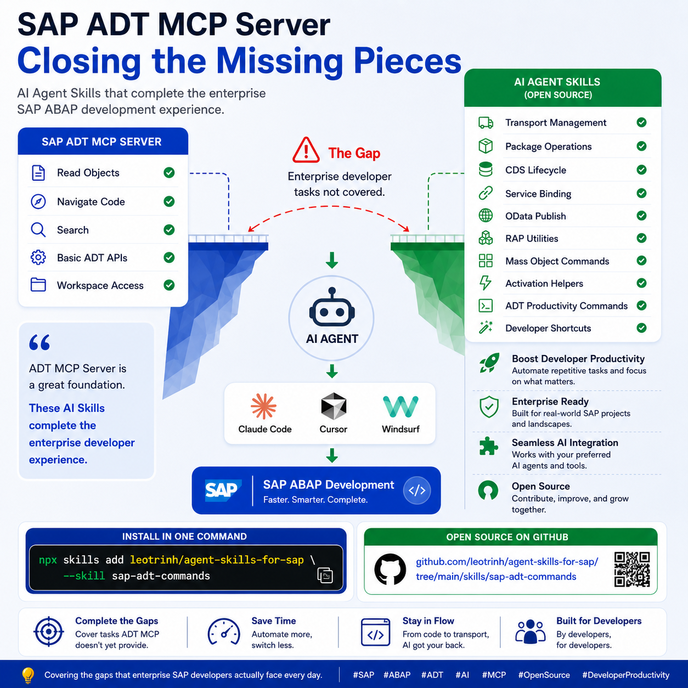

# SAP ADT Commands

Command-line client for SAP ABAP Development Tools (ADT) REST services,
packaged as an Agent Skill. Use it to script ABAP repository operations that
existing MCP tooling does not cover: repository search, object creation,
message-class and text-element maintenance, transport lifecycle, and quality
checks.


> [!IMPORTANT]
> This is part of an independent community project. It is not affiliated
> with, sponsored by, or endorsed by SAP SE.

## Overview

The skill ships a single supported entry point:

- `scripts/adt-client.py` — Python source (authoritative).

A PyInstaller spec (`scripts/adt-client.spec`) is included as a contributor
build configuration for anyone who wants to package a local executable for
their own use. No prebuilt executable is distributed from the default
branch.

Every command returns JSON on stdout, so results can be composed into
subsequent commands, tests, or dashboards.

The primary consumer is an AI agent that has this skill installed. The
`SKILL.md` file contains the activation criteria, connection model, safety
rules, and links into the reference documentation. Humans can read `SKILL.md`
too, but the material below is optimized for human onboarding.

## Use Cases

Use this skill when:

- You need to browse or inspect an SAP ABAP repository outside SAP GUI or
  Eclipse ADT (for example, from a headless CI job or an AI agent).
- The task involves creating, updating, activating, or deleting ABAP
  objects, message classes, or CDS data definitions.
- You want to script transport request creation, movement of objects between
  tasks, or transport contents inspection.
- You want to run ATC or ABAP Unit checks as part of an automated
  workflow.

Do not use this skill when:

- The MCP tooling in your environment already provides the required
  operation. Prefer that.
- You need SAP GUI-only capabilities such as ATC baseline management,
  interactive debugging with breakpoints, or SAP customizing (SM30, SPRO).
- The target system is production and there is no explicit authorization to
  operate against it.

## Supported Command Groups

Each group has a dedicated reference file. Load the specific reference when
you need the full command syntax.

- **Discovery and inspection** —
  [references/command-discovery-and-inspection.md](references/command-discovery-and-inspection.md).
- **Source and object management** —
  [references/command-source-and-object-management.md](references/command-source-and-object-management.md).
- **Message classes and text elements** —
  [references/command-messages-and-text-elements.md](references/command-messages-and-text-elements.md).
- **Quality checks and testing** —
  [references/command-quality-and-testing.md](references/command-quality-and-testing.md).
- **Transports and object lifecycle** —
  [references/command-transports-and-lifecycle.md](references/command-transports-and-lifecycle.md).
- **Troubleshooting** —
  [references/troubleshooting.md](references/troubleshooting.md).
- **Connection and credentials** —
  [references/connection-and-credentials.md](references/connection-and-credentials.md).
- **Development** —
  [references/development.md](references/development.md).

## Installation

### Through the Skills CLI

```bash
# Install everything from this repository
npx skills add leotrinh/agent-skills-for-sap

# Install this skill only
npx skills add leotrinh/agent-skills-for-sap --skill sap-adt-commands
```

Support for the Skills CLI depends on the AI client.

### Manual install

Copy the `skills/sap-adt-commands/` directory into your client's local
skills folder. The exact location depends on the client. Consult your
client's documentation for the target path.

## Python Requirements

- Python 3.10 or newer.
- Packages: `requests`, `urllib3`. Install with
  `pip install -r requirements.txt`.

See [references/development.md](references/development.md) for the
complete setup steps.

## Quick Start

Install the Python dependencies (see
[references/development.md](references/development.md) for a virtualenv
recipe):

```powershell
python -m pip install -r requirements.txt
```

Set up a destination once per SAP system. The URL is not a secret and can
be scripted. The password must be set by the human, not by the agent:

```powershell
setx SAP_DEV_URL "https://sap.example.com:44300"
setx SAP_DEV_DEVELOPER_PWD "<password>"
```

Then run any command against the Python source with `--dest`:

```powershell
python .\scripts\adt-client.py --dest DEV_100_DEVELOPER_EN discovery
python .\scripts\adt-client.py --dest DEV_100_DEVELOPER_EN search "Z*" --type PROG/P
python .\scripts\adt-client.py --dest DEV_100_DEVELOPER_EN object-properties ZEXAMPLE_PROGRAM --type PROG/P
```

## Secure Credential Setup

Credentials must live outside the agent conversation:

- Set `SAP_<SID>_URL` and `SAP_<SID>_<USER>_PWD` with `setx` on Windows or
  an equivalent secret store on other platforms.
- Never paste a password into an AI chat. Never place a password directly on
  a generated command line.
- The client resolves values from process env first, then from
  `HKCU\Environment` in the Windows registry, so `setx` values are usable
  immediately without a re-login.

Full details in
[references/connection-and-credentials.md](references/connection-and-credentials.md).

## Optional Local Executable

No prebuilt executable is shipped from the default branch. Contributors
who want a single-file entry point for their own use may build one locally
with PyInstaller using `scripts/adt-client.spec` — see
[references/development.md](references/development.md) for the exact
command. Locally built binaries are the responsibility of the builder;
they are not code-signed, audited, or supported by this project.

The Python source remains authoritative. Running it directly is the
supported and preferred workflow.

## Safety Model

- Read-only commands are safe to run repeatedly.
- Write commands (`write-source`, `create-*`, `activate`) require a lock,
  a transport for tracked objects, and human authorization.
- Destructive commands (`delete`, `delete-transport`, `unlock`,
  `release-transport`, `move-object`) require explicit, contemporaneous
  human authorization — even if the overall task description implies
  cleanup or deployment.
- The agent never types or transmits an SAP password.

## Limitations

- SAP ADT endpoint availability differs by SAP system, release, and
  configured services. Some commands may return HTTP 404 or 406 on releases
  where the endpoint is not exposed. When this happens, use SAP GUI (SE38,
  SE80, SE01/SE09/SE10, SCI, SM12) instead.
- The client is not a replacement for SAP authorization controls. If your
  user does not have the required ADT authorization objects, the operation
  will fail with HTTP 403.
- Users remain responsible for testing changes in an appropriate
  non-production system before promoting them.
- Only the Python source is distributed. A locally built executable is
  optional and produced by the contributor at their own risk.

## Documentation

- Agent-facing guide: [`SKILL.md`](SKILL.md).
- References: [`references/`](references/).
- Repository-level docs: [`../../README.md`](../../README.md),
  [`../../SECURITY.md`](../../SECURITY.md),
  [`../../CONTRIBUTING.md`](../../CONTRIBUTING.md).

## License

Apache License 2.0. See [`../../LICENSE`](../../LICENSE) for the full text.

---

SAP is a trademark of SAP SE. Use of the SAP name in this documentation does
not imply any affiliation with or endorsement by SAP SE.
