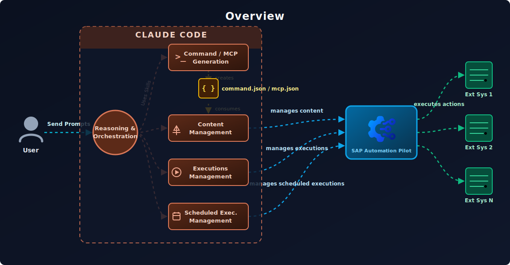

[](https://api.reuse.software/info/github.com/SAP/automation-pilot-agent-skills)

#  SAP Automation Pilot Agent Skills

### The fastest way to build SAP BTP automations — describe what you want, deploy in minutes.

This repository brings **AI-powered development** to [SAP Automation Pilot](https://help.sap.com/docs/automation-pilot). Using [Claude Code](https://claude.ai/code), you can generate production-ready Commands through natural conversation — the AI handles JSON schemas, jq expressions, and best practices while you focus on what to automate. Review code, deploy to your tenant, trigger Executions, and troubleshoot failures — all without leaving your IDE or terminal.



**What makes the difference:**

- **Instant expertise** — SAP's proven patterns and best practices guide every Command you create
- **End-to-end workflow** — From "I need an automation that..." to deployed and running
- **Production quality by default** — Error handling, retry logic, security flags, and validation included automatically
- **Zero context switching** — Generate, review, deploy, trigger, monitor, and troubleshoot in one place

## Table of contents

- [About SAP Automation Pilot](#about-sap-automation-pilot)
- [Why this repository](#why-this-repository)
- [What's included](#whats-included)
- [Getting started](#getting-started)
- [How to use](#how-to-use)
- [Resources](#resources)
- [Support and contributing](#support-and-contributing)
- [License](#license)

## About SAP Automation Pilot

 [SAP Automation Pilot](https://help.sap.com/docs/automation-pilot) is SAP's native automation engine for Business Technology Platform — the control plane for your BTP operations. From routine maintenance to complex incident response, it handles the workflows that keep your landscape running.

Think of it as Infrastructure-as-Code meets workflow automation, purpose-built for SAP BTP. **Commands** define your automations, **Inputs** store credentials and configuration, and **Executions** are running instances you can monitor and troubleshoot.

**What you can automate:**

| Category | Services & Capabilities |
|----------|------------------------|
| **SAP HANA Cloud** | Lifecycle management, updates, mass operations, backups, audit logs, credential rotation |
| **BTP Management** | Subaccount creation, environment setup, entitlements, identity provider configuration |
| **Cloud Foundry** | Apps, services, spaces, routes, mass restart/stop/start, quota notifications, certificate checks |
| **Kubernetes/Kyma** | Deployments, pods, services, jobs, config maps, secrets, script execution via K8s |
| **Neo** | Application lifecycle, auto-scaling, process management |
| **Service Manager** | Instances, bindings, plans, platforms, service keys |
| **SAP Cloud ALM** | Health monitoring, Cloud Connector status, metrics collection |
| **AI Core** | GPT completions, AI model orchestration |
| **Monitoring** | Dynatrace integration, availability checks, alert correlation |
| **DevOps** | GitHub workflows, Jenkins pipelines, JIRA issue management |
| **Notifications** | Email/SMTP, Alert Notification Service (ANS), Slack via webhooks |
| **Security** | XSUAA token management, destination service, credential rotation |
| **Database** | SQL operations, database lifecycle management |
| **Transport** | Cloud Transport Management System (cTMS) operations |
| **HTTP/REST** | Any API with OAuth, basic auth, certificates, Cloud Connector |
| **Scripting** | Bash, Python, Node.js, PowerShell, Terraform with BTP Provider |
| **Utilities** | Data transformation, JSON-to-HTML, parallel execution (ForEach), delays |

## Why this repository

SAP Automation Pilot provides a powerful automation engine with hundreds of built-in Commands and a rich expression language. **This repository amplifies that power with AI-assisted development.**

Think of it as a force multiplier: these skills encode expert-level patterns — Command structures, expression syntax, security requirements, error handling strategies — and apply them automatically as you work. You focus on *what* you want to automate; the AI handles the implementation details.

**Who benefits:**

| You are... | How AI skills help |
|------------|-------------------|
| **Getting started** | Generate your first Command in minutes through natural conversation |
| **Building complex workflows** | Get production-quality Commands with error handling and validation built in |
| **Reviewing team code** | Automated checks for security, naming conventions, and best practices |
| **Operating at scale** | Trigger, monitor, and troubleshoot Executions — all via CLI |
| **Integrating with CI/CD** | API skills plug directly into your automation pipelines |

## What's included

| Skill | Description |
|-------|-------------|
| [**Command Generation**](.claude/skills/automation-pilot-command-generation/SKILL.md) | Create Commands from natural language descriptions using patterns and best practices |
| [**Catalog Explorer**](.claude/skills/automation-pilot-catalog-explorer/SKILL.md) | Discover available Commands and executors in your tenant via API |
| [**Code Review**](.claude/skills/automation-pilot-command-review/SKILL.md) | Validate security, naming conventions, expression sanitization, and best practices |
| [**Content Management API**](.claude/skills/automation-pilot-content-management-via-api/SKILL.md) | Deploy, update, list, and delete Commands, Inputs, and MCP servers via API |
| [**Executions API**](.claude/skills/automation-pilot-executions-api/SKILL.md) | Trigger Commands, monitor status, view logs |
| [**Execution Debugger**](.claude/skills/automation-pilot-debugger/SKILL.md) | Debug failed Executions, error pattern matching, troubleshooting workflows |
| [**Scheduled Executions API**](.claude/skills/automation-pilot-scheduled-executions-api/SKILL.md) | Create and manage recurring Command schedules |
| [**MCP Server Generation**](.claude/skills/automation-pilot-mcp-server-generation/SKILL.md) | Create MCP server definitions to expose Commands as AI assistant tools |
| [**HTTP Executor**](.claude/skills/automation-pilot-executor-httprequest/SKILL.md) | Guidance for HTTP requests with retry, timeout, and error handling |
| [**Script Executor**](.claude/skills/automation-pilot-executor-executescript/SKILL.md) | Guidance for ExecuteScript with Base64 encoding and language wrappers |

## Getting started

### Prerequisites

| Tool | Purpose |
|------|---------|
| [Claude Code](https://claude.ai/code) | Required to use the skills (VS Code extension, CLI, or desktop app) |
| `curl` | API calls to SAP Automation Pilot |
| `jq` | JSON parsing and transformation |

You'll also need an SAP Automation Pilot tenant with API credentials.

### 1. Clone the repository

```bash
git clone https://github.com/SAP/automation-pilot-agent-skills.git
cd automation-pilot-agent-skills
```

### 2. Configure authentication

Create a `.env` file in the repository root:

```bash
# SAP Automation Pilot credentials
export AUTOPI_HOSTNAME='emea.autopilot.cloud.sap'
export AUTOPI_USERNAME='your-tenant-technical-user'
export AUTOPI_PASSWORD='your-password-here'
export AUTOPI_DEFAULT_CATALOG='your-catalog-id'
```

**Important notes:**

- **Use single quotes** for `AUTOPI_PASSWORD` if it contains special characters (`$`, `!`, etc.) to prevent shell expansion
- **Supported hostnames:**
  - `emea.autopilot.cloud.sap` (Europe)
  - `amer.autopilot.cloud.sap` (Americas)
  - `apac.autopilot.cloud.sap` (Asia Pacific)
  - `aus.autopilot.cloud.sap` (Australia)
  - `ksa.autopilot.cloud.sap` (Saudi Arabia)
- The `.env` file is gitignored — your credentials stay local

### 3. Load environment variables

Before using the API skills, load your credentials:

```bash
source .env
```

### 4. Verify connection

Test your setup by listing your Catalogs:

```bash
curl -s -u "$AUTOPI_USERNAME:$AUTOPI_PASSWORD" \
  "https://$AUTOPI_HOSTNAME/api/v1/catalogs?own=true" | jq .
```

## How to use

Open this repository in Claude Code and start a conversation. The skills are automatically available.

#### Generate a Command

```
Create an Automation Pilot Command that restarts a Cloud Foundry app 
and waits for it to become healthy, with proper error handling.
```

#### Review a Command

```
Review MyCommand.command.json for production readiness
```

#### Deploy to Automation Pilot

```
Upload MyCommand.command.json to my Automation Pilot tenant
```

#### Trigger and monitor an Execution

```
Trigger the Command my-catalog:MyCommand:1 with Input {"appName": "my-app"}
and show me the results when it finishes
```

#### Troubleshoot a failed Execution

```
The Execution abc123 failed — show me the logs and help me understand what went wrong
```

#### Check recent Execution health

```
Show me my last 15 executions — how many passed and how many failed?
```

#### Manage scheduled Executions

```
Do I have any enabled scheduled executions? List them and disable the ones that are active.
```

## Resources

**SAP Automation Pilot:**
- [Official Documentation](https://help.sap.com/docs/automation-pilot) — Complete guides, API reference, expression language
- [SAP Automation Pilot Examples](https://github.com/SAP-samples/automation-pilot-examples) — Ready-to-import examples for HANA Cloud, BTP, Cloud Foundry, Kubernetes, and more
- [SAP Community](https://community.sap.com/t5/technology-blogs-by-sap/bg-p/technology-blog-sap) — Blog posts, tips, and community discussions

**Claude Code:**
- [Claude Code Documentation](https://docs.anthropic.com/en/docs/claude-code) — Installation, configuration, and usage guides
- [Claude Code GitHub](https://github.com/anthropics/claude-code) — Report issues, request features

## Support and contributing

This project is open to feature requests, bug reports, and contributions via [GitHub Issues](https://github.com/SAP/automation-pilot-agent-skills/issues).

For contribution guidelines, see [CONTRIBUTING.md](CONTRIBUTING.md).

### Security

If you discover a security vulnerability, please follow our [security policy](https://github.com/SAP/automation-pilot-agent-skills/security/policy) on how to report it. Please do not create GitHub issues for security-related doubts or problems.

### Code of conduct

We as members, contributors, and leaders pledge to make participation in our community a harassment-free experience for everyone. By participating in this project, you agree to abide by its [Code of Conduct](https://github.com/SAP/.github/blob/main/CODE_OF_CONDUCT.md) at all times.

## License

Copyright 2026 SAP SE or an SAP affiliate company and automation-pilot-agent-skills contributors. See [LICENSE](LICENSE) for details. Third-party component information is available via the [REUSE tool](https://api.reuse.software/info/github.com/SAP/automation-pilot-agent-skills).