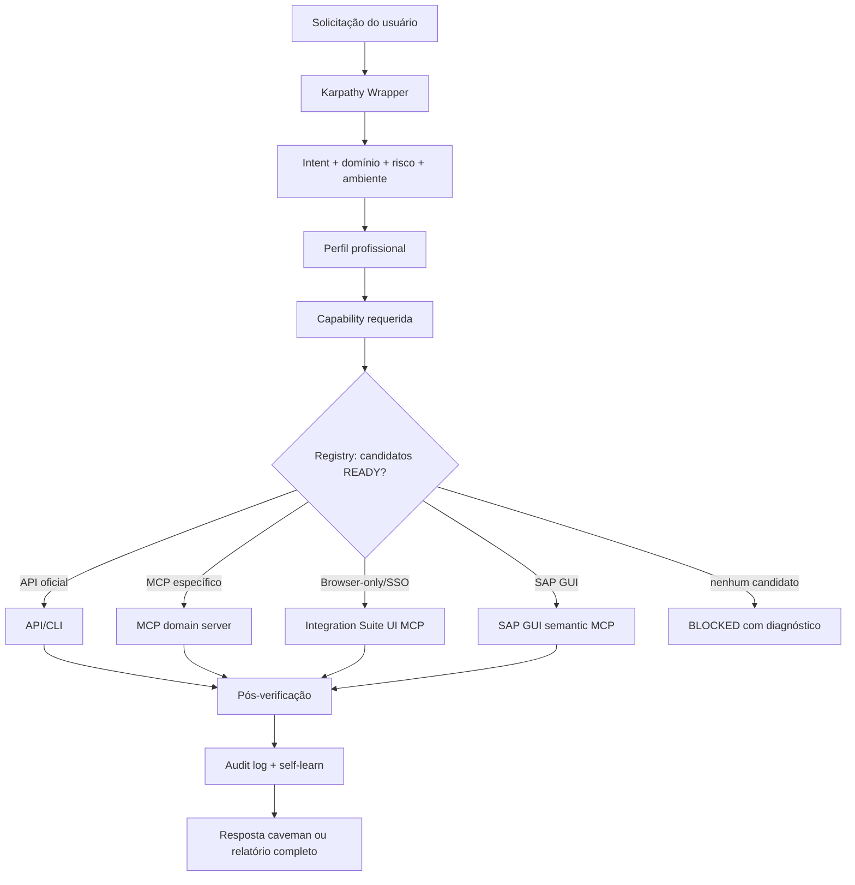
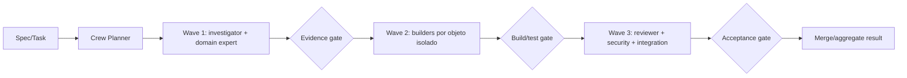
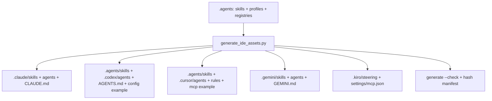
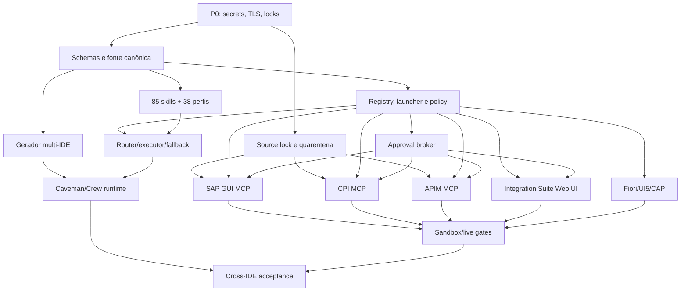

# Plano Mestre de Implementação End-to-End — Skills, MCPs e Orquestração SAP

> Documento: `PLAN-E2E-SAP-ROUTER-2026-07-12`  
> Status: pronto para execução; requer autorização externa apenas para rotação de credenciais e reescrita de histórico Git  
> Release-alvo: **v6.0.0**, por introduzir mudanças incompatíveis em configuração, healthcheck, segurança e roteamento  
> Baseline auditado: 2026-07-12, workspace Windows, Python 3.14.4, Node.js 24.16.0  
> Princípio obrigatório: **Karpathy — Think → Simplify → Surgical → Verify**  
> Documento substitui, para este escopo, `implementation_plan.md` e `GUIA_IMPLEMENTACAO_V5.md`; esses arquivos permanecem como histórico.

---

## 1. Resumo executivo

O SAP Router deve deixar de ser um catálogo declarativo com fallbacks simulados e passar a ser uma plataforma verificável, segura e independente de IDE. A implementação será considerada concluída quando:

1. Nenhuma credencial, token, cookie, senha, certificado privado ou bypass de TLS estiver versionado.
2. Cada MCP habilitado puder completar `initialize`, `tools/list` e um probe de domínio sem mutação.
3. Cada skill e perfil profissional apontar para capacidades reais, não para nomes de ferramentas inexistentes.
4. Claude, Codex, Cursor, Gemini/Antigravity e Kiro forem gerados a partir da mesma fonte canônica.
5. CPI, APIM, Fiori, UI5 e CAP tiverem caminhos API/CLI/MCP testados e fallback Web UI autenticado.
6. SAP GUI reutilizar sessão existente e operar por IDs semânticos; coordenadas serão último recurso.
7. Caveman e Crew executarem subagentes reais em paralelo, com isolamento, agregação e métricas de tokens.
8. O roteador falhar fechado: servidor desconhecido, não testado, `SKIPPED`, sem binário ou sem capability nunca será selecionado.

### 1.1 Resultado esperado para o usuário

- Uma solicitação SAP em linguagem natural é classificada em domínio, intenção, risco e capability.
- O perfil profissional correto é associado automaticamente.
- O caminho mais simples e confiável é escolhido: API oficial → CLI → MCP específico → Web UI → automação visual.
- Operações de escrita exigem contexto funcional, autorização, confirmação e pós-verificação.
- Falhas produzem diagnóstico acionável; não produzem falso `success` ou fallback silencioso.
- O mesmo comportamento é obtido em todas as IDEs suportadas.

### 1.2 Não objetivos

- Não instalar ZROUTER automaticamente. Ele continua opcional e opt-in.
- Não substituir APIs oficiais SAP por automação de navegador quando a API cobre a operação.
- Não executar mutações em PRD durante desenvolvimento ou teste do roteador.
- Não criar um script Python e um JavaScript duplicado para cada skill. Serão criados SDKs compartilhados por família, e cada skill declarará o helper apropriado.
- Não manter MCPs apenas para aumentar contagem. MCP sem owner, licença, probe ou rota ficará `disabled` ou `roadmap`.

---

## 2. Baseline verificado e premissas

### 2.1 Estado técnico atual

| Item | Baseline verificado | Impacto |
|---|---:|---|
| Skills de domínio | 85 | Existem somente em `.claude/skills` e `.agents/skills` |
| Perfis profissionais | 23 | Não incorporam Karpathy/MCP/Caveman de forma canônica |
| MCPs declarados | 42 | 4 stubs, 3 comandos ausentes, 23 entrypoints locais inexistentes |
| MCPs high/medium considerados prontos | 7/12 | Métrica inflada porque `SKIPPED` conta como saudável |
| Scripts Python | 24 | Cobertura concentrada em router, ABAP e empacotamento |
| Scripts JavaScript | 1 | Insuficiente para MCP/browser/Fiori/CAP |
| Smoke offline | 65/65 | Não prova handshake, tenant, GUI ou mutação |
| SAP GUI Mario | handshake e 7 tools | Coordenadas/screenshot; não reutiliza sessão |
| CrewAI | diretório/venv presentes | Pacote `crewai` ausente; payload aponta para MCP inexistente |
| CPI Python | GET mínimo | Sem CSRF, retry, paginação, write ou APIM |
| Segurança | bloqueador P0 | Segredos literais e permissões destrutivas configuradas |

### 2.2 Premissas de implementação

- O repositório continuará compatível com Windows; componentes não GUI também serão testados em Linux.
- SAP GUI semantic MCP será Windows-only por depender do SAP GUI Scripting COM.
- CPI/APIM usarão tenants sandbox/non-production para contract tests e smoke mutável.
- SSO/MFA no fallback Web UI será realizado interativamente pelo usuário; o agente nunca receberá a senha.
- Credenciais de serviço permanecerão fora do repositório, preferencialmente em Credential Manager, vault corporativo ou variáveis injetadas pelo runtime.
- `main` ficará protegido durante a rotação de credenciais e reescrita coordenada do histórico.
- Alterações serão implementadas em branch `codex/router-v6-hardening` ou equivalente aprovado.

### 2.3 Invariantes

1. Read-only é o default de todo servidor e perfil.
2. `ALLOW_DELETE=false`, `ALLOW_EXECUTE=false`, `SAP_ALLOW_UNAUTHORIZED=false` e verificação TLS ativa são defaults imutáveis em código.
3. Write exige `allow_mutation=true`, escopo de capability, confirmação e verificação.
4. Destructive exige confirmação forte fora do modelo, resumo do alvo e `action_id` vinculado a autorização one-time mantida no keyring.
5. Secrets nunca aparecem em stdout, logs, erros, screenshots, traces ou prompts.
6. MCP stdout é reservado ao protocolo; logs vão para stderr ou arquivo redigido.
7. Um resultado só é `success` depois de pós-condição verificável.
8. Self-learn só aprende de chamadas executadas; planos simulados não alimentam confiabilidade.
9. Roteamento nunca substitui um MCP indisponível por outro domínio apenas porque ele está saudável.
10. O wrapper Karpathy antecede toda execução, em toda IDE.

---

## 3. Arquitetura-alvo

### 3.1 Fluxo de execução



### 3.2 Fluxo multiagente



### 3.3 Fonte canônica e renderização por IDE



### 3.4 Trust boundaries

| Boundary | Dados permitidos | Dados proibidos | Controle |
|---|---|---|---|
| IDE → Router | intenção, paths, payload de negócio autorizado | senha/cookie/token | schema validation + redaction |
| Router → MCP | parâmetros mínimos da capability | credenciais em argumentos | env/vault injection |
| MCP → SAP/BTP | chamada autorizada | fallback cross-domain silencioso | scopes + allowlist |
| Browser MCP → UI | ações DOM tipadas | exportação de cookies/localStorage | session broker |
| Agent → logs | IDs, status, latência, correlation ID | body sensível e headers auth | structured redacted logging |
| Self-learn → MEMORY | métricas agregadas | prompts, payloads, secrets | whitelist de campos |

---

## 4. Estrutura de repositório proposta

```text
.agents/
  skills/<skill>/SKILL.md                 # fonte canônica
  profiles/<profile>.yaml                 # perfil neutro por IDE
  crews/caveman.yaml                      # papéis, budgets, waves
  registries/
    capabilities.yaml
    mcps.yaml
    routes.yaml
    policies.yaml
    versions.yaml
  schemas/
    skill.schema.json
    profile.schema.json
    mcp.schema.json
    route.schema.json
    health.schema.json
    execution-result.schema.json

.claude/                                  # gerado
.codex/                                   # agents/config examples gerados; skills vêm de .agents
.cursor/                                  # gerado
.gemini/                                  # gerado
.kiro/                                    # gerado

packages/
  sap-cpi-mcp/                            # TypeScript MCP
  sap-apim-mcp/                           # TypeScript MCP
  integration-suite-ui-mcp/              # TypeScript Playwright/CDP
  sap-gui-semantic-mcp/                   # Python Windows COM; evolução Mario
  shared-mcp-ts/                          # auth, OData, CSRF, retry, logging

python/
  sap_router_core/
    registry.py
    policies.py
    launcher.py
    mcp_client.py
    redaction.py
    execution.py
    crew_runtime.py

scripts/
  generate_ide_assets.py
  validate_catalog.py
  mcp_launcher.py
  mcp_probe.py
  secret_audit.py
  cpi_client.py                            # expandido
  apim_client.py                           # novo
  browser_session_probe.py                 # novo
  sap_gui_session_probe.py                 # novo

tests/
  unit/
  contract/
  integration/
  live_readonly/
  live_mutation_sandbox/
  fixtures/
  samples/cap/
  samples/ui5/
  samples/fiori/

reports/
  health/
  security/
  mcp-contracts/
  token-metrics/
```

### 4.1 Decisões de layout

- `.agents` será fonte neutra e rastreada. Codex e Cursor reutilizam `.agents/skills`; Claude/Gemini recebem renderizações quando o cliente exigir sua árvore própria.
- Não usar symlinks/junctions, pois prejudicam Windows, ZIPs e clientes que não os seguem.
- Código compartilhado Python ficará fora de `scripts/`; `scripts/` conterá apenas entrypoints finos.
- MCPs TypeScript usarão workspaces npm e lockfile raiz único.
- O pacote Mario local será preservado durante a migração; a prioridade do router mudará somente após o semantic MCP passar gate live.

---

## 5. Contratos canônicos

### 5.1 Taxonomia de capabilities

Formato: `<plataforma>.<domínio>.<recurso>.<ação>`.

Exemplos obrigatórios:

```text
sap.adt.source.read
sap.adt.source.write
sap.adt.object.activate
sap.adt.search.execute
sap.transport.read
sap.transport.modify
sap.gui.session.attach
sap.gui.screen.read
sap.gui.transaction.execute
sap.gui.control.modify
sap.cpi.package.read
sap.cpi.artifact.read
sap.cpi.artifact.deploy
sap.cpi.message.read
sap.cpi.trace.read
sap.cpi.security.metadata.read
sap.apim.proxy.read
sap.apim.proxy.modify
sap.apim.proxy.deploy
sap.apim.product.modify
sap.fiori.app.generate
sap.fiori.app.modify
sap.ui5.project.validate
sap.cap.model.search
sap.cap.project.build
```

### 5.2 Registry MCP (`.agents/registries/mcps.yaml`)

```yaml
schema_version: 1
servers:
  - id: ui5-mcp
    display_name: UI5 MCP Server
    status: enabled                 # enabled|disabled|roadmap|quarantined
    source:
      repository: https://github.com/UI5/mcp-server
      license: Apache-2.0
      package: "@ui5/mcp-server"
      version: "0.2.14"
      integrity: "sha512-..."
    runtime:
      launcher: node-local
      command: node
      args: ["node_modules/@ui5/mcp-server/bin/run.js"]
      cwd: "."
      transport: stdio
      platforms: [windows, linux, macos]
    auth:
      mode: none
      env_refs: []
    capabilities:
      - sap.ui5.project.validate
    safety:
      default_mode: read_only
      mutations: explicit
    probes:
      startup_timeout_ms: 15000
      initialize: true
      tools_list: true
      required_tools: [run_ui5_linter, run_manifest_validation]
      domain_probe: ui5_fixture_validate
    routing:
      priority: 10
      fallback_group: ui5-development
    owner: sap-ui5-developer
```

Campos obrigatórios:

- `id`, `status`, `source.repository`, `source.license`, `source.version`.
- `runtime.command`, `runtime.args`, `runtime.cwd`, `runtime.transport`, `runtime.platforms`.
- `capabilities`, `safety`, `probes`, `routing`, `owner`.
- Nenhum valor secreto. `auth.env_refs` contém somente nomes de variáveis.

### 5.3 Skill frontmatter canônico

```yaml
---
name: cpi-iflow-development
version: 6.0.0
description: Desenvolvimento e operação verificável de iFlows SAP Cloud Integration.
trigger:
  keywords: [cpi, cloud integration, iflow, mpl, integration suite]
  intent: Criar, revisar, implantar ou diagnosticar artefatos CPI.
professional_profiles:
  - sap-cpi-developer
  - sap-integration-architect
capabilities:
  required:
    - sap.cpi.artifact.read
  optional:
    - sap.cpi.artifact.deploy
helpers:
  python: [cpi_client]
  javascript: [sap-cpi-mcp]
safety:
  default: read_only
  mutations_require_confirmation: true
verification:
  - cpi_contract
  - cpi_live_readonly
---
```

### 5.4 Perfil profissional canônico

```yaml
id: sap-cpi-developer
title: Senior SAP Cloud Integration Developer
seniority: senior
domains: [cpi, integration-suite]
karpathy_wrapper: mandatory
default_output: caveman
capabilities:
  allow:
    - sap.cpi.package.read
    - sap.cpi.artifact.read
    - sap.cpi.message.read
    - sap.cpi.trace.read
  gated:
    - sap.cpi.artifact.deploy
  deny:
    - sap.cpi.security.secret.read
preferred_skills:
  - cpi-iflow-development
preferred_helpers:
  - cpi_client
  - sap-cpi-mcp
delegation:
  investigator: cavecrew-investigator
  reviewer: sap-integration-reviewer
verification:
  required: [contract, live_readonly]
```

### 5.5 RouteDecision

```json
{
  "schema_version": 1,
  "request_id": "uuid",
  "intent": "deploy_iflow",
  "domain": "cpi",
  "capability": "sap.cpi.artifact.deploy",
  "risk": "mutating",
  "environment": "DEV",
  "profile": "sap-cpi-developer",
  "candidate_servers": ["sap-cpi-mcp", "integration-suite-ui-mcp"],
  "selected_server": "sap-cpi-mcp",
  "selection_reason": "READY, API-first, priority=10",
  "confirmation_required": true,
  "fallback_policy": "same-capability-only",
  "health_snapshot_id": "uuid",
  "confidence": 0.92
}
```

### 5.6 HealthResult

Estados permitidos:

- `READY`: initialize + tools/list + required tools + domain probe passaram.
- `DEGRADED`: servidor funciona, mas capability opcional ou domain probe não crítico falhou.
- `UNAVAILABLE`: command, entrypoint, handshake ou credencial obrigatória falhou.
- `UNAUTHORIZED`: autenticação/role/scope insuficiente.
- `DISABLED`: explicitamente desabilitado.
- `ROADMAP`: não instalado por decisão.
- `QUARANTINED`: falhou segurança/licença/integridade.

`SKIPPED` só pode existir como detalhe de probe e nunca será estado saudável.

```json
{
  "server_id": "sap-cpi-mcp",
  "status": "READY",
  "checked_at": "2026-07-12T18:00:00Z",
  "expires_at": "2026-07-12T18:15:00Z",
  "checks": {
    "command": "PASS",
    "entrypoint": "PASS",
    "initialize": "PASS",
    "tools_list": "PASS",
    "required_tools": "PASS",
    "domain_probe": "PASS"
  },
  "capabilities_ready": ["sap.cpi.package.read"],
  "latency_ms": 220,
  "error_code": null
}
```

### 5.7 Envelope MCP comum

Todos os MCPs locais retornam `structuredContent` equivalente:

```ts
interface McpResult<T> {
  ok: boolean;
  correlation_id: string;
  target: {
    alias: string;
    product: "sap-gui" | "cpi" | "apim" | "fiori" | "ui5" | "cap";
    environment: "local" | "dev" | "qa" | "prod";
    tenant_or_system?: string;
  };
  data?: T;
  page?: { next_cursor?: string; returned: number; truncated: boolean };
  warnings: Array<{ code: string; message: string }>;
  audit: {
    tool: string;
    risk: "read" | "low_write" | "high_write" | "critical";
    action_id?: string;
    request_hash: string;
    before_hash?: string;
    after_hash?: string;
  };
  error?: {
    code: string;
    class: "CONFIG" | "AUTHENTICATION" | "AUTHORIZATION" | "VALIDATION" |
      "CONFLICT" | "RATE_LIMIT" | "UPSTREAM" | "UNSUPPORTED" |
      "SESSION_LOST" | "UNKNOWN_EXECUTION";
    message: string;
    retryable: boolean;
    http_status?: number;
    action_required?: string;
  };
}
```

Nunca retornar token, cookie, certificado privado, senha, Authorization header, CSRF token ou secret value.

### 5.8 QueryInput seguro

MCPs CPI/APIM não aceitam URL, `$filter` ou nextLink arbitrários do modelo:

```ts
interface QueryInput {
  filter?: Array<{
    field: string;
    operator: "eq" | "ne" | "gt" | "ge" | "lt" | "le" | "contains" | "startswith";
    value: string | number | boolean;
  }>;
  select?: string[];
  order_by?: Array<{ field: string; direction: "asc" | "desc" }>;
  page_size?: number; // 1..200
  cursor?: string;    // opaco, assinado e same-origin
}
```

### 5.9 Approval broker fora do modelo

Toda mutação segue `plan_*` → aprovação local → `commit_*`:

```text
scripts/approval_broker.py show <action_id>
scripts/approval_broker.py approve <action_id>
scripts/approval_broker.py reject <action_id>
scripts/approval_broker.py status <action_id>
```

1. `plan_*` lê estado, calcula diff e grava `.sap-router/actions/<action_id>.json` sem secrets.
2. O usuário aprova em terminal/UI local; high/critical exige digitar alias do ambiente e, quando crítico, ID do objeto.
3. Broker grava token one-time no Credential Manager/keyring, TTL 5 min.
4. `commit_*` recebe somente `action_id`; servidor consome token internamente.
5. Modelo nunca recebe token.
6. Mudança de screen hash, ETag, version, target ou arguments hash invalida aprovação.
7. PRD nunca permite autoaprovação.

### 5.10 ExecutionResult

```json
{
  "request_id": "uuid",
  "server_id": "sap-cpi-mcp",
  "tool": "cpi_commit_action",
  "status": "success",
  "changed": true,
  "target": {"type": "iflow", "id": "OrderProcessing", "environment": "DEV"},
  "verification": {
    "status": "pass",
    "checks": ["deployment_started", "runtime_status_started"]
  },
  "audit_id": "uuid",
  "duration_ms": 4200,
  "redactions": 0
}
```

Estados: `success`, `failed`, `blocked`, `needs_confirmation`, `partial`. `success` com `changed=true` exige `verification.status=pass`.

---

## 6. Workstream P0 — Contenção e remediação de segurança

### 6.1 Objetivo

Eliminar exposição de segredos, impedir novas mutações durante a correção e estabelecer uma base de confiança antes de instalar ou habilitar novos MCPs.

### 6.2 Sequência obrigatória

#### SEC-001 — Congelar mutações

1. Proteger `main` e bloquear merges temporariamente.
2. Desabilitar no runtime todas as capabilities `mutating` e `destructive`.
3. Forçar:

```text
ALLOW_WRITE=false
ALLOW_DELETE=false
ALLOW_EXECUTE=false
SAP_ALLOW_UNAUTHORIZED=false
WEB_ALLOW_UNAUTHORIZED=false
DRY_RUN=true
```

4. Invalidar a health cache atual; ela foi gerada por lógica que considera `SKIPPED` saudável.
5. Registrar janela de contenção e responsáveis pela rotação.

**Aceite:** qualquer solicitação mutável retorna `blocked/security-freeze`; operações read-only continuam disponíveis somente em servidores comprovadamente iniciáveis.

#### SEC-002 — Inventário redigido de segredos

Criar `scripts/secret_audit.py` com saída exclusivamente de metadados:

```json
{
  "file": ".mcp.json",
  "line": 34,
  "key": "SAP_PASSWORD",
  "classification": "credential",
  "value": "REDACTED",
  "tracked": true
}
```

Regras:

- Nunca imprimir valor ou hash reversível.
- Detectar JSON, TOML, YAML, `.env`, Python defaults, shell e histórico Git.
- Detectar chaves conhecidas e entropia alta.
- Verificar pelo menos `.mcp.json`, `.codex/config.toml`, `.claude/settings*.json`, `.env*`, `scripts/`, `packages/` e histórico completo.
- Gerar `reports/security/secret-inventory.json`, que deve estar no `.gitignore` se contiver paths de infraestrutura sensíveis.

#### SEC-003 — Rotação externa

Rotacionar, nesta ordem:

1. Tokens de provedores LLM.
2. Usuários/senhas SAP compartilhados.
3. Client secrets CPI e APIM.
4. Chaves RAG/search.
5. Sessões/cookies de navegador e tokens persistidos.

Para cada segredo:

- Revogar valor antigo antes de habilitar novo valor no agente.
- Gerar credencial com escopo mínimo e prazo definido.
- Separar credencial read-only de credencial mutável.
- Confirmar que logs e shell history não contêm o valor.
- Registrar somente ID lógico, owner, data de rotação e expiração.

**Dependência externa:** administradores SAP/BTP/IdP. O código não pode completar esta tarefa sozinho.

#### SEC-004 — Remover segredos da árvore corrente

- `.mcp.json` passa a conter apenas referências `${ENV_NAME}` ou IDs de credential store.
- `.codex/config.toml` gerado não conterá valores; somente `env_vars` ou referências.
- `.claude/settings.local.json` permanece local/ignorado e sem tokens quando o cliente puder herdar do ambiente.
- Defaults sensíveis em scripts são removidos; ausência gera erro explícito.
- `.gitignore` inclui arquivos locais de credenciais, browser state, downloads e relatórios sensíveis.
- `.env.template` contém nomes e descrições, nunca exemplos realistas de segredo.

#### SEC-005 — Limpar histórico Git

Procedimento coordenado:

1. Criar backup bare criptografado para custódia temporária.
2. Notificar colaboradores e congelar pushes.
3. Usar `git filter-repo` com arquivo de substituições redigido fora do repositório.
4. Remover blobs contendo `.mcp.json`/config antigo e defaults secretos.
5. Executar secret scan sobre `--all` no repositório reescrito.
6. Force-push protegido, invalidar clones antigos e exigir clone novo.
7. Excluir backup após aceite de segurança conforme política corporativa.

**Rollback:** se o rewrite falhar, restaurar backup bare em repositório isolado; segredos antigos continuam revogados e nunca voltam a ser usados.

#### SEC-006 — Credential provider

Implementar interface Python e TypeScript equivalente:

```python
class CredentialProvider(Protocol):
    def get(self, reference: str) -> SecretValue: ...
    def metadata(self, reference: str) -> SecretMetadata: ...
```

Providers, por prioridade:

1. Credential Manager/vault corporativo.
2. Variável de ambiente injetada.
3. Arquivo local explicitamente ignorado, somente para desenvolvimento.

`SecretValue`:

- não implementa `repr` com conteúdo;
- zera buffers quando possível;
- nunca é serializado;
- registra acesso por correlation ID, não o valor.

#### SEC-007 — TLS e autorização

- Remover bypass global de certificado.
- Adicionar `SAP_CA_BUNDLE`, `CPI_CA_BUNDLE`, `APIM_CA_BUNDLE` e truststore por servidor.
- Certificado self-signed só é aceito se pinado por fingerprint/CA interna.
- `verify=false` é proibido em produção e exige feature flag de desenvolvimento mais warning bloqueante.
- `BLOCKED_PACKAGES` deixa de ser vazio por default; política deny-by-default para pacotes não autorizados.
- Roles e scopes são validados no probe de domínio.

### 6.3 Supply chain

#### SEC-008 — Lockfiles e instalação determinística

- Criar `package-lock.json` raiz e npm workspaces para pacotes TypeScript.
- Usar `npm ci`, nunca `npm install`, em CI e bootstrap controlado.
- Fixar versões exatas dos MCPs; não usar `@latest` em produção.
- Python: adotar `uv.lock` raiz ou requirements com hashes; escolher `uv.lock` como fonte canônica.
- Imagens Docker são pinadas por digest.
- Binários Go externos exigem versão, checksum SHA-256 e origem publicada.
- Gerar SBOM CycloneDX para Node, Python e binários externos.

#### SEC-009 — Scans CI

Gates obrigatórios:

- `gitleaks detect --redact` no working tree e histórico relevante.
- `npm audit --audit-level=high` após lockfile.
- `pip-audit`/`uv audit` para Python.
- verificação de licenças permitidas;
- SBOM diff;
- checksum de binários MCP;
- bloqueio de dependência sem licença ou de origem não aprovada.

### 6.4 Critérios de aceite P0

- [ ] Todas as credenciais identificadas foram rotacionadas.
- [ ] Secret scan em árvore e histórico retorna zero finding real.
- [ ] Nenhum config rastreado contém segredo literal.
- [ ] Write/delete/execute desabilitados por default.
- [ ] TLS verificado em todos os clientes.
- [ ] Lockfiles presentes e `npm ci`/`uv sync --frozen` passam.
- [ ] SBOM e relatório de licenças gerados.
- [ ] Security freeze só é removido após aprovação do Security Owner.

---

## 7. Workstream P1 — Fonte canônica, schemas e multi-IDE

### 7.1 Objetivo

Eliminar divergência manual entre 85 skills, 23 perfis, 42 MCPs, versões e configurações de IDE.

### 7.2 Fonte de verdade

`.agents` será rastreado e conterá:

- skills neutras;
- perfis profissionais neutros;
- crew definitions;
- registries e schemas.

Todo arquivo derivado terá cabeçalho:

```text
GENERATED FILE — DO NOT EDIT
source: .agents/...
generator_version: 1
source_sha256: ...
```

### 7.3 Normalização das 85 skills

#### SKL-001 — Corrigir frontmatter

- Corrigir YAML inválido em `btp-cloud-identity` e `cds-view-entities`.
- `name` deve ser igual ao nome da pasta.
- `trigger` deve ser objeto `{keywords, intent}`, nunca lista/string.
- Adicionar `version`, profiles, capabilities, helpers, safety e verification.
- Validar UTF-8 e eliminar mojibake.

#### SKL-002 — Classificar skills

Cada skill terá um `kind`:

- `operational`: executa capabilities.
- `development`: cria/modifica código ou artefato.
- `review`: análise sem mutação.
- `reference`: documentação; não requer MCP.
- `orchestrator`: roteia outras skills.

Skills `reference` devem declarar `documentation_only: true`; isso evita inventar MCP apenas para satisfazer cobertura.

#### SKL-003 — Estrutura mínima de conteúdo

Todas as skills deverão conter:

1. Papel e objetivo.
2. Quando acionar e quando não acionar.
3. Intake mínimo.
4. Capability e caminho preferencial.
5. Fallbacks permitidos.
6. Helpers Python/JavaScript compartilhados.
7. Segurança/autorização.
8. Fluxo de execução.
9. Falhas conhecidas.
10. Verificação e aceite.
11. Referências oficiais.

Não impor tamanho uniforme. Skills simples podem ser curtas se o contrato acima estiver completo. Para preservar descoberta eficiente e reduzir contexto desperdiçado:

- a soma serializada de `name` + `description_short` do catálogo exposto ao Codex deve permanecer abaixo de **7.500 bytes**;
- o corpo principal de cada `SKILL.md` deve ficar, como regra, abaixo de **3.500 palavras ou 20 KiB**, usando o menor dos dois limites;
- conteúdo excedente deve ir para `references/`, carregado somente pela rota indicada no `SKILL.md`;
- `operational`, `development`, `review` e `orchestrator` devem declarar pelo menos um helper Python e um helper JavaScript/TypeScript, ainda que apontem para bibliotecas compartilhadas;
- `reference` pode declarar `documentation_only: true` e usar apenas o indexador compartilhado, sem MCP artificial;
- o validador deve rejeitar UTF-8 inválido, BOM inesperado, caracteres invisíveis perigosos e padrões de mojibake.

`rap-business-events` e outras skills monolíticas serão divididas primeiro, pois são candidatas a consumir contexto mesmo quando apenas uma subseção é necessária.

### 7.4 Gerador de IDEs

Implementar `scripts/generate_ide_assets.py`:

```text
generate_ide_assets.py generate --targets all
generate_ide_assets.py generate --targets codex,cursor
generate_ide_assets.py check
generate_ide_assets.py diff
```

Saídas:

| Target | Skills/perfis | Entrada principal | MCP config |
|---|---|---|---|
| Claude | `.claude/skills`, `.claude/agents` | `CLAUDE.md` | `.mcp.json` ou settings gerado |
| Codex | `.agents/skills`, `.codex/agents` | `AGENTS.md` | `.codex/config.toml` gerado a partir de example sem segredo |
| Cursor | `.agents/skills`, `.cursor/rules/*.mdc` | rule mestre/indexador | `.cursor/mcp.json` |
| Gemini | `.gemini/skills`, `.gemini/agents` | `GEMINI.md` | `.gemini/settings.json` |
| Kiro | `.kiro/agents`, `.kiro/steering`, `.kiro/powers/*/POWER.md` | `sap-router.md` | `.kiro/settings/mcp.json` |

Regras:

- Arquivos físicos, não symlinks.
- Ordenação determinística.
- Line endings normalizados para LF no Git.
- Paths renderizados por target; conteúdo técnico permanece neutro.
- `generate --check` falha se houver edição manual em gerado.
- Manifesto `generated-assets.json` registra hashes.
- Cursor não recebe uma cópia `.cursor/skills`; ele reutiliza `.agents/skills` e ganha apenas regras de descoberta.
- Kiro recebe doze powers por família de capability, evitando transformar cada uma das 85 skills em um power isolado.
- `.codex/config.toml` real é local/ignorado quando contiver endpoint ou referência de credencial; o Git contém somente `config.example.toml` sanitizado.

### 7.5 Versionamento único

`.agents/registries/versions.yaml`:

```yaml
product: 6.0.0
schema: 1
skills_catalog: 6.0.0
mcp_registry: 1
ide_generator: 1
health_cache: 2
```

README, package manifest, master skill e CLI `--version` passam a ler/ser gerados desse arquivo. Contagens também serão calculadas, nunca digitadas manualmente.

### 7.6 Validação

`scripts/validate_catalog.py` deve verificar:

- YAML/JSON/TOML válidos;
- schema completo;
- `name == folder`;
- capability existente;
- profile existente;
- helper existente;
- MCP capability existente para skills operacionais;
- links/paths locais existentes;
- nenhuma tool nominal ausente do `tools/list` gravado em contract fixture;
- ausência de segredo;
- paridade de hashes gerados;
- versões e contagens consistentes.
- orçamento de descoberta do Codex abaixo de 7.500 bytes;
- limite de tamanho do corpo principal, com exceções justificadas e registradas;
- paridade semântica entre targets, não apenas igualdade textual.

### 7.7 Critérios de aceite P1

- [ ] 85/85 skills passam schema.
- [ ] 100% dos perfis passam schema.
- [ ] Cinco targets de IDE são gerados deterministicamente.
- [ ] Segunda execução do gerador produz diff vazio.
- [ ] Nenhuma referência `.Codex`/path inexistente permanece.
- [ ] Uma única versão/contagem aparece em todos os artefatos.
- [ ] CI falha ao editar manualmente um arquivo gerado.
- [ ] Catálogo resumido do Codex permanece abaixo de 7.500 bytes.
- [ ] Nenhuma skill operacional fica sem helper Python e JS/TS válido.

---

## 8. Workstream P1 — Perfis profissionais aplicados ao runtime

### 8.1 Perfis existentes

Migrar os 23 perfis atuais para YAML canônico, preservando conhecimento válido e removendo referências ausentes.

### 8.2 Perfis técnicos novos obrigatórios

| Perfil | Skills principais | Capabilities principais |
|---|---|---|
| `sap-rap-abap-cloud-developer` | rap, abap-cloud, released-abap-classes | RAP/CDS/behavior/ADT/ATC |
| `sap-btp-platform-engineer` | btp-cloud-platform, cloud-foundry, kyma | accounts/runtime/services/destinations |
| `sap-btp-security-architect` | dependency-security, credential-store, IAM | scopes/TLS/secrets/audit |
| `sap-cpi-developer` | cpi-iflow-development, btp-integration-suite | CPI content/MPL/trace/deploy |
| `sap-apim-architect` | sap-api-policy, sap-api-style | proxy/product/policy/deploy |
| `sap-fiori-ui5-developer` | sap-fiori-tools, sapui5-framework | Fiori generation/UI5 validate |
| `sap-cap-developer` | sap-cap, btp-cloud-foundry | CAP model/build/deploy |
| `sap-gui-automation-engineer` | sap-gui-scripting, sap-gui-web-enrich | COM/session/control/transaction |
| `sap-hana-data-engineer` | hana-cli, hana-sqlscript, hana-ml | SQL/HDI/plan/data validation |
| `sap-datasphere-engineer` | sap-datasphere, data-intelligence | spaces/models/federation/pipelines |
| `sap-ai-llm-engineer` | sap-ai-core, sap-cloud-sdk-ai, llm-engineering | model/RAG/evaluation/governance |
| `sap-sac-developer` | sap-sac-scripting, sap-sac-planning | stories/widgets/planning/tests |
| `sap-commerce-developer` | sap-commerce-skill | extensions/integration/build/test |
| `sap-devops-transport-engineer` | sap-btp-devops, transport-management | CI/CD/CTS/CTMS/rollback |
| `sap-orchestrator` | sap-router-skill, karpathy-guidelines | routing/policy/crew/verification |

Os 23 perfis atuais mais os 15 novos resultam em **38 perfis profissionais**. `cavecrew-investigator`, `cavecrew-builder` e `cavecrew-reviewer` são workers de execução e não entram nessa contagem profissional.

### 8.3 Wrapper obrigatório por perfil

Todo prompt renderizado inicia com:

```text
KARPATHY WRAPPER
1. Think: declare assumptions, environment, auth and uncertainty.
2. Simplify: choose smallest verified capability path.
3. Surgical: restrict targets and scope.
4. Verify: define and execute postconditions.
```

Em seguida:

- papel e limites;
- capability allow/gated/deny;
- skills preferenciais;
- formato de resposta;
- política de delegação;
- critérios de aceite.

### 8.4 Mapeamento de perfil para MCP

Perfis não devem gravar IDs de MCP diretamente. Eles solicitam capabilities. O registry escolhe o servidor READY. Isso permite trocar implementação sem reescrever 38 prompts.

Exemplo:

```text
sap-cpi-developer → sap.cpi.message.read
registry candidates → sap-cpi-mcp, cpi-mcp-server, integration-suite-ui-mcp
policy → API-first + same-capability-only
```

### 8.5 Intake por ambiente

Todo perfil mutável deve obter:

- sistema/tenant lógico;
- ambiente DEV/QA/PRD;
- client/subaccount/space quando aplicável;
- objeto alvo;
- modo read-only ou mutating;
- transport/change ID quando aplicável;
- critério de sucesso.

PRD exige autorização explícita e não pode ser inferido.

### 8.6 Critérios de aceite de perfis

- [ ] Todos os perfis incluem Karpathy.
- [ ] Todos declaram allow/gated/deny.
- [ ] Nenhum contém segredo ou endpoint pessoal.
- [ ] Todos os perfis técnicos têm pelo menos uma skill e capability válidas.
- [ ] Functional profiles delegam desenvolvimento técnico ao perfil correto.
- [ ] Testes de prompt verificam que mutações sem ambiente/contexto são bloqueadas.

---

## 9. Workstream P1 — Registry, launcher e healthcheck fail-closed

### 9.1 MCP launcher uniforme

Criar `scripts/mcp_launcher.py --id <server>` como único entrypoint usado pelas IDEs.

Responsabilidades:

1. Carregar registry validado.
2. Recusar server `disabled`, `roadmap` ou `quarantined`.
3. Resolver command/cwd e verificar integridade.
4. Injetar env refs via CredentialProvider.
5. Aplicar platform guard.
6. Iniciar subprocesso sem shell interpolation.
7. Preservar stdout para MCP e enviar logs redigidos a stderr.
8. Propagar exit code.

Ele não baixa dependências. Bootstrap separado instala versões pinadas.

### 9.2 Bootstrap determinístico

`scripts/bootstrap.py`:

```text
bootstrap.py plan
bootstrap.py install --group core
bootstrap.py install --group integration
bootstrap.py verify
```

Grupos:

- `core`: router, schemas, aibap/ADT selecionado.
- `gui`: semantic GUI, Sapient, WebGUI fallback.
- `integration`: CPI, APIM, Playwright/DevTools.
- `frontend`: Fiori, UI5, CAP.
- `optional`: RAG, Datasphere, ALM.

`plan` não altera arquivos e mostra downloads, licenças, versões e checksums.

### 9.3 Healthcheck v2

Refatorar `HealthChecker` em probes compostos:

```python
check_registry()
check_command()
check_entrypoint()
check_integrity()
check_initialize()
check_tools_list()
check_required_tools()
check_auth()
check_domain_readonly()
```

Timeouts default:

| Probe | Timeout |
|---|---:|
| command/entrypoint | 2 s |
| initialize | 10 s |
| tools/list | 10 s |
| local domain probe | 15 s |
| SAP/BTP read-only | 30 s |
| browser attach | 30 s |

O probe inicia servidor isolado, negocia MCP, valida `tools/list` e encerra graciosamente. Processos órfãos são finalizados somente se pertencem ao probe.

### 9.4 Health cache v2

- Arquivo: `.healthcheck_cache.json`, ignorável ou gerado.
- TTL default: 15 min; GUI/browser: 5 min.
- Cache key inclui server version, config hash e environment logical ID.
- Resultado expirado é `UNKNOWN`, nunca `READY`.
- Escrita atômica por arquivo temporário + rename.
- Lock de processo para evitar corrupção.

### 9.5 Probes sem mutação por domínio

| Domínio | Probe |
|---|---|
| ADT | system info + search limitada |
| SAP GUI | enumerate connections/sessions; não abrir transação |
| CPI | `IntegrationPackages?$top=1&$select=Id,Name` |
| APIM | listar um proxy com campos mínimos |
| Fiori | `tools/list` + fixture local |
| UI5 | validar sample manifest local |
| CAP | pesquisar model fixture local |
| Web UI | attach + confirmar origin/tenant; sem click |

### 9.6 Política de seleção

O router considera apenas `READY` e, quando permitido pela capability, `DEGRADED`. `UNAVAILABLE`, `UNAUTHORIZED`, `UNKNOWN`, `DISABLED`, `ROADMAP` e `QUARANTINED` são excluídos.

Self-learn reordena candidatos somente depois do filtro de saúde/capability/safety. Confiabilidade nunca torna um servidor não autorizado elegível.

### 9.7 Critérios de aceite do healthcheck

- [ ] Server inexistente retorna `UNAVAILABLE`.
- [ ] `SKIPPED` não aumenta contagem de readiness.
- [ ] Plugin stub sem comando não é READY.
- [ ] Tool obrigatória ausente falha o probe.
- [ ] Cache expirado não é usado para roteamento.
- [ ] Logs não contêm env values.
- [ ] Router retorna `blocked/no-ready-server` quando nenhum candidato existe.

---

## 10. Workstream P2 — SAP GUI semantic MCP e reforma do Mario

### 10.1 Decisão de arquitetura

O pacote Mario não será removido imediatamente. Ele será:

1. retirado da posição de primário enquanto inseguro;
2. envolvido por feature flag `GUI_MARIO_LEGACY_ENABLED=false`;
3. evoluído ou substituído internamente por `sap-gui-semantic-mcp`;
4. promovido somente depois de testes Windows live em DEV.

Durante a migração, prioridade recomendada:

```text
sap-gui-semantic-mcp (quando READY)
→ sapient-mcp (attach/read fallback)
→ sapgui.mcp WebGUI (quando SAP WebGUI aplicável)
→ Mario legacy visual (explicitamente habilitado)
→ manual
```

### 10.2 Componentes internos

```text
SapGuiMcpServer
├── SapSessionBroker
│   ├── enumerate_connections()
│   ├── enumerate_sessions()
│   ├── attach(session_id)
│   └── lock(session_id)
├── SapControlService
│   ├── snapshot_tree()
│   ├── find_by_id()
│   ├── find_by_label()
│   └── read_table()
├── SapActionService
│   ├── set_text()
│   ├── press()
│   ├── send_vkey()
│   └── start_transaction()
├── SapSafetyPolicy
│   ├── classify_tcode()
│   ├── authorize_action()
│   └── require_confirmation()
├── SapVerificationService
│   ├── read_statusbar()
│   ├── detect_modal()
│   └── assert_postcondition()
└── VisualFallback
    ├── screenshot(redacted=True)
    └── coordinate_action(explicit_gate=True)
```

### 10.3 Sessão e autenticação

- Usar `GetObject("SAPGUI").GetScriptingEngine` para enumerar conexões existentes.
- `attach_session` recebe filtros de sistema/client e retorna ID opaco; não recebe senha.
- Se não houver sessão, `open_logon_entry` abre uma entrada nomeada do SAP Logon sem `-pw`; login/MFA permanece com usuário.
- Nunca matar `saplogon.exe`, `sapshcut.exe` ou sessão que não foi criada pelo MCP.
- Um lock por sessão impede dois agentes de digitar simultaneamente.
- Lease default: 60 s, renovável durante ação; expiração libera lock.
- `detach` não fecha sessão; `close_owned_session` só fecha sessão criada pelo MCP e exige confirmação.

### 10.4 Tool contracts

#### `sap_gui_list_sessions`

Input:

```json
{"include_busy": false}
```

Output redigido:

```json
{
  "sessions": [{
    "session_id": "opaque",
    "system": "DS4",
    "client": "100",
    "transaction": "SESSION_MANAGER",
    "busy": false,
    "owned_by_mcp": false
  }]
}
```

Não retornar usuário completo se política de privacidade exigir mascaramento.

#### `sap_gui_attach_session`

```json
{
  "system": "DS4",
  "client": "100",
  "session_id": null,
  "require_idle": true
}
```

Falhas: `no_session`, `multiple_matches`, `busy`, `scripting_disabled`.

#### `sap_gui_get_screen_state`

Parâmetros:

- `session_id` obrigatório;
- `depth` default 4, máximo 8;
- `include_values` default false;
- `include_tables` default false;
- `redact` sempre true para campos password/secret/token.

Retorna title, tcode, program, dynpro, statusbar, modals e árvore resumida de controles.

#### `sap_gui_find_control`

Aceita exatamente um seletor:

- `control_id` exato;
- `label` + tipo esperado;
- `text` + ancestor;
- `technical_name`.

Se houver múltiplos resultados, retorna candidatos; não escolhe silenciosamente.

#### `sap_gui_set_field`

```json
{
  "session_id": "opaque",
  "control_id": "wnd[0]/usr/ctxt...",
  "value": "...",
  "expected_current_value": null,
  "commit": false
}
```

`commit=false` apenas preenche. Campos secretos não entram em audit log.

#### `sap_gui_press`

Aceita `control_id` ou `vkey`, nunca ambos. `expected_screen` permite pós-condição.

#### `sap_gui_read_table`

Suporta ALV/grid/table control:

- colunas por technical name;
- `offset`, `limit` máximo 500;
- leitura paginada;
- output estruturado;
- célula sensível redigida por policy.

#### `sap_gui_execute_transaction` — somente leitura

```json
{
  "session_id": "opaque",
  "tcode": "MM03",
  "mode": "read_only",
  "expected_initial_screen": null
}
```

T-codes são classificados em registry:

- read-only: MM03, VA03, SE16N com restrições;
- mutating: MM01, VA01, SM30 change;
- destructive/admin: SU01 changes, transport release, deletes.

Para as duas últimas classes, `sap_gui_execute_transaction` retorna `operation_not_readonly`; a execução correta é:

```text
sap_gui_plan_action(operation, target, expected_screen_hash)
→ aprovação humana via approval_broker.py
→ sap_gui_commit_action(action_id)
```

O `commit` relê sessão, identity, t-code, program/dynpro e screen hash antes de consumir a aprovação.

#### `sap_gui_handle_dialog`

Exige `expected_title`, `expected_text_hash` e ação allowlisted. Nunca confirma diálogo desconhecido.

#### `sap_gui_capture_screenshot`

- redaction automática de regiões de campos secretos;
- gravação apenas em `reports/gui/` ou diretório aprovado;
- path relativo ao workspace;
- base64 só sob solicitação e limite de tamanho.

#### `sap_gui_coordinate_action` — fallback visual somente leitura

Desabilitado por default. Exige:

```text
GUI_VISUAL_FALLBACK_ENABLED=true
fresh screenshot hash
action ∈ {inspect, focus, scroll, capture}
```

Qualquer clique, digitação ou confirmação visual mutável usa `sap_gui_plan_visual_action` e `sap_gui_commit_action(action_id)`; a ferramenta de coordenadas não aceita token, booleano `confirm` nem texto livre para contornar policy.

### 10.5 Política de confirmação

Para mutação, `sap_gui_plan_action` retorna:

```json
{
  "status": "approval_required",
  "action_id": "uuid",
  "summary": "Executar MM01 no sistema DS4 cliente 100",
  "target_hash": "sha256:...",
  "expires_in_seconds": 120
}
```

O modelo mostra `summary` e `action_id`, mas não recebe o segredo de aprovação. O usuário aprova fora do modelo; `sap_gui_commit_action(action_id)` consome a autorização no keyring. Mudança de tela, identity, target ou argumentos invalida a ação.

### 10.6 Remoções obrigatórias no Mario legacy

- Remover senha de argv e DEBUG log.
- Remover `taskkill` global.
- Corrigir versão `setup.py` versus server handshake.
- Atualizar testes `include_screenshot` → `return_screenshot`.
- Instalar/pinar `pytest-asyncio` no ambiente de desenvolvimento.
- Separar exceptions MCP de erros retornáveis.
- Adicionar `--read-only`, allowlist e audit log.

### 10.7 Testes

Unitários:

- mocks COM para connection/session/control tree;
- ambiguity de selector;
- statusbar E/A/S/W;
- modal inesperado;
- redaction;
- lock/lease;
- policy por tcode.

Integração Windows:

- handshake MCP;
- attach em sessão idle já autenticada;
- MM03 read-only;
- leitura ALV controlada;
- nenhuma criação/morte de processo externo;
- nenhuma senha em process list/log.

Sandbox mutável:

- transação Z de teste ou objeto descartável;
- confirmação de duas etapas;
- pós-verificação;
- rollback do dado criado.

### 10.8 Gate de promoção

Só se torna primário após:

- 100 execuções read-only, ≥99% sucesso;
- zero vazamento de segredo;
- zero encerramento de sessão alheia;
- 20 execuções mutáveis sandbox, 100% pós-verificadas;
- aprovação Security + Basis.

---

## 11. Workstream P2 — SAP CPI API MCP

### 11.1 Estratégia em duas etapas

**Etapa A — baseline rápido e read-only:** integrar versão pinada do `vadimklimov/cpi-mcp-server` via stdio, somente capabilities de leitura.

**Etapa B — servidor nativo:** implementar `packages/sap-cpi-mcp` TypeScript usando APIs oficiais e shared SDK. A Etapa B substitui a A após contract/live gates.

### 11.2 Separação de endpoints e credenciais

Config canônica:

```yaml
cpi:
  design:
    base_url_ref: CPI_DESIGN_BASE_URL
    token_url_ref: CPI_DESIGN_TOKEN_URL
    client_id_ref: CPI_DESIGN_CLIENT_ID
    client_secret_ref: CPI_DESIGN_CLIENT_SECRET
  runtime:
    base_url_ref: CPI_RUNTIME_BASE_URL
    token_url_ref: CPI_RUNTIME_TOKEN_URL
    client_id_ref: CPI_RUNTIME_CLIENT_ID
    client_secret_ref: CPI_RUNTIME_CLIENT_SECRET
```

Não reutilizar token runtime para design-time. Probe valida audience/scopes e dá erro `wrong_credential_profile` em vez de 401 genérico.

### 11.3 Shared HTTP client

`packages/shared-mcp-ts` fornece:

- OAuth client credentials cacheado até `expires_at - 60s`;
- timeout connect 5 s, request 30 s;
- retry com jitter para 429, 502, 503 e 504;
- respeito a `Retry-After`;
- sem retry automático para 400, 401, 403 ou mutação não idempotente;
- OData V2 pagination `__next`/`$skiptoken`;
- `$select` mínimo;
- escaping seguro de literals OData;
- ETag/`If-Match`;
- CSRF fetch + cookie jar para operações que exigirem;
- limite de payload e streaming para ZIP;
- structured logging redigido;
- correlation ID.

### 11.4 Tool contracts read-only

| Tool | Capability | Parâmetros principais | Verificação |
|---|---|---|---|
| `cpi_health` | health | profile | service root + roles |
| `cpi_list_packages` | package.read | filter, select, cursor, limit≤100 | schema OData |
| `cpi_get_package` | package.read | package_id | ID exato |
| `cpi_list_artifacts` | artifact.read | package_id, type, cursor | artifact count |
| `cpi_get_artifact` | artifact.read | artifact_id, version | metadata/etag |
| `cpi_export_artifact` | artifact.read | id, version, output_path | ZIP hash + validate |
| `cpi_list_runtime_artifacts` | artifact.read | status, cursor | runtime status |
| `cpi_list_messages` | message.read | from, to, status, artifact, cursor | janela obrigatória |
| `cpi_get_message` | message.read | message_id | ID exato |
| `cpi_get_trace` | trace.read | message_id, include_payload=false | trace availability |
| `cpi_list_security_metadata` | security.metadata.read | type, expiring_before | nunca retorna secret |

Regras MPL:

- `from`/`to` obrigatórios; janela default 1 h, máximo 24 h sem override.
- `$top` máximo 100 por call.
- Payload/attachments não retornados por default.
- PII redigida conforme policy.

### 11.5 Tool contracts mutáveis

| Tool | Risco | Gate | Pós-verificação |
|---|---|---|---|
| `cpi_plan_import_package` | mutating | DEV/QA + bundle hash | package/version no plano |
| `cpi_plan_upload_artifact` | mutating | ETag/current version | design artifact diff/hash |
| `cpi_plan_deploy_artifact` | mutating | role + runtime pre-state | plano de deploy verificável |
| `cpi_plan_undeploy_artifact` | destructive | gate forte | dependências e runtime listados |
| `cpi_commit_action` | conforme plano | `action_id` aprovado no broker | poll e verificação específica |
| `cpi_cancel_action` | control | owner do plano | plano marcado cancelled |

Não incluir create/update de credentials no v6.0.0. O MCP poderá listar aliases/expiração, mas material secreto continuará administrado por processo separado.

### 11.6 Deploy state machine

```text
VALIDATE_INPUT
→ FETCH_CURRENT_VERSION
→ BUILD_CONFIRMATION_SUMMARY
→ WAIT_CONFIRMATION
→ SUBMIT_DEPLOY
→ POLL_BUILD_AND_DEPLOY_STATUS
→ VERIFY_RUNTIME_ARTIFACT
→ OPTIONAL_TEST_MESSAGE
→ AUDIT_SUCCESS|AUDIT_FAILURE
```

Timeout de deploy default 5 min; poll 2 s com backoff até 10 s. Timeout retorna `partial` com deployment ID, nunca `success`.

### 11.7 Python CLI companion

Refatorar `scripts/cpi_client.py` para usar `python/sap_router_core`:

```text
cpi_client.py health --profile design
cpi_client.py packages list --top 10
cpi_client.py artifacts export --id X --output scratch/X.zip
cpi_client.py messages list --from ... --to ...
cpi_client.py deploy plan --id X
cpi_client.py action show --action-id ...
cpi_client.py action commit --action-id ...
```

O CLI é probe, diagnóstico e fallback; não duplica regra de negócio do MCP. Contratos JSON devem ser equivalentes.

### 11.8 Empacotador CPI

`cpi_iflow_packager.py` deixa de afirmar deployabilidade apenas por XML válido.

Novos níveis:

- `STRUCTURE_VALID`: ZIP e arquivos mínimos.
- `CONTENT_VALID`: schemas, referências e scripts analisados.
- `TENANT_ACCEPTED`: upload/import dry-run ou sandbox passou.
- `DEPLOYED_VERIFIED`: runtime STARTED e teste passou.

### 11.9 Testes CPI

- Unit: OAuth, retry, pagination, escaping, CSRF, ETag, redaction.
- Contract: fixtures gravadas sem payload sensível para cada entity set.
- Negative: 401, 403, 404, 412, 429, 5xx, timeout, token audience errado.
- Live read-only: package/artifact/MPL mínimo.
- Live mutation sandbox: import/deploy/undeploy de artefato exclusivo de teste.
- Assert: nenhum teste opera PRD e todo objeto sandbox é limpo.

---

## 12. Workstream P2 — SAP API Management MCP

### 12.1 Base oficial

Implementar `packages/sap-apim-mcp` sobre o plano `apiportal-apiaccess` e APIs REST/OData oficiais. Não adotar MCP comunitário sem licença como dependência de produção.

### 12.2 Auth profiles

```yaml
apim:
  read:
    role: APIPortal.Guest
    base_url_ref: APIM_API_BASE_URL
    token_url_ref: APIM_TOKEN_URL
    client_id_ref: APIM_READ_CLIENT_ID
    client_secret_ref: APIM_READ_CLIENT_SECRET
  admin:
    role: APIPortal.Administrator
    base_url_ref: APIM_API_BASE_URL
    token_url_ref: APIM_TOKEN_URL
    client_id_ref: APIM_ADMIN_CLIENT_ID
    client_secret_ref: APIM_ADMIN_CLIENT_SECRET
```

Admin só é carregado quando capability mutável é confirmada. Preferir X.509 quando disponível no ambiente corporativo.

### 12.3 Tools read-only

| Tool | Capability | Output |
|---|---|---|
| `apim_health` | health | endpoint, role, capabilities |
| `apim_list_proxies` | proxy.read | ID, name, state, version, base path |
| `apim_get_proxy` | proxy.read | metadata, endpoints, revision |
| `apim_export_proxy` | proxy.read | bundle salvo + SHA-256 |
| `apim_list_products` | product.read | product metadata |
| `apim_get_product` | product.read | APIs/visibility/state |
| `apim_list_policies` | policy.read | name, type, flow, order |
| `apim_get_policy` | policy.read | XML redigido |
| `apim_list_kvms` | kvm.metadata.read | nomes/metadata; sem values secretos |

### 12.4 Tools mutáveis

| Tool | Comportamento |
|---|---|
| `apim_plan_import_proxy` | planeja nova revisão a partir de bundle validado |
| `apim_plan_update_proxy` | exige current revision/ETag e produz diff |
| `apim_plan_attach_policy` | valida XML, schema e posição do flow |
| `apim_plan_deploy_proxy` | registra revision/virtual host/base path e pós-health esperado |
| `apim_plan_undeploy_proxy` | gate forte + checagem de products/consumers |
| `apim_plan_create_product` | valida nome, visibility e APIs |
| `apim_plan_update_product` | diff explícito de associações |
| `apim_commit_action` | executa somente `action_id` aprovado e verifica estado |
| `apim_cancel_action` | cancela ação ainda não consumida |

Delete físico de proxy/product fica fora do v6.0.0 ou atrás de `APIM_DESTRUCTIVE_ENABLED=false` e aprovação separada.

### 12.5 Policy validation

Antes de attach/deploy:

- XML well-formed;
- tipo de policy reconhecido;
- nomes únicos;
- flow/step válido;
- nenhuma credencial hardcoded;
- rate/quota bounds configuráveis;
- target URL permitido;
- OAuth/Threat Protection presentes conforme profile;
- diff produzido e mostrado na confirmação.

### 12.6 Deploy state machine

```text
EXPORT_CURRENT
→ VALIDATE_BUNDLE_AND_POLICIES
→ COMPUTE_DIFF
→ CREATE_REVISION
→ WAIT_CONFIRMATION
→ DEPLOY
→ POLL_STATE
→ CALL_HEALTH_ENDPOINT
→ VERIFY_POLICIES
→ AUDIT
```

Rollback automático permitido somente para retornar à revisão previamente exportada e comprovada. Rollback também é auditado.

### 12.7 Python companion

Criar `scripts/apim_client.py`:

```text
apim_client.py health --profile read
apim_client.py proxies list
apim_client.py proxies export --id X
apim_client.py policies validate --file policy.xml
apim_client.py deploy plan --bundle X.zip
apim_client.py deploy execute --plan-id ... --confirm ...
```

### 12.8 Testes APIM

- Unit/contract equivalentes ao CPI.
- Fixtures de proxy REST/OData e policies.
- Validar roles Guest/Admin.
- Live read-only em tenant sandbox.
- Mutation sandbox: importar proxy exclusivo, deploy, health, rollback, undeploy.
- Nunca alterar proxy existente não marcado `router-test-*`.

---

## 13. Workstream P2 — Integration Suite Web UI MCP com sessão logada

### 13.1 Quando usar

Web UI só é elegível quando:

- capability é browser-only;
- API oficial não cobre operação;
- tenant exige login interativo/SSO para a ação;
- API retorna erro classificado `unsupported`, não 429/5xx transitório;
- policy permite UI fallback.

401/403 não acionam UI automaticamente. Eles geram `UNAUTHORIZED` e instrução de role/auth.

### 13.2 Arquitetura

`packages/integration-suite-ui-mcp` será TypeScript com Playwright library e MCP SDK. Microsoft Playwright MCP poderá ser usado para diagnóstico genérico, mas as tools expostas aos agentes serão domain-specific.

```text
IntegrationSuiteUiMcp
├── BrowserSessionBroker
├── OriginPolicy
├── IdentityAndTenantDetector
├── CpiPageObjects
├── ApimPageObjects
├── SelectorRegistry
├── UiStateMachine
├── ScreenshotRedactor
├── DownloadGuard
└── AuditLogger
```

### 13.3 Conexão ao browser

Modos, por prioridade:

1. Playwright browser extension conectada a aba existente.
2. CDP em Chrome/Edge dedicado, bind somente loopback.
3. Perfil persistente dedicado `ms-playwright/sap-router-*`.
4. Storage state somente em sandbox e criptografado; nunca versionado.

O usuário realiza IAS/SAML/MFA. O servidor detecta identity/tenant depois do login e mostra confirmação antes de qualquer mutação.

### 13.4 Origin allowlist

Config explícita por ambiente:

```yaml
allowed_origins:
  - "https://*.integrationsuite.cfapps.<region>.hana.ondemand.com"
  - "https://*.it-cpi*.cfapps.<region>.hana.ondemand.com"
  - "https://*.apim.cfapps.<region>.hana.ondemand.com"
```

Wildcards são compilados e validados; redirects fora da allowlist bloqueiam sessão.

A flag upstream `--allowed-origins` do Playwright MCP não será tratada isoladamente como boundary de segurança. O wrapper também intercepta requests, redirects e downloads no browser context e, quando disponível, aplica proxy/egress policy externa. `--ignore-https-errors`, `--no-sandbox`, `--allow-unrestricted-file-access`, `browser_run_code_unsafe` e origins `*` são negados pelo launcher.

### 13.5 Tools CPI UI

Read-only:

- `cpi_ui_attach`
- `cpi_ui_identity`
- `cpi_ui_list_packages`
- `cpi_ui_open_artifact`
- `cpi_ui_read_artifact_summary`
- `cpi_ui_open_monitor`
- `cpi_ui_list_messages`
- `cpi_ui_open_trace`
- `cpi_ui_capture_failure_evidence`

Mutating:

- `cpi_ui_plan_import_package`
- `cpi_ui_plan_edit_externalized_parameter`
- `cpi_ui_plan_deploy_artifact`
- `cpi_ui_plan_undeploy_artifact`
- `is_ui_commit_action`
- `is_ui_cancel_action`

Editor gráfico arbitrário não entra no primeiro release. Mudanças complexas devem usar export/edit/import ou intervenção humana assistida.

### 13.6 Tools APIM UI

Read-only:

- `apim_ui_attach`
- `apim_ui_identity`
- `apim_ui_list_proxies`
- `apim_ui_open_proxy`
- `apim_ui_read_revision`
- `apim_ui_list_policies`
- `apim_ui_capture_console_network_errors`

Mutating:

- `apim_ui_plan_import_proxy`
- `apim_ui_plan_attach_policy`
- `apim_ui_plan_deploy_proxy`
- `apim_ui_plan_rollback_revision`
- `is_ui_commit_action`
- `is_ui_cancel_action`

### 13.7 State machine comum

```text
DETACHED
→ ATTACHING
→ AUTH_REQUIRED | TENANT_READY
→ PAGE_IDENTIFIED
→ ACTION_PLANNED
→ APPROVAL_REQUIRED
→ APPROVED | REJECTED | EXPIRED
→ EXECUTING
→ VERIFYING
→ READY | ERROR_RECOVERABLE | BLOCKED
```

Cada transition valida URL, page marker e identity. Selector failure captura DOM snapshot redigido, screenshot e console/network metadata.

### 13.8 Seletores

Prioridade:

1. ARIA role/name.
2. `data-testid` ou identificador estável.
3. label/texto com ancestor estável.
4. CSS versionado por tenant/UI release.
5. Coordenada — proibida no Integration Suite UI MCP.

Selector registry registra `valid_from`, `valid_to`, locale e feature flag.

### 13.9 Segurança browser

- Não expor `browser_evaluate` genérico ao agente.
- Não retornar cookies, localStorage, sessionStorage ou Authorization headers.
- DevTools network captura apenas URL, status, timing e headers allowlisted.
- Downloads restritos a `scratch/integration-suite/` e verificados por MIME/tamanho/hash.
- Upload restrito a arquivo dentro do workspace e tipo permitido.
- Screenshot redige campos sensíveis e áreas configuradas.
- Uma mutação por tab/session; leituras paralelas podem usar tabs diferentes.
- Perfil browser não é compartilhado por dois processos MCP.

### 13.10 Testes Web UI

- Unit de selector/page objects com HTML fixtures.
- Contract de state machine.
- Attach a browser já logado.
- Sessão expirada, MFA, redirect IdP, tenant errado.
- Locale EN/PT e pelo menos um segundo layout/feature release.
- Network 429/5xx não aciona ação duplicada.
- Sandbox deploy/import/rollback.
- Assert de zero cookies/tokens em tool output e logs.

---

## 14. Workstream P2 — MCPs oficiais Fiori, UI5 e CAP

### 14.1 Pacotes pinados iniciais

```text
@sap-ux/fiori-mcp-server = 1.8.1
@ui5/mcp-server         = 0.2.14
@cap-js/mcp-server      = 0.0.5
@playwright/mcp         = 0.0.78
```

Versões são baseline auditado; Dependabot/Renovate propõe atualização, nunca atualização automática de produção.

### 14.2 Fiori MCP

Capabilities:

- documentação Fiori/annotations;
- listar apps;
- listar sistemas salvos;
- baixar metadata OData;
- gerar app Fiori OData/CAP;
- listar e executar funcionalidades suportadas.

Safety:

- `search_docs`, list e metadata são read-only.
- geração/modificação exige path do app, git clean check e diff.
- alteração em app existente só após backup/diff e testes.

Probe:

- initialize/tools-list;
- required tools;
- gerar app em temp fixture ou executar funcionalidade de leitura;
- nunca acessar sistema real no probe básico.

### 14.3 UI5 MCP

Capabilities:

- scaffold UI5;
- API reference/guidelines;
- project info;
- manifest validation;
- UI5 linter.

Configurar `UI5_MCP_SERVER_ALLOWED_DOMAINS` com allowlist corporativa; vazio para “permitir todos” é proibido.

### 14.4 CAP MCP

Capabilities iniciais:

- `search_model`;
- `search_docs`.

O CAP MCP é contextual/read-only; build e mutação continuam no `cds` CLI e helpers controlados:

```text
scripts/cap_validate.mjs model
scripts/cap_validate.mjs compile
scripts/cap_validate.mjs build
scripts/cap_validate.mjs test
```

### 14.5 Roteamento explícito

| Intenção | Capability | Primário | Fallback |
|---|---|---|---|
| criar app Fiori sobre CAP | sap.fiori.app.generate | Fiori MCP | manual guided |
| validar manifest UI5 | sap.ui5.project.validate | UI5 MCP | UI5 CLI |
| buscar entidade CAP | sap.cap.model.search | CAP MCP | `cds compile` local |
| compilar CAP | sap.cap.project.build | `cds` CLI helper | blocked com diagnóstico |
| baixar EDMX | sap.fiori.metadata.read | Fiori MCP | HTTP client autorizado |

### 14.6 Sample projects e testes

- `tests/samples/ui5/basic-app`.
- `tests/samples/fiori/cap-list-report`.
- `tests/samples/cap/bookshop-minimal`.
- Snapshots de outputs sem dependência de sistema real.
- Smoke por package version em Windows e Linux.
- Teste cross-client confirma mesma tools list via launcher.

---

## 15. Workstream P2 — Router, executor e fallback reais

### 15.1 Separação de responsabilidades

Refatorar o monólito sem reescrever regras SAP desnecessariamente:

```text
SapRouter                 # classifica e cria RouteDecision
CapabilityRegistry        # candidatos por capability
HealthRepository          # health cache validada
SecurityPolicy            # autoriza/nega
McpExecutor               # executa MCP real
FallbackCoordinator       # classifica erro e tenta same-capability
VerificationEngine        # pós-condições
AuditLogger               # evento redigido
SelfLearnRecorder         # métricas de chamadas reais
```

`sap_router.py` permanece CLI/compatibility facade e delega aos módulos em `python/sap_router_core`.

### 15.2 Classificação de intenção

Saída mínima do classificador:

- `domain`;
- `intent`;
- `capability`;
- `risk`;
- `environment`;
- `target_scope`;
- `functional_context`;
- `confidence`;
- `missing_context`.

Se `confidence < 0.70` em mutação, bloquear e pedir contexto. Leitura pode seguir para descoberta restrita quando policy permitir.

### 15.3 Rotas explícitas por domínio

Adicionar antes do GUI default:

1. CPI.
2. APIM.
3. Fiori/UI5.
4. CAP.
5. BTP/CF.
6. ADT/ABAP.
7. SAP GUI transactions.
8. Functional BAPI/RFC.
9. Documentation/reference.

Tokens desconhecidos nunca caem automaticamente em SAP GUI. Resultado: `blocked/unclassified-intent` com sugestões.

### 15.4 `McpExecutor`

Interface:

```python
class McpExecutor:
    async def initialize(self, server_id: str) -> ServerSession: ...
    async def list_tools(self, session: ServerSession) -> list[Tool]: ...
    async def call_tool(
        self,
        session: ServerSession,
        tool: str,
        arguments: dict,
        context: OperationContext,
    ) -> ExecutionResult: ...
```

Regras:

- Validar input contra schema observado/aprovado.
- Validar policy antes do call.
- Não serializar secrets no audit.
- Timeout por tool/capability.
- Cancelamento propaga ao subprocesso.
- Resposta acima do limite vai para artifact redigido.
- `isError=true` vira falha tipada.
- Tool call sem verificação não pode retornar `success` para mutação.

### 15.5 Classificação de erros

| Classe | Exemplos | Retry | Fallback |
|---|---|---:|---:|
| `transient` | timeout, 429, 502/503/504 | sim, limitado | mesma capability |
| `unavailable` | command/entrypoint/process | não no mesmo server | mesma capability READY |
| `unsupported` | tool/capability ausente | não | candidato específico/UI permitido |
| `unauthorized` | 401/403/role | não | não escalar privilégio |
| `validation` | 400/schema | não | bloquear/corrigir input |
| `conflict` | 409/412/ETag | não automático | refetch + novo plano |
| `tls_security` | cert/host/source mismatch | não | bloquear |
| `business` | BAPIRET2 E/A, MPL business error | não | reportar; não trocar canal |
| `partial` | deploy submetido, poll timeout | poll/resume | não repetir mutação |

### 15.6 Retry

Default read-only:

- máximo 3 tentativas;
- delays 0.5 s, 1.5 s, 4 s + jitter;
- respeitar `Retry-After` até 30 s;
- idempotency key estável.

Mutação:

- não reenviar sem idempotency/operation ID;
- em timeout, consultar status antes de qualquer retry;
- se status incerto, retornar `partial` e bloquear duplicação.

### 15.7 Fallback real

`fallback_engine.py` será reduzido a coordenador. Cada tier deve chamar `McpExecutor` ou helper concreto. Gerar `tool_call` será status `planned`, não `success`.

Regras:

- somente servidores que declaram a mesma capability;
- efeito do fallback não pode ter risco maior;
- 403/TLS/policy deny encerram cadeia;
- UI fallback exige policy específica;
- manual é sempre último e retorna guia, nunca `executed`.

### 15.8 SecurityPolicy central

Perfis runtime:

| Perfil | Ambientes | Read | Write | Execute | Destructive/admin |
|---|---|---:|---:|---:|---:|
| `readonly` | DEV/QA/PRD | sim | não | não | não |
| `developer-dev` | DEV | sim | confirmação | confirmação | não |
| `operator-nonprod` | DEV/QA | sim | confirmação | confirmação | não por default |
| `production-readonly` | PRD | sim | não | não | não |

PRD mutável fica fora de v6.0.0.

Reason codes obrigatórios:

```text
ALLOW_READ
DENY_UNKNOWN_SERVER
DENY_UNKNOWN_TOOL
DENY_UNKNOWN_EFFECT
DENY_PROFILE
DENY_ENVIRONMENT
DENY_PRODUCTION_MUTATION
DENY_FUNCTIONAL_CONTEXT_REQUIRED
DENY_APPROVAL_REQUIRED
DENY_APPROVAL_EXPIRED
DENY_APPROVAL_MISMATCH
DENY_IDEMPOTENCY_KEY_REQUIRED
DENY_TICKET_REQUIRED
DENY_COOLDOWN
DENY_HEALTHCHECK
DENY_TLS
DENY_SOURCE_UNTRUSTED
```

### 15.9 Aprovação em duas fases

```text
plan(operation) → action_id + target_hash + redacted summary + expiry
external_approve(action_id) → token gravado em keyring, invisível ao modelo
commit(action_id) → broker autoriza + servidor relê preconditions + run + verify
```

- Expira em 5 min; GUI screen confirmation pode expirar em 2 min.
- One-time use.
- Bind a user/profile/environment/target/arguments hash.
- Qualquer diff invalida.
- O JSON de ação persiste com ACL do usuário e sem secrets; o token fica apenas no Credential Manager/keyring.
- Nenhum MCP aceita `confirm: true`, token digitado no prompt ou aprovação retornada ao modelo.

### 15.10 Cooldowns mínimos

| Operação | Cooldown |
|---|---:|
| SAP generic write | 5 s |
| financial posting | 10 s |
| transport release | 30 min |
| user administration | 1 h |
| destructive delete | negado em v6 |

### 15.11 Self-learn corrigido

Registrar somente:

- server/capability;
- latency;
- success/failure class;
- environment class, não endpoint;
- timestamp;
- fallback count;
- verification status.

Não registrar payload, object data, prompt ou secret. Plano/route sem execução não aumenta success rate.

### 15.12 Compatibilidade CLI

Manter comandos atuais com aviso de depreciação e adicionar:

```text
sap_router.py classify --task ...
sap_router.py route --task ... --explain
sap_router.py execute --route-file route.json
sap_router.py confirm --approval-id ...
sap_router.py resume --request-id ...
sap_router.py health --capability ...
```

---

## 16. Workstream P3 — Caveman e Crew multiagente reais

### 16.1 Objetivo

Converter a saída JSON atual em execução real, mantendo economia de tokens para tarefas pequenas e paralelismo seguro para tarefas grandes.

### 16.2 Papéis Caveman

#### `cavecrew-investigator`

- somente leitura;
- contexto máximo 12.000 tokens, saída máxima 1.200 tokens e timeout 90 s;
- usa `rg`, AST/indexes e tools read-only;
- entrega paths, símbolos, dependências e evidência;
- não propõe refatoração ampla.

#### `cavecrew-builder`

- alteração limitada a 1–2 arquivos e um objetivo;
- contexto máximo 24.000 tokens, saída máxima 2.500 tokens e timeout 180 s;
- recebe evidência do investigator;
- usa worktree/ownership de arquivos quando possível;
- roda testes proporcionais;
- não faz commit/push.

#### `cavecrew-reviewer`

- somente leitura do diff;
- contexto máximo 20.000 tokens, saída máxima 2.000 tokens e timeout 180 s;
- findings severity-tagged;
- um finding por causa raiz;
- valida segurança, regressão e aceite.

#### Orçamentos do runtime

| Classe | Contexto máx. | Saída máx. | Timeout | Uso |
|---|---:|---:|---:|---|
| investigator | 12k | 1,2k | 90 s | busca e evidência |
| builder | 24k | 2,5k | 180 s | mudança cirúrgica |
| reviewer | 20k | 2k | 180 s | diff/risco/aceite |
| specialist-small | 32k | 4k | 300 s | um domínio e poucos artefatos |
| specialist-medium | 64k | 8k | 600 s | integração ou análise ampla |
| specialist-large | 96k | 12k | 900 s | arquitetura/release excepcional |
| synthesizer | 24k de resumos | 4k | 300 s | consolidação sem reler todo o workspace |

O hard cap de uma execução Crew é **40.000 tokens de saída**. Aos 80%, o planner proíbe novas subtasks opcionais; aos 90%, exige sumarização; aos 100%, cancela tasks não críticas e retorna `budget_exhausted` sem inventar conclusão.

### 16.3 Perfis Crew adicionais

- `sap-integration-expert` para CPI/APIM.
- `sap-gui-expert` para COM/UI.
- `sap-security-reviewer`.
- `sap-fiori-cap-expert`.
- `sap-release-gate`.

### 16.4 CrewPlan canônico

```json
{
  "plan_id": "uuid",
  "task": "...",
  "parallel": true,
  "max_concurrency": 4,
  "waves": [
    {
      "id": 1,
      "tasks": [
        {
          "id": "investigate-router",
          "agent": "cavecrew-investigator",
          "mode": "readonly",
          "inputs": ["scripts/sap_router.py"],
          "outputs": ["evidence.json"],
          "context_budget": 12000,
          "output_budget": 1200,
          "timeout_seconds": 90
        }
      ]
    }
  ],
  "gates": ["evidence", "tests", "review"],
  "conflict_policy": "single-writer-per-file"
}
```

### 16.5 Runtime adapters

`crew_runtime.py` fornece interface neutra:

```python
class AgentRuntime(Protocol):
    async def spawn(self, task: CrewTask) -> AgentHandle: ...
    async def send(self, handle: AgentHandle, message: str) -> None: ...
    async def collect(self, handle: AgentHandle) -> AgentResult: ...
    async def cancel(self, handle: AgentHandle) -> None: ...
```

Adapters:

- native Codex collaboration;
- Claude subagents;
- Gemini/Antigravity agents;
- Cursor/Kiro quando suportado;
- CrewAI local opcional para CLI offline.

Se runtime não suporta spawn, executar serialmente mantendo o mesmo CrewPlan.

O runtime CLI persiste estado local em `var/orchestrator.db` (SQLite, ignorado pelo Git): plans, tasks, dependências, leases, resource locks, budgets, checkpoints e hashes de artefato. O banco não armazena source/prompt completo nem secrets. A recuperação após falha retoma somente tasks idempotentes; uma task mutável em estado ambíguo exige reconciliação antes de retry.

### 16.6 Planejamento e paralelismo

1. Decompor por output e ownership, não apenas por etapa abstrata.
2. Tasks na mesma wave não podem escrever o mesmo arquivo.
3. Read-only pode rodar paralelamente sem lock de arquivo.
4. Builders recebem paths exclusivos.
5. Reviewer só inicia após build/test artifacts.
6. Falha de um builder não cancela investigators; bloqueia merge da wave.
7. Agregador valida schemas de resultado.
8. Concorrência global máxima é quatro agentes, incluindo o coordenador quando a IDE contabilizá-lo.
9. Locks de recurso usam `file:<path>`, `sap:<system>:<object>`, `cpi:<tenant>:<artifact>` e `apim:<tenant>:<proxy>`.
10. Tarefa mutável nunca é redistribuída automaticamente após timeout sem consultar o estado real.

### 16.7 Resultado de agente

```json
{
  "task_id": "investigate-router",
  "status": "success",
  "changed_files": [],
  "findings": [],
  "tests": [],
  "tokens": {"input": 900, "output": 600},
  "duration_ms": 12000,
  "evidence_artifact": "..."
}
```

### 16.8 Geração e registro dos agentes

Fonte: `.agents/crews/caveman.yaml` e profiles canônicos. O gerador cria definições compatíveis por IDE. Nomes citados pelo router devem existir no registry antes de `crew-dispatch` retornar executável.

### 16.9 CrewAI local

- Adicionar dependências a lockfile Python.
- Remover URL placeholder da skill.
- Configurar MCP bridge somente depois de handshake/probe.
- Não afirmar “nenhum código sai da máquina” quando provider remoto é usado; relatório deve indicar provider/data boundary.
- Cache de análise inclui source hash, prompt version e model ID.

### 16.10 Métricas de economia

Medir por classe de tarefa:

- tokens single full agent;
- tokens crew/caveman;
- latency;
- findings úteis;
- retrabalho;
- taxa de conflito.

Antes de publicar qualquer ganho, executar benchmark controlado de 30 tarefas (10 busca/revisão curta, 10 mudança de 1–2 arquivos e 10 fluxos SAP multidomínio), sempre comparando o mesmo modelo, versão de prompt, fixture e critério de aceite. O dataset de roteamento terá pelo menos 200 prompts rotulados; gate de promoção: ≥95% top-1 e 100% nas rotas críticas de segurança.

Meta de “60% savings” só permanece se mediana observada por pelo menos 30 execuções for ≥50%; caso contrário, documentação usa valor real.

### 16.11 Critérios de aceite Crew

- [ ] Três agentes Caveman registrados em cinco targets.
- [ ] Execução paralela real observada quando runtime suporta.
- [ ] Single-writer evita conflito.
- [ ] Token budgets aplicados.
- [ ] Resultados agregados e verificados.
- [ ] CrewAI opcional falha graciosamente quando ausente.
- [ ] Nenhum plano é registrado como execução.

---

## 17. Workstream P3 — Testes e CI/CD

### 17.1 Pirâmide de testes

| Camada | Ambiente | Frequência | Mutação |
|---|---|---|---|
| Schema/static | local + CI | todo commit | não |
| Unit | local + CI | todo commit | não |
| MCP lifecycle fake | CI | todo commit | não |
| Contract API | CI | todo commit | não |
| Sample Fiori/UI5/CAP | CI | todo commit | temp only |
| Live read-only | protected manual/schedule | diário | não |
| Live sandbox mutation | protected manual | pré-release | DEV sandbox |
| SAP GUI Windows | self-hosted protected | pré-release | read; mutation separada |

### 17.2 Fake MCP fixtures

Criar servidores sintéticos para:

- lifecycle correto;
- startup timeout;
- protocol mismatch;
- server identity mismatch;
- missing tool;
- extra/drifted tool;
- malformed response;
- tool `isError`;
- process orphan;
- stderr contendo secret sintético para testar redaction.

### 17.3 Testes do registry/gerador

- YAML inválido falha.
- `name != folder` falha.
- capability/profile/helper ausente falha.
- MCP enabled sem source/version/license/probe falha.
- Fallback cycle falha.
- Segundo generate não altera arquivos.
- Alteração manual em gerado é detectada.
- Paths Windows/Linux são corretos.

### 17.4 Matriz de policy

Testar cada combinação environment × profile × effect, incluindo approval expirado, reutilizado, hash alterado, cooldown e ticket ausente.

### 17.5 Testes TLS

- CA pública válida passa.
- CA privada sem bundle falha.
- CA privada com bundle passa.
- hostname mismatch/expired/downgrade falham.
- variável de bypass bloqueia launcher.
- TLS failure não aciona fallback inseguro.

### 17.6 CI workflows

Criar:

- `ci.yml`: schemas, generate-check, Python, Node, samples, fake MCP.
- `security.yml`: gitleaks, dependency audits, source locks, licenses, SBOM, dangerous patterns.
- `live-readonly.yml`: manual/scheduled, protected environment.
- `live-sandbox-mutation.yml`: manual, approval, sandbox allowlist.
- `windows-gui.yml`: self-hosted Windows, sessão controlada.

### 17.7 Segurança CI

- Actions pinadas por SHA.
- `permissions: contents: read` default.
- Sem `pull_request_target` com código não confiável.
- Secrets indisponíveis em PRs de fork.
- Environment approvals para live/sandbox.
- Artifacts redigidos, retenção curta.
- CODEOWNERS em security/registry/workflows/lockfiles.

### 17.8 Coverage e quality gates

| Componente | Meta inicial |
|---|---:|
| registry/policy/health Python | ≥90% branch |
| CPI/APIM shared TS | ≥90% branch |
| browser page/state logic | ≥80% branch |
| SAP GUI logic mockable | ≥85% branch |
| router/fallback | ≥90% branch |

Coverage não substitui contract/live gates.

### 17.9 Relatórios

- `reports/health/<timestamp>.json`.
- `reports/security/summary.json` redigido.
- `reports/mcp-contracts/<server>/<version>.json`.
- `reports/token-metrics/<date>.json`.
- `reports/release/v6.0.0-acceptance.md`.

---

## 18. Migração, rollout e rollback

### 18.1 Feature flags

```text
ROUTER_V6_ENABLED=false
MCP_STRICT_HEALTH=false
MCP_POLICY_PROXY_ENABLED=false
GUI_SEMANTIC_ENABLED=false
CPI_NATIVE_MCP_ENABLED=false
APIM_NATIVE_MCP_ENABLED=false
INTEGRATION_UI_ENABLED=false
CREW_RUNTIME_ENABLED=false
MUTATIONS_ENABLED=false
```

Flags são config não secreta, por ambiente. PRD mantém `MUTATIONS_ENABLED=false`.

### 18.2 Ondas

#### Onda 0 — Incidente

- security freeze;
- rotação/revogação;
- HEAD/histórico sanitizados;
- CI secret scan.

#### Onda 1 — Fundação

- schemas/registries;
- launcher;
- gerador multi-IDE;
- healthcheck v2;
- router shadow mode.

#### Onda 2 — Read-only

- ADT/GUI attach read-only;
- CPI read-only;
- APIM read-only;
- Fiori/UI5/CAP oficiais;
- live read-only gates.

#### Onda 3 — Mutação DEV

- semantic GUI gated;
- CPI deploy sandbox;
- APIM import/deploy sandbox;
- approvals/cooldowns/rollback.

#### Onda 4 — Web UI

- attach SSO;
- read-only UI;
- mutações browser-only sandbox;
- selector drift monitoring.

#### Onda 5 — Crew e release

- subagentes reais;
- token metrics;
- cross-IDE acceptance;
- v6.0.0.

### 18.3 Shadow mode

Router v5 e v6 classificam a mesma solicitação; apenas v5 executa inicialmente. Comparar:

- domain/capability;
- selected server;
- risk/policy;
- fallback;
- expected verification.

Promover v6 quando divergências críticas forem zero em 100 rotas representativas.

### 18.4 Rollback

- Config: reverter para última configuração **sanitizada**, nunca config antiga com segredo.
- Router: desligar `ROUTER_V6_ENABLED`; manter security proxy/strict TLS.
- MCP: desabilitar servidor afetado; usar fallback já aprovado.
- Dependency: reverter lockfile para versão aprovada anterior.
- CPI/APIM mutation: executar rollback por version/revision exportada.
- GUI: desabilitar semantic MCP; manter manual/read-only.
- History: restaurar somente mirror sanitizado.
- Credential: gerar nova; nunca reativar comprometida.

### 18.5 Compatibilidade e deprecações

- Ler `.mcp.json` legacy somente em comando `migrate-config`; nunca executar diretamente.
- `migrate-config` redige valores e gera inventário de env refs.
- CLI antiga recebe warnings por uma minor release.
- `SKIPPED=healthy`, GUI unknown fallback e simulated success são removidos sem compatibility mode.

---

## 19. Curadoria de MCPs GitHub e APIs oficiais

### 19.1 Princípio de adoção

Encontrar um repositório não o torna automaticamente confiável. Cada candidato passa por seis estados explícitos:

```text
DISCOVERED
→ QUARANTINED
→ SOURCE_REVIEWED
→ CONTRACT_TESTED
→ SANDBOX_VERIFIED
→ ADOPTED | REJECTED
```

Regras:

1. Um repositório sem licença identificável não pode ser incorporado, empacotado ou derivado; serve apenas para pesquisa de capability/UX.
2. `stars`, popularidade ou data recente não substituem revisão de source, dependências e comportamento de runtime.
3. Oficial SAP/UI5/CAP tem preferência para desenvolvimento, mas ainda passa por pin, source lock e contract test.
4. MCP comunitário CPI/GUI pode enriquecer o contrato, nunca furar policy, launcher, approval broker ou TLS.
5. API oficial é a implementação primária de CPI/APIM. Web UI é fallback quando a capability oficial não existir ou estiver indisponível no tenant.
6. Atualização upstream nunca é automática; um bot pode abrir PR, mas promoção requer revisão humana, diff de tools e sandbox.

### 19.2 Matriz de candidatos

| Domínio | Projeto | Uso proposto | Status inicial | Condição para adoção |
|---|---|---|---|---|
| Fiori | [SAP/open-ux-tools — fiori-mcp-server](https://github.com/SAP/open-ux-tools/tree/main/packages/fiori-mcp-server) | geração/modificação guiada de apps Fiori | oficial, preferencial | versão pinada, tool snapshot e sample test |
| UI5 | [UI5/mcp-server](https://github.com/UI5/mcp-server) | conhecimento e assistência UI5 | oficial, preferencial | versão pinada, project-scope e testes locais |
| CAP | [cap-js/mcp-server](https://github.com/cap-js/mcp-server) | `search_model` e `search_docs` CAP | oficial, preferencial | pacote pinado; validar que tools não são tratadas como deploy |
| Browser | [microsoft/playwright-mcp](https://github.com/microsoft/playwright-mcp) | engine de automação para Web UI MCP | upstream de engine, encapsulado | browser attach controlado, origin allowlist e egress deny |
| Browser diagnóstico | [ChromeDevTools/chrome-devtools-mcp](https://github.com/ChromeDevTools/chrome-devtools-mcp) | console/network/performance em troubleshooting | opcional, read-only por default | profile isolado e payload redaction |
| CPI | [vadimklimov/cpi-mcp-server](https://github.com/vadimklimov/cpi-mcp-server) | comparar contratos de packages, artifacts, MPL e deploy | candidato comunitário | source audit, licença, sandbox e adaptação ao envelope comum |
| CPI | [prudvigit/mcp-sap-cpi](https://github.com/prudvigit/mcp-sap-cpi) | comparar monitoring, iFlows, security metadata e runtime | candidato comunitário | nunca retornar material secreto; contract fixture obrigatório |
| CPI/OData | [lemaiwo/ci-mcp-server](https://github.com/lemaiwo/ci-mcp-server) | referência de exposição das APIs OData de Cloud Integration | candidato comunitário | limitar query, autenticar via provider e negar OData livre |
| OData base | [lemaiwo/odata-mcp-proxy](https://github.com/lemaiwo/odata-mcp-proxy) | avaliar geração config-driven de tools tipadas | biblioteca/referência | schema fechado, allowlist de entity sets e sem URL arbitrária |
| Integration Suite | [1nbuc/mcp-integration-suite](https://github.com/1nbuc/mcp-integration-suite) | inventário de capabilities | pesquisa apenas enquanto licença não for validada | licença compatível e revisão completa antes de qualquer código |
| SAP GUI | [mario-andreschak/mcp-sap-gui](https://github.com/mario-andreschak/mcp-sap-gui) | base solicitada, a ser reformada para COM semântico | fork local controlado | remover credenciais/kill global/coordinate-first; testes com fake COM |
| SAP GUI | [kts982/mcp-sap-gui](https://github.com/kts982/mcp-sap-gui) | benchmark de cobertura semântica de Scripting API | referência/candidato | mapear tools úteis, revisar segurança e evitar cópia sem análise |
| Catálogo | [marianfoo/sap-ai-mcp-servers](https://github.com/marianfoo/sap-ai-mcp-servers) | descoberta contínua de projetos SAP MCP | catálogo, não dependência | cada item descoberto repete todo o gate |

Decisão específica para CPI: os quatro projetos comunitários serão comparados contra um contrato próprio `packages/sap-cpi-mcp`. Código será reutilizado somente se licença, qualidade e arquitetura permitirem; caso contrário, somente fixtures, casos de teste e ideias de capability serão aproveitados de forma independente.

### 19.3 APIs oficiais prioritárias

| Área | Base oficial | Capabilities do plano |
|---|---|---|
| Cloud Integration design | [SAP Integration Suite APIs](https://api.sap.com/package/CloudIntegrationAPI) | packages, artifacts, versions, resources, deploy/undeploy quando suportado |
| Cloud Integration monitoring | [SAP Help — Cloud Integration](https://help.sap.com/docs/integration-suite/sap-integration-suite/cloud-integration) | MPL, runtime status, trace/attachments sob gate e metadados de segurança |
| API Management | [SAP Help — API access plan](https://help.sap.com/docs/integration-suite/sap-integration-suite/api-access-plan-for-api-portal) | proxies, products, KVM metadata, import/export e lifecycle via REST/OData |
| API catalog | [SAP Business Accelerator Hub](https://api.sap.com/) | contratos publicados e exemplos de endpoints |
| Fiori | [SAP/open-ux-tools](https://github.com/SAP/open-ux-tools) | geração e modificação de projeto |
| UI5 | [UI5 Tooling](https://ui5.github.io/cli/) | build/serve/lint local e metadados de framework |
| CAP | [CAP documentation](https://cap.cloud.sap/docs/) | model/build/test/deploy guidance; deploy continua via CLI/pipeline governado |

O plano não grava paths de endpoint específicos em skills. O registry resolve `base_url_ref`, e a documentação oficial funciona como fonte do contrato; uma fixture de tenant confirma as variações efetivamente habilitadas.

### 19.4 Source lock obrigatório

Criar `config/mcp-sources.lock.json`:

```json
{
  "schema_version": 1,
  "generated_at": "2026-07-12T00:00:00Z",
  "sources": [
    {
      "id": "cap-mcp",
      "repository": "https://github.com/cap-js/mcp-server",
      "package": "@cap-js/mcp-server",
      "version": "0.0.5",
      "commit": "<full-40-char-sha>",
      "tree_sha256": "sha256:<artifact>",
      "license": "Apache-2.0",
      "reviewed_by": ["devsecops", "cap-owner"],
      "reviewed_at": "<ISO-8601>",
      "capabilities": ["sap.cap.model.search", "sap.cap.docs.search"],
      "status": "adopted"
    }
  ]
}
```

Validações do source lock:

- SHA Git completo, nunca branch/tag flutuante;
- pacote e tarball hash compatíveis com lockfile;
- licença presente e compatível;
- `reviewed_at` não pode ser anterior ao commit;
- capabilities existem no registry;
- item `rejected` registra reason code, mas não pode aparecer em launcher/config gerado;
- source vendorizado ou submodule deve corresponder ao commit; gitlink órfão falha o CI;
- nenhuma source usa `latest`, `main`, `master`, URL encurtada ou script remoto por pipe.

### 19.5 Checklist de quarentena

Cada MCP candidato recebe relatório `reports/security/mcp/<id>-assessment.md` com:

- identidade do repositório, owner, commit e licença;
- manutenção: releases, issues críticas, frequência e bus factor;
- `package.json`, `pyproject.toml`, install scripts e binários baixados;
- lockfile, hashes, provenance e dependências transitivas;
- transporte MCP e comportamento de initialize/tools/list;
- lista de tools, schemas, efeitos e default de segurança;
- rede: origins, redirects, proxy, DNS e egress;
- arquivos: roots lidos/escritos, traversal e symlinks;
- processos: shell, argv, environment e child processes;
- segredo: fontes, redaction, logs e crash dumps;
- TLS: verificação, CA corporativa e proibição de bypass;
- prompt injection: dados remotos tratados como dados, não instruções;
- mutações: idempotência, confirmação, dry-run, rollback e pós-verificação;
- testes executados e evidências;
- decisão `adopt`, `adapt`, `reference-only` ou `reject`.

---

## 20. Backlog de implementação rastreável

Estimativas são esforço líquido de engenharia, não duração de calendário. `d` significa engineer-day. IDs devem virar issues e manter o mesmo código até o release.

### 20.1 P0 — Segurança e contenção

| ID | Entrega | Dependência | Esforço | Owner | Critério de aceite |
|---|---|---|---:|---|---|
| SEC-001 | congelar releases e mutations | nenhuma | 0,5 d | Release | flags off e comunicado registrado |
| SEC-002 | inventariar secrets em HEAD, histórico e artefatos | SEC-001 | 1 d | Security | inventário com owner/rotation status; nenhum valor reproduzido |
| SEC-003 | revogar/rotacionar credenciais expostas | SEC-002 | 2 d | Security + SAP Basis | credenciais antigas falham; novas ficam no provider |
| SEC-004 | sanitizar `.mcp.json`, caches, examples e logs no HEAD | SEC-003 | 1 d | DevSecOps | secret scanner limpo no HEAD |
| SEC-005 | reescrever histórico e coordenar re-clone | SEC-003 | 2 d | Git Admin | mirror sanitizado, force update aprovado e runbook emitido |
| SEC-006 | corrigir `.gitignore` e política de artifacts | SEC-004 | 0,5 d | DevSecOps | cache/action/db/screenshot sensível não versiona |
| SEC-007 | importar CA correta e remover bypass TLS | SEC-003 | 1 d | Security | handshake válido; certificado inválido falha fechado |
| SEC-008 | gerar lockfiles e SBOM inicial | SEC-004 | 1,5 d | DevSecOps | installs reproduzíveis e SBOM anexada |
| SEC-009 | ativar gitleaks/secret scan/dependency review | SEC-004 | 1 d | DevSecOps | PR com secret fixture proposital é bloqueado |
| SEC-010 | auditar gitlinks/submodules e criar `.gitmodules` válido ou vendor controlado | SEC-004 | 1 d | DevSecOps | zero gitlink órfão; commit pinado |
| SEC-011 | criar `mcp-sources.lock.json` | SEC-008, SEC-010 | 1 d | Security | schema e hashes passam CI |
| SEC-012 | criar CODEOWNERS para policy, registry, launcher e credentials | SEC-004 | 0,5 d | Maintainer | mudança crítica exige review designado |

### 20.2 P1 — Fonte canônica, perfis e multi-IDE

| ID | Entrega | Dependência | Esforço | Owner | Critério de aceite |
|---|---|---|---:|---|---|
| CAN-001 | schemas JSON de skill/profile/MCP/route/crew/health/action | SEC-004 | 2 d | Orchestrator | fixtures positivas/negativas aprovadas |
| CAN-002 | árvore `.agents` canônica | CAN-001 | 1 d | Orchestrator | todos os objetos têm fonte única |
| CAN-003 | registry de capabilities e efeitos | CAN-001 | 2 d | Security + Orchestrator | zero capability sem effect/policy |
| SKL-001 | migrar frontmatter das 85 skills | CAN-001 | 4 d | Skill owners | 85/85 schema-valid |
| SKL-002 | classificar kind e documentação-only | SKL-001 | 1 d | Skill owners | nenhum MCP artificial em reference |
| SKL-003 | completar seções operacionais e fallbacks | SKL-001 | 6 d | Skill owners | checklist mínimo presente |
| SKL-004 | conectar helpers Python e JS/TS | CAN-002 | 3 d | Runtime | helper existe, testa e é referenciado |
| SKL-005 | dividir skills acima do limite | SKL-001 | 2 d | Skill owners | main bodies respeitam limite |
| SKL-006 | reduzir catálogo resumido para <7.500 bytes | SKL-001 | 1 d | Orchestrator | teste mede bytes serializados |
| PRO-001 | migrar 23 perfis existentes | CAN-001 | 3 d | Functional/Tech leads | 23/23 schema-valid |
| PRO-002 | criar 15 perfis técnicos | CAN-001 | 4 d | Tech leads | total 38 e capability maps válidos |
| PRO-003 | aplicar Karpathy wrapper e policy matrix | PRO-001, PRO-002 | 2 d | Orchestrator | prompt snapshots aprovados |
| IDE-001 | implementar gerador determinístico | CAN-002 | 3 d | Tooling | segunda execução não gera diff |
| IDE-002 | render Claude/Gemini | IDE-001 | 1 d | Tooling | skill discovery smoke test |
| IDE-003 | render Codex/Cursor via `.agents/skills` | IDE-001 | 1 d | Tooling | discovery sem cópia indevida |
| IDE-004 | render Kiro agents/steering/12 powers | IDE-001 | 2 d | Tooling | Kiro parse/smoke test |
| IDE-005 | corrigir AGENTS/readmes/paths/version/counts | IDE-001 | 1 d | Docs | link checker e version check limpos |

### 20.3 P1 — Gateway, policy, approval e health

| ID | Entrega | Dependência | Esforço | Owner | Critério de aceite |
|---|---|---|---:|---|---|
| REG-001 | registry MCP completo e validado | CAN-003, SEC-011 | 3 d | Runtime | todos os servidores têm source/auth/health/effects |
| REG-002 | launcher único Python | REG-001 | 3 d | Runtime | nenhum client executa command arbitrário |
| REG-003 | adapter Node compartilhado | REG-002 | 2 d | Runtime | envelopes Python/TS idênticos |
| REG-004 | credential providers/keyring | SEC-003, REG-002 | 2 d | Security | nenhum secret em argv/env dump/log |
| POL-001 | SecurityPolicy central | CAN-003 | 3 d | Security | matriz de deny/allow cobre perfis/ambientes |
| APR-001 | action store e approval broker | POL-001, REG-004 | 3 d | Security + Runtime | modelo nunca vê token; one-time/TTL testado |
| APR-002 | CLI/UI local approve/reject/show | APR-001 | 2 d | Tooling | strong confirmation funciona fora do modelo |
| HLT-001 | healthcheck v2 e estados corretos | REG-001 | 3 d | Runtime | SKIPPED não é READY |
| HLT-002 | probes por servidor/capability | HLT-001 | 3 d | MCP owners | cada adopted MCP tem initialize/list/probe |
| HLT-003 | cache v2 com fingerprint | HLT-001 | 1 d | Runtime | mudança de config/source invalida cache |
| HLT-004 | modo strict/fail-closed | HLT-002, POL-001 | 1 d | Security | unknown/degraded não recebe mutação |

### 20.4 P2 — SAP GUI MCP

| ID | Entrega | Dependência | Esforço | Owner | Critério de aceite |
|---|---|---|---:|---|---|
| GUI-001 | assessment/fork pinado do Mario | SEC-011 | 2 d | GUI owner | source report e commit lockados |
| GUI-002 | adapter COM e session lease/lock | REG-003 | 4 d | GUI owner | attach não fecha sessão alheia |
| GUI-003 | screen model e control discovery | GUI-002 | 4 d | GUI owner | fake COM cobre controls/tables/modals |
| GUI-004 | semantic read tools | GUI-003 | 3 d | GUI owner | outputs estruturados/redigidos |
| GUI-005 | transaction policy registry | POL-001 | 2 d | Basis + Security | tcodes classificados e unknown bloqueado |
| GUI-006 | plan/commit para ações mutáveis | APR-001, GUI-005 | 4 d | GUI owner | screen hash/identity mismatch invalida |
| GUI-007 | fallback visual isolado | GUI-003 | 3 d | GUI owner | disabled default; fresh screenshot obrigatório |
| GUI-008 | suíte fake COM + smoke Windows | GUI-004, GUI-006 | 4 d | QA | 25 transações cobertas conforme risco |
| GUI-009 | migração/remoção de password argv e taskkill global | GUI-001 | 1 d | GUI owner | testes negativos provam remoção |

### 20.5 P2 — SAP CPI MCP

| ID | Entrega | Dependência | Esforço | Owner | Critério de aceite |
|---|---|---|---:|---|---|
| CPI-001 | comparar quatro MCPs CPI em quarentena | SEC-011 | 3 d | CPI owner + Security | matriz adopt/adapt/reference/reject |
| CPI-002 | client HTTP comum OAuth/CSRF/ETag/retry | REG-003, SEC-007 | 4 d | CPI owner | testes 401/403/412/429/5xx/TLS |
| CPI-003 | tools design-time read-only | CPI-002 | 3 d | CPI owner | packages/artifacts/resources paginados |
| CPI-004 | tools MPL/runtime/trace read-only | CPI-002 | 4 d | CPI owner | time window/top/redaction aplicados |
| CPI-005 | security metadata sem material secreto | CPI-002 | 2 d | CPI owner + Security | secret values nunca retornam |
| CPI-006 | plan import/upload/deploy/undeploy | CPI-003, APR-001 | 4 d | CPI owner | plano contém hash/prestate/diff |
| CPI-007 | commit/cancel e deploy state machine | CPI-006 | 4 d | CPI owner | success só após runtime verification |
| CPI-008 | refatorar `cpi_client.py` e packager | CPI-002 | 3 d | CPI owner | CLI/MCP contract parity |
| CPI-009 | contract/live sandbox suite | CPI-004, CPI-007 | 4 d | QA + CPI owner | import/deploy/undeploy e cleanup passam |

### 20.6 P2 — SAP APIM MCP

| ID | Entrega | Dependência | Esforço | Owner | Critério de aceite |
|---|---|---|---:|---|---|
| API-001 | mapear API Access plan e tenant fixtures | SEC-011 | 3 d | APIM owner | endpoints/scopes/roles documentados |
| API-002 | auth profiles guest/admin e HTTP client | REG-003, SEC-007 | 3 d | APIM owner | least privilege e token redaction |
| API-003 | tools proxy/product/policy/KVM read-only | API-002 | 4 d | APIM owner | paginação e XML redigido |
| API-004 | policy validators XML/security/order | API-003 | 3 d | APIM architect | policies inseguras bloqueadas |
| API-005 | plan import/update/policy/product/deploy | API-003, APR-001 | 4 d | APIM owner | revision/ETag/dependencies no plano |
| API-006 | commit/cancel/deploy/rollback verification | API-005 | 4 d | APIM owner | endpoint health e revision reconciliados |
| API-007 | `apim_client.py` companion | API-002 | 2 d | APIM owner | mesma regra via core library |
| API-008 | contract/live sandbox suite | API-004, API-006 | 4 d | QA + APIM owner | proxy exclusivo de teste com cleanup |

### 20.7 P2 — Web UI, Fiori, UI5 e CAP

| ID | Entrega | Dependência | Esforço | Owner | Critério de aceite |
|---|---|---|---:|---|---|
| WEB-001 | browser attach com perfil logado | REG-002, POL-001 | 3 d | Web owner | sem captura de senha/cookie |
| WEB-002 | allowlist de origin/redirect/egress | WEB-001 | 2 d | Security | off-origin e download inesperado bloqueados |
| WEB-003 | page identity e selector registry | WEB-001 | 4 d | Web owner | semantic/data-test/ARIA priority |
| WEB-004 | CPI UI read-only tools | WEB-003 | 3 d | Web + CPI | evidence bundle redigido |
| WEB-005 | APIM UI read-only tools | WEB-003 | 3 d | Web + APIM | console/network sem tokens |
| WEB-006 | plan/commit UI mutations | APR-001, WEB-004, WEB-005 | 4 d | Web owner | identity/page hash revalidado |
| WEB-007 | prompt-injection and download defenses | WEB-003 | 2 d | Security | hostile page fixture não vira instrução |
| WEB-008 | selector drift CI/sandbox | WEB-004, WEB-005 | 3 d | QA | drift gera blocked + evidence, não clique cego |
| DEV-001 | pin e registrar Fiori MCP | SEC-011, REG-001 | 1 d | Fiori owner | tool snapshot/sample app |
| DEV-002 | pin e registrar UI5 MCP | SEC-011, REG-001 | 1 d | UI5 owner | sample build/lint |
| DEV-003 | pin e registrar CAP MCP | SEC-011, REG-001 | 1 d | CAP owner | `search_model/docs` fixture |
| DEV-004 | impedir que MCP de conhecimento simule deploy | POL-001, DEV-003 | 1 d | Security | route/effect tests bloqueiam |

### 20.8 P2/P3 — Router, Crew, testes e release

| ID | Entrega | Dependência | Esforço | Owner | Critério de aceite |
|---|---|---|---:|---|---|
| RTR-001 | separar classifier/planner/executor/verifier | CAN-001, REG-002 | 4 d | Orchestrator | classes testáveis e side effects isolados |
| RTR-002 | capability routing e route explanation | REG-001 | 3 d | Orchestrator | 200-prompt dataset ≥95% top-1 |
| RTR-003 | McpExecutor handshake/list/call/timeout | REG-002 | 4 d | Runtime | nenhum simulated success |
| RTR-004 | error taxonomy/retry/idempotency | RTR-003 | 3 d | Runtime | retry somente seguro |
| RTR-005 | fallback same-capability-only | RTR-002, HLT-004 | 3 d | Orchestrator | fallback cross-effect bloqueado |
| RTR-006 | audit/self-learn sem dados sensíveis | RTR-003 | 2 d | Observability | route sem call não conta sucesso |
| RTR-007 | CLI compatibility/migration | RTR-001 | 2 d | Tooling | comandos antigos avisam, novos passam |
| CRW-001 | schemas/registry Crew e Caveman | CAN-001 | 2 d | Crew owner | três workers + perfis registrados |
| CRW-002 | SQLite state/checkpoint/resource locks | CRW-001 | 3 d | Crew owner | restart/idempotency tests |
| CRW-003 | adapters Codex/Claude/Gemini/CLI | CRW-001 | 4 d | Crew owner | paralelo quando suportado; serial fallback |
| CRW-004 | token/context/time budgets | CRW-002 | 2 d | Crew owner | 80/90/100% behavior testado |
| CRW-005 | planner DAG e single-writer | CRW-002 | 3 d | Crew owner | conflitos detectados antes da execução |
| CRW-006 | reviewer/synthesizer e result aggregation | CRW-003 | 2 d | Crew owner | evidence/test/findings schema-valid |
| CRW-007 | benchmark de 30 tarefas | CRW-004, CRW-006 | 3 d | QA | economia publicada usa resultado real |
| TST-001 | unit/contract fixtures globais | CAN-001 | 4 d | QA | deterministic/offline suite |
| TST-002 | integration tests launcher/router/policy | RTR-005, APR-001 | 4 d | QA | deny matrix e failures cobertos |
| TST-003 | live read-only gate por domínio | HLT-002 | 3 d | QA + owners | ambiente de teste produz evidência |
| TST-004 | live mutation sandbox gate | GUI/CPI/API/WEB mutation tasks | 4 d | QA + owners | objetos exclusivos e cleanup |
| TST-005 | cross-IDE smoke matrix | IDE-004, REG-002 | 3 d | QA | cinco IDEs descobrem mesma versão |
| REL-001 | shadow mode 100 rotas | RTR-005 | 2 d | Release | zero divergência crítica |
| REL-002 | release candidate e SBOM/provenance | todas P0–P2 críticas | 2 d | DevSecOps | artifacts assinados e reproduzíveis |
| REL-003 | acceptance report/sign-offs | todos gates | 2 d | Release | RACI aprova ou registra exceção expirada |

---

## 21. Dependências, caminho crítico e paralelismo

### 21.1 Grafo lógico



### 21.2 Caminho crítico

```text
SEC-001..011
→ CAN-001/CAN-003
→ REG-001/REG-002/POL-001/APR-001
→ CPI-002..007 + API-002..006 + GUI-002..006
→ TST-004
→ REL-001..003
```

O Web UI não bloqueia a promoção API-first de CPI/APIM, mas bloqueia a afirmação de que todas as operações sem API/CLI têm fallback por sessão logada. Crew não bloqueia os MCPs, porém bloqueia a entrega do objetivo multiagente solicitado.

### 21.3 Ondas paralelas recomendadas

- **Wave A:** segurança, source lock e schemas; somente trabalho read-only paralelo antes da rotação.
- **Wave B:** skills/perfis/gerador em paralelo com registry/launcher/health.
- **Wave C:** GUI, CPI, APIM e Fiori/UI5/CAP em quatro trilhas, todos sobre contratos congelados.
- **Wave D:** Web UI, router real e Crew runtime; compartilhar policy/approval, sem duplicar.
- **Wave E:** fixtures, live sandbox, cross-IDE, benchmark e release.

Cada wave termina com uma baseline tag interna. Uma trilha não importa branch/artefato de outra sem os contract tests da baseline.

---

## 22. Cronograma, capacidade e governança

### 22.1 Estimativa de esforço

| Workstream | Esforço estimado |
|---|---:|
| Segurança, histórico, TLS, supply chain | 10 d |
| Fonte canônica e gerador multi-IDE | 15 d |
| Skills e perfis | 12 d |
| Registry, launcher, policy, approval, health | 18 d |
| SAP GUI MCP | 25 d |
| CPI MCP | 28 d |
| APIM MCP | 28 d |
| Integration Suite Web UI MCP | 24 d |
| Fiori/UI5/CAP oficiais | 10 d |
| Router/executor/fallback/self-learn | 22 d |
| Caveman/Crew | 18 d |
| QA, CI, live gates e performance | 25 d |
| Documentação, rollout e release | 12 d |
| **Total** | **247 engineer-days** |

Com cinco pessoas dedicadas, o esforço bruto equivale a aproximadamente dez semanas, mas dependências, tenants, aprovações e estabilização levam a uma previsão de **14 semanas**. Com três pessoas, planejar 20–24 semanas. Essas datas começam somente após P0 e acesso aos sandboxes.

### 22.2 Agenda de 14 semanas

| Semana | Resultado de saída |
|---|---|
| 1 | freeze, inventário, rotação iniciada, HEAD sanitizado |
| 2 | histórico/TLS/lockfiles/source lock; schemas congelados |
| 3 | `.agents`, registry inicial, launcher skeleton, 85 skills em migração |
| 4 | gerador cinco IDEs, 38 perfis, healthcheck v2, policy skeleton |
| 5 | approval broker; GUI/CPI/APIM clients read-only em desenvolvimento |
| 6 | semantic GUI read; CPI design/MPL read; APIM proxy/product read |
| 7 | Fiori/UI5/CAP gates; router/executor real; read-only live tests |
| 8 | GUI/CPI/APIM plan actions e sandbox preparations |
| 9 | commits e state machines; pós-verificação/rollback |
| 10 | browser attach/origin/identity e UI read-only |
| 11 | Web UI gated mutations; selector drift suite; Crew runtime |
| 12 | multi-IDE + Crew + 200-route dataset + 30-task benchmark |
| 13 | live sandbox completo, security review, performance e failure injection |
| 14 | shadow mode, RC, SBOM/provenance, sign-off e release |

### 22.3 Papéis de governança

| Sigla | Papel |
|---|---|
| PO | Product owner / patrocinador |
| SEC | SAP/BTP Security |
| ORC | Arquiteto do router e contracts |
| GUI | Engenheiro SAP GUI/Basis |
| INT | Engenheiro Integration Suite CPI/APIM |
| DEV | Engenheiro Fiori/UI5/CAP |
| DSO | DevSecOps/release |
| QA | QA/automation |

### 22.4 RACI

| Entrega | PO | SEC | ORC | GUI | INT | DEV | DSO | QA |
|---|---|---|---|---|---|---|---|---|
| incidente/rotação/histórico | I | A | C | I | I | I | R | C |
| schemas/registry/router | I | C | A/R | C | C | C | C | C |
| policy/approval broker | I | A | R | C | C | C | C | C |
| skills/perfis/Karpathy | A | C | R | C | C | C | C | C |
| SAP GUI MCP | I | C | C | A/R | I | I | C | R |
| CPI/APIM MCP | I | C | C | I | A/R | I | C | R |
| Web UI MCP | I | A/C | C | I | R | C | C | R |
| Fiori/UI5/CAP | I | C | C | I | I | A/R | C | R |
| Crew runtime | I | C | A/R | C | C | C | C | R |
| CI/SBOM/release | I | C | C | C | C | C | A/R | R |
| go/no-go | A | R | R | C | C | C | R | R |

`A` é único por linha. Exceção de segurança necessita `SEC=A`, prazo de expiração e compensating control; não basta aceite do PO.

### 22.5 Cerimônias e artefatos

- triagem diária curta dos blockers do caminho crítico;
- revisão de contract duas vezes por semana até congelamento;
- threat-model review por MCP antes de mutation sandbox;
- demo semanal somente com evidência reproduzível;
- release readiness nas semanas 12, 13 e 14;
- ADR para mudanças em source of truth, approval, policy ou trust boundary;
- decision log em `reports/decisions/ADR-xxxx.md`;
- issue template com ID de backlog, risk, environment, owner e acceptance test.

---

## 23. Plano de testes e critérios de aceite

### 23.1 Regras gerais de evidência

Um teste só conta como aprovado quando registra:

- ID do teste e requisito/backlog relacionado;
- commit, versão do registry, versão do schema e target IDE;
- sistema/tenant lógico e classe de ambiente, sem endpoint/usuário sensível;
- inputs redigidos, output estruturado e timestamps;
- logs do launcher/policy/MCP/verifier correlacionados por `request_id`;
- estado anterior e posterior para mutação;
- cleanup ou rollback quando sandbox;
- assinatura/hash do artifact de evidência;
- executor e reviewer independentes em testes critical.

Evidência deve ficar em `reports/acceptance/<release>/<domain>/<test-id>/`; payloads SAP, cookies, tokens, screenshots com PII e exports de clientes não entram no Git.

### 23.2 Matriz funcional

| Teste | Cenário | Ação | Resultado obrigatório |
|---|---|---|---|
| SEC-AT-01 | secret fixture no staged diff | executar pre-commit/CI | build bloqueado sem exibir secret |
| SEC-AT-02 | certificado self-signed não confiado | probe HTTPS | `TLS_ERROR`, nenhum fallback inseguro |
| SEC-AT-03 | source lock aponta SHA diferente | validate source | CI falha antes do launcher |
| SEC-AT-04 | MCP não registrado solicitado | route/execute | `DENY_UNKNOWN_SERVER` |
| SEC-AT-05 | tool registrada com schema alterado | contract snapshot | incompatibilidade bloqueia promoção |
| CAT-AT-01 | 85 skills canônicas | validate catalog | 85/85 válidas; nomes únicos |
| CAT-AT-02 | catálogo resumido Codex | serialize discovery | tamanho <7.500 bytes |
| CAT-AT-03 | skill acima de 20 KiB/3.500 palavras | validate catalog | falha ou exceção ADR explícita |
| CAT-AT-04 | duas gerações consecutivas | generate all duas vezes | segunda execução sem diff |
| CAT-AT-05 | arquivo gerado alterado manualmente | generator check | hash mismatch e source path exibido |
| IDE-AT-01 | Claude/Codex/Cursor/Gemini/Kiro | discovery smoke | mesma versão/capabilities e Karpathy wrapper |
| PRO-AT-01 | 38 perfis + 3 workers | validate profiles | IDs únicos e allow/gated/deny completos |
| PRO-AT-02 | prompt mutável sem ambiente | profile intake | blocked, solicita contexto mínimo |
| HLT-AT-01 | binário ausente | healthcheck | `NOT_INSTALLED`, nunca READY |
| HLT-AT-02 | probe não executado | healthcheck | `SKIPPED` e capability não elegível para mutação |
| HLT-AT-03 | cache com source fingerprint antigo | healthcheck | cache invalidado e probe refeito |
| HLT-AT-04 | initialize ok/tools/list inválido | healthcheck | `CONTRACT_ERROR` |
| APR-AT-01 | `plan_*` sem aprovação | `commit_action` | `DENY_APPROVAL_REQUIRED` |
| APR-AT-02 | token expirado/consumido | `commit_action` | expired/replayed; nenhuma mutação |
| APR-AT-03 | target/ETag/screen hash muda | `commit_action` | `DENY_APPROVAL_MISMATCH` |
| APR-AT-04 | prompt tenta enviar `confirm:true` | tool call | schema rejeita campo |
| GUI-AT-01 | duas sessões candidatas | attach por system/client | `multiple_matches`, sem escolha silenciosa |
| GUI-AT-02 | sessão ocupada | attach require_idle | `busy`, sem input |
| GUI-AT-03 | screen com password | get_screen/capture | valor/região redigidos |
| GUI-AT-04 | ALV >500 linhas | read_table | paginação estável e limite aplicado |
| GUI-AT-05 | MM03 | execute read-only | navega, lê e não altera |
| GUI-AT-06 | MM01 sem action | execute | `operation_not_readonly` |
| GUI-AT-07 | MM01 planejado/aprovado DEV | commit | screen hash validado e pós-condição confirmada |
| GUI-AT-08 | modal inesperado | handle_dialog | blocked; evidence capturada |
| GUI-AT-09 | processo SAP Logon alheio | detach/error cleanup | processo permanece vivo |
| CPI-AT-01 | listar packages/artifacts | read tools | paginação, schema e IDs corretos |
| CPI-AT-02 | MPL sem janela | list messages | default 1 h e top limitado |
| CPI-AT-03 | trace/payload default | get trace | payload ausente/redigido |
| CPI-AT-04 | 429 com Retry-After | list messages | retry com limite/jitter; audit registra |
| CPI-AT-05 | upload com ETag antigo | plan/commit | precondition failure; sem overwrite |
| CPI-AT-06 | deploy sandbox | plan/approve/commit | STARTED verificado; deployment ID auditado |
| CPI-AT-07 | deploy timeout | commit | `partial`, nunca success; resume disponível |
| CPI-AT-08 | security material | metadata tool | alias/expiry apenas, zero secret |
| API-AT-01 | guest profile | list proxies/products | read permitido, mutation não exposta |
| API-AT-02 | export proxy | export | bundle hash, revision e redaction |
| API-AT-03 | policy XML insegura | plan attach | validation error antes da aprovação |
| API-AT-04 | revision mudou | commit update | mismatch e novo plano obrigatório |
| API-AT-05 | proxy sandbox deploy | plan/approve/commit | revision deployed e health verificado |
| API-AT-06 | product associado em undeploy | plan | dependência mostrada; policy pode negar |
| WEB-AT-01 | browser sem login | attach | `AUTH_REQUIRED`, usuário faz SSO/MFA |
| WEB-AT-02 | redirect fora allowlist | navigation | sessão bloqueada |
| WEB-AT-03 | página contém instrução maliciosa | read | conteúdo tratado como dados, tool não muda policy |
| WEB-AT-04 | selector principal ausente | read/action | fallback semântico ou blocked, nunca coordenada cega |
| WEB-AT-05 | identity muda após aprovação | commit | mismatch, sem clique |
| WEB-AT-06 | download inesperado | action | cancelado/quarentenado fora do workspace |
| DEV-AT-01 | sample Fiori | generate/modify/build | projeto válido e diff limitado |
| DEV-AT-02 | sample UI5 | docs/tooling/build/lint | build/lint passam |
| DEV-AT-03 | sample CAP | search_model/search_docs/test | modelo localizado; test passa |
| DEV-AT-04 | pedido de deploy via CAP knowledge MCP | route | encaminhado a pipeline governado, não simulado |
| RTR-AT-01 | 200 prompts rotulados | classify | top-1 ≥95%; security-critical 100% |
| RTR-AT-02 | MCP primário indisponível | execute | fallback somente mesma capability/effect |
| RTR-AT-03 | resultado sem verifier | execute mutation | não retorna success |
| RTR-AT-04 | timeout ambíguo | execute | reconcile antes de retry |
| CRW-AT-01 | três buscas independentes | crew dispatch | concorrência real, outputs agregados |
| CRW-AT-02 | dois builders no mesmo arquivo | plan | conflito detectado/single writer |
| CRW-AT-03 | runtime sem spawn | execute crew | execução serial preserva DAG |
| CRW-AT-04 | budget chega a 80/90/100% | execute crew | throttle/summarize/cancel conforme contrato |
| CRW-AT-05 | restart do coordenador | resume | tasks idempotentes retomam; mutation ambígua reconcilia |
| REL-AT-01 | 100 rotas shadow | compare v5/v6 | zero divergência crítica |
| REL-AT-02 | instalação limpa | bootstrap + driver | dependências pinadas; checks passam |
| REL-AT-03 | rollback rehearsal | disable flags/revert sanitized config | sistema retorna a baseline segura |

### 23.3 Testes não funcionais

| Área | Meta inicial | Medição |
|---|---:|---|
| launcher local start p95 | ≤2 s, excluindo download proibido | 100 starts em runner limpo com cache aprovado |
| MCP initialize/tools/list p95 | ≤5 s local; ≤15 s remoto | spans por servidor |
| overhead policy/envelope p95 | ≤100 ms | benchmark sem backend SAP |
| read tool availability | ≥99% em janela de trabalho, excluindo tenant | health history |
| redaction | 100% dos fixtures sensíveis | property/fuzz tests |
| schema determinism | 100% hash estável | repeated generation |
| audit correlation | 100% de mutações com request/action/audit IDs | query automatizada |
| mutation verification | 100%; zero success sem postcondition | acceptance report |
| cleanup sandbox | 100% ou incident aberto automaticamente | inventory diff |
| recovery | nenhuma mutation duplicada após timeout/restart | fault injection |

### 23.4 Failure injection

Introduzir de forma controlada:

- timeout antes, durante e depois de enviar request;
- resposta truncada ou JSON/XML inválido;
- 401 após token refresh, 403 por role, 412 por ETag, 429 e 5xx;
- DNS failure, proxy authentication e CA incorreta;
- MCP que trava em initialize ou muda `tools/list`;
- COM disconnect, sessão ocupada, modal e dynpro inesperado;
- browser crash, tab fechada, redirect e selector drift;
- SQLite lock/crash entre plan/approve/commit;
- agente que excede budget ou tenta escrever recurso sem lock.

O esperado é estado explícito e recuperável. Nenhum fault injection pode cair em `success` genérico.

---

## 24. Definition of Done

### 24.1 Para uma skill

- [ ] fonte em `.agents/skills/<name>/SKILL.md`;
- [ ] frontmatter válido, nome igual à pasta e versão canônica;
- [ ] trigger positivo e negativo testados;
- [ ] kind, profiles, capabilities, effects e safety declarados;
- [ ] Karpathy aplicado ao fluxo, não apenas mencionado;
- [ ] intake, caminho primário, fallbacks e stop conditions definidos;
- [ ] helper Python e JS/TS existentes quando aplicável;
- [ ] nenhuma tool inexistente ou MCP hardcoded indevidamente;
- [ ] verificação e critérios de aceite executáveis;
- [ ] referências progressivas e corpo dentro do orçamento;
- [ ] renderização/paridade em targets aplicáveis;
- [ ] UTF-8, links, secrets e prompt snapshot aprovados.

### 24.2 Para um perfil profissional

- [ ] papel, senioridade, responsabilidades e limites explícitos;
- [ ] 38-profile registry atualizado, sem duplicidade semântica;
- [ ] capability allow/gated/deny e environment policy completos;
- [ ] skills preferenciais e delegações técnicas válidas;
- [ ] intake e output contract definidos;
- [ ] wrapper Karpathy presente;
- [ ] mutação sem contexto/ambiente bloqueada em teste;
- [ ] nenhum endpoint, tenant, usuário ou credencial pessoal.

### 24.3 Para um MCP

- [ ] source lock/commit/license/assessment aprovados;
- [ ] launcher é o único entry point gerado;
- [ ] initialize, tools/list e probe passam;
- [ ] tool schemas snapshotados e efeitos registrados;
- [ ] envelope `McpResult` comum em sucesso e erro;
- [ ] TLS estrito, egress/roots limitados e credentials via provider;
- [ ] read-only por default;
- [ ] mutação usa plan/approval broker/commit;
- [ ] idempotência, timeout, retry, reconciliation e cooldown definidos;
- [ ] redaction e audit correlation passam;
- [ ] unit, contract, negative e live sandbox passam;
- [ ] runbook, owner, SLO, rollback e deprecation definidos;
- [ ] nenhum `SKIPPED`, dry-run ou simulated response é reportado como success.

### 24.4 Para o release v6.0.0

- [ ] P0 encerrado e credenciais antigas irrevogáveis;
- [ ] 85 skills, 38 perfis e 3 workers validados;
- [ ] cinco targets IDE com a mesma versão e sem drift;
- [ ] healthcheck não classifica ausente/skipped como healthy;
- [ ] Mario reformado ou desabilitado; caminho GUI seguro disponível;
- [ ] CPI e APIM API-first com read e mutation sandbox aprovados;
- [ ] Web UI attach/read e pelo menos um fluxo browser-only sandbox aprovado;
- [ ] Fiori/UI5/CAP oficiais pinados/testados;
- [ ] router executa MCP real e fallback policy-safe;
- [ ] Caveman/Crew executa, mede e limita tokens;
- [ ] 200-route dataset, 30-task benchmark e 100-route shadow aprovados;
- [ ] SBOM, provenance, release notes, migration e rollback anexados;
- [ ] todos os sign-offs RACI obtidos; exceções têm owner e expiry.

---

## 25. Runbooks operacionais

### 25.1 Baseline diária

1. Confirmar branch/commit e ausência de alterações inesperadas em generated assets.
2. Executar validação de schemas, source lock e secrets.
3. Executar `healthcheck --strict --read-only`.
4. Revisar MCPs `DEGRADED`, `CONTRACT_ERROR`, `TLS_ERROR` e cache invalidado.
5. Confirmar `MUTATIONS_ENABLED` conforme ambiente; PRD deve permanecer false.
6. Confirmar fila de actions pendentes/expiradas e remover expiradas.
7. Revisar resource locks/crew tasks órfãos.
8. Publicar snapshot sanitizado em `reports/health/`.

### 25.2 Suspeita de segredo exposto

1. Parar mutations e release; não copiar o valor em issue/chat.
2. Identificar tipo, escopo, owner, exposição em HEAD/histórico/artifact/log.
3. Revogar primeiro; sanitizar depois.
4. Rotacionar e validar que a credencial antiga falha.
5. Remover de HEAD e artefatos; executar scanner completo.
6. Decidir reescrita de histórico com Git admin e consumidores.
7. Invalidar caches/builds/SBOM/provenance derivados.
8. Emitir incident report sem secret e atualizar prevenção.

### 25.3 Onboarding de novo MCP

1. Criar entrada `discovered` no source lock.
2. Clonar em quarentena sem executar install scripts.
3. Validar licença, owner, commit, dependencies e source.
4. Extrair tools/list estaticamente quando possível.
5. Instalar em ambiente descartável, sem credencial real.
6. Observar filesystem, process e network behavior.
7. Criar mapping para capabilities/effects; negar tools genéricas perigosas.
8. Adicionar launcher adapter, health probe e fixtures.
9. Rodar contract/negative/sandbox.
10. Obter reviews Security + domain owner; mudar para `adopted`.

### 25.4 MCP degradado

1. Consultar health state, `last_success_at`, fingerprint e reason code.
2. Distinguir binary/config/auth/TLS/contract/backend/rate-limit.
3. Não limpar cache para mascarar erro; invalidar somente com causa registrada.
4. Tentar fallback apenas para a mesma capability/effect e ambiente.
5. Para mutation, exigir fallback READY e novo plano/aprovação.
6. Se estado remoto for ambíguo, reconciliar antes de repetir.
7. Registrar outage e atualizar SLO.

### 25.5 Aprovar ação mutável

1. Executar `plan_*`; revisar environment, identity, target, diff, pre-state, risk, ticket e verifier.
2. Usar `approval_broker.py show <action_id>` no terminal/UI local.
3. Para high/critical, digitar alias do ambiente e ID do objeto solicitado pelo broker.
4. Aprovar ou rejeitar; nunca colar token no chat.
5. Executar `commit_action(action_id)` dentro do TTL.
6. Conferir postconditions e audit ID.
7. Em `partial`, reconciliar/resume; não criar novo plano cegamente.

### 25.6 Rollback CPI

1. Congelar nova mutation no artifact.
2. Consultar deployment ID, versão atual e versão exportada antes da mudança.
3. Confirmar se falha é design-time, build, deploy ou runtime.
4. Planejar redeploy da versão anterior; obter nova aprovação.
5. Commit e poll até estado verificável.
6. Executar smoke message não produtiva quando permitido.
7. Registrar versão, MPL correlation e impacto; preservar evidence redigida.

### 25.7 Rollback APIM

1. Bloquear nova revisão do proxy.
2. Reconciliar revision deployed, products e policies.
3. Exportar revision problemática para análise sem secrets.
4. Planejar deploy da última revision conhecida; validar base path/virtual host.
5. Aprovar/commit e verificar endpoint health.
6. Validar products/subscriptions conforme escopo.
7. Registrar root cause e policy validator faltante, se aplicável.

### 25.8 Selector drift no Web UI

1. MCP retorna `BLOCKED_SELECTOR_DRIFT`; não tentar coordenadas automaticamente.
2. Capturar URL allowlisted, page marker, DOM redigido, screenshot e console/network metadata.
3. Confirmar tenant/identity e versão visual.
4. Atualizar selector fixture preferindo semantic/test ID/ARIA.
5. Rodar replay e sandbox; obter review Web + domain owner.
6. Publicar nova versão do selector registry; invalidar actions antigas.

### 25.9 Crew travado, conflito ou budget esgotado

1. Consultar plan/task DAG e leases em `var/orchestrator.db`.
2. Não redistribuir task mutável sem reconciliation.
3. Liberar lock somente após lease expirado e owner inativo comprovado.
4. Em conflito de arquivo/recurso, cancelar um writer e replanejar wave.
5. Aos 80/90% aplicar throttle/summarization.
6. Em hard cap, preservar artifacts/evidence e retornar `budget_exhausted`.
7. Reviewer final deve declarar partes não concluídas.

---

## 26. Interfaces CLI alvo e artifacts

Os comandos abaixo são contratos a implementar; não significam que a versão atual já os suporta.

```powershell
python scripts/validate_catalog.py --strict
python scripts/generate_ide_assets.py generate --targets all
python scripts/generate_ide_assets.py check
python scripts/mcp_source_audit.py verify --lock config/mcp-sources.lock.json
python scripts/healthcheck.py --strict --read-only --output reports/health/latest.json
python scripts/mcp_launcher.py list --capability sap.cpi.message.read
python scripts/mcp_launcher.py probe --server sap-cpi-mcp
python scripts/sap_router.py classify --task "..." --explain
python scripts/sap_router.py execute --route-file scratch/route.json
python scripts/approval_broker.py show <action_id>
python scripts/approval_broker.py approve <action_id>
python scripts/sap_router.py resume --request-id <request_id>
python scripts/crew_runtime.py plan --task-file scratch/task.md
python scripts/crew_runtime.py execute --plan-id <plan_id>
python scripts/crew_runtime.py status --plan-id <plan_id>
```

### 26.1 Saídas padronizadas

| Artifact | Local | Contém |
|---|---|---|
| catalog report | `reports/catalog/validation.json` | counts, byte budgets, paths/errors |
| generated manifest | `generated-assets.json` | target/path/source hash/output hash |
| source assessment | `reports/security/mcp/` | commit/license/threat/tests/decision |
| health snapshot | `reports/health/` | state/reason/fingerprint/latency |
| route trace | `reports/routes/` | capability/risk/policy/candidates/selection |
| action plan | `.sap-router/actions/` local | redacted diff/hash/TTL/status; ignorado |
| audit | `reports/audit/` ou sink corporativo | request/action/tool/outcome/verifier |
| GUI evidence | `reports/gui/` local/quarentena | screenshot/DOM-like state redigidos |
| token metrics | `reports/token-metrics/` | task class/baseline/crew/tokens/quality |
| acceptance | `reports/acceptance/v6.0.0/` | test results e hashes de evidência |
| release report | `reports/release/v6.0.0-acceptance.md` | gates/exceptions/sign-offs |

Artifacts locais contendo dados de tenant devem ser ignorados e ter retention limitada. O relatório versionado contém somente resumos/hashes não sensíveis.

---

## 27. Riscos e respostas

| ID | Risco | Prob. | Impacto | Mitigação | Trigger/contingência | Owner |
|---|---|---|---|---|---|---|
| R-01 | segredo permanece no histórico/fork/cache | alta | crítico | revogar, rewrite, scan, re-clone | qualquer scanner hit → incident | SEC |
| R-02 | certificado corporativo mal configurado incentiva bypass | média | alto | CA bundle gerenciado e fail-closed | TLS error → bloquear, corrigir trust | SEC |
| R-03 | pacote GitHub sofre supply-chain compromise | média | crítico | commit/hash/lock/provenance/quarentena | hash/tool diff → disable source | DSO |
| R-04 | repositório CPI sem licença é reutilizado | média | alto | license gate | license unknown → reference-only | SEC |
| R-05 | tool schema upstream muda | alta | alto | contract snapshots e pin | diff → quarantine upgrade | ORC |
| R-06 | Mario permanece coordinate-first inseguro | média | crítico | semantic fork e visual disabled | semantic gate falha → GUI read-only/manual | GUI |
| R-07 | SAP GUI scripting desabilitado por Basis | média | médio | readiness probe e ADT/BAPI/manual fallback | scripting_disabled → route alternate | GUI |
| R-08 | UI SAP muda seletores | alta | alto | semantic selectors/drift suite/evidence | drift → blocked, fixture update | INT |
| R-09 | browser reutiliza sessão/tenant errado | média | crítico | origin + identity + action binding | identity mismatch → detach/block | SEC |
| R-10 | prompt injection em UI/trace/log | média | crítico | treat-as-data, no policy from content | hostile fixture → security incident | SEC |
| R-11 | CPI/APIM endpoint varia por tenant/release | alta | médio | capability probes e tenant fixtures | 404/contract diff → degraded | INT |
| R-12 | permissões OAuth excessivas | média | alto | read/admin profiles e lazy admin load | scope audit fail → revoke/reissue | SEC |
| R-13 | timeout causa mutation duplicada | média | crítico | idempotency/reconcile/resume | ambiguous → no retry until read-back | ORC |
| R-14 | postcondition insuficiente gera falso sucesso | média | crítico | verifier obrigatório por capability | missing verifier → fail release | QA |
| R-15 | 85 skills divergem entre IDEs | alta | médio | canonical generator/hashes | drift → CI fail/regenerate | ORC |
| R-16 | descrições consomem contexto e quebram discovery | alta | médio | 7.500-byte budget/progressive disclosure | budget fail → shorten descriptions | ORC |
| R-17 | Crew aumenta custo em tarefa pequena | média | médio | caveman classifier/budgets/benchmark | savings abaixo da meta → tune/serial | ORC |
| R-18 | subagentes conflitam ou repetem mutation | média | crítico | DAG/resource locks/single writer | conflict → cancel/replan/reconcile | ORC |
| R-19 | falta de sandbox atrasa live gates | alta | alto | acesso como pré-requisito formal | sem tenant até semana 6 → rebaseline | PO |
| R-20 | limpeza de objeto de teste falha | média | alto | inventory/TTL/cleanup job | leftover → mutation freeze no tenant | QA |
| R-21 | métricas armazenam dados SAP sensíveis | baixa | alto | metadata-only/redaction/retention | detection → purge/incident | SEC |
| R-22 | PRD é classificado incorretamente | baixa | crítico | environment registry, no inference, double confirm | unknown → deny as production-like | SEC |
| R-23 | versão/contagem documentada fica stale | alta | baixo | generated docs from versions registry | mismatch → CI fail | DSO |
| R-24 | CrewAI/provider remoto viola data boundary | média | alto | provider declaration e source minimization | policy mismatch → local/disabled | SEC |

---

## 28. KPIs, SLOs e dashboards

### 28.1 Segurança

- secrets em HEAD/CI: **0**;
- MCPs adopted sem source lock/licença/review: **0**;
- TLS bypasses: **0**;
- mutation em PRD no v6: **0**;
- approvals consumidas mais de uma vez: **0**;
- logs contendo token/password/cookie fixture: **0**.

### 28.2 Qualidade de roteamento

- top-1 no dataset ≥95%;
- rotas security-critical =100%;
- fallback cross-capability/effect =0;
- unknown actions bloqueadas ou esclarecidas =100%;
- simulated successes =0;
- route explanations com candidate/reason/policy =100%.

### 28.3 MCPs

- initialize/tools/list contract pass =100% dos adopted;
- read tools p95 por backend acompanhado, sem esconder tempo SAP;
- mutations com post-verification =100%;
- error responses no envelope comum =100%;
- health cache hit ratio monitorado, mas nunca otimizado sacrificando freshness;
- mean time to detect selector/contract drift <1 dia útil.

### 28.4 Skills e IDEs

- skills schema-valid 85/85;
- perfis schema-valid 38/38 e workers 3/3;
- generated drift =0;
- discovery bytes <7.500;
- broken paths/links =0;
- cross-IDE smoke pass =5/5.

### 28.5 Caveman/Crew

- token delta versus baseline por classe;
- p50/p95 de latency;
- useful findings aceitos pelo reviewer;
- rework rate e conflicts;
- budget exceeded rate;
- parallel efficiency e serial fallback rate;
- claim de economia publicado somente com n≥30 e qualidade não inferior.

Dashboard deve mostrar numerator/denominator, período, versão de prompt/model/fixture e excluir runs inválidas com reason explícito; nunca selecionar apenas execuções favoráveis.

---

## 29. Referências normativas e técnicas

### 29.1 MCP, supply chain e segurança

- [Model Context Protocol — specification](https://modelcontextprotocol.io/specification/latest)
- [GitHub — Removing sensitive data from a repository](https://docs.github.com/en/authentication/keeping-your-account-and-data-secure/removing-sensitive-data-from-a-repository)
- [npm — Generating provenance statements](https://docs.npmjs.com/generating-provenance-statements)
- [OpenSSF Scorecard](https://github.com/ossf/scorecard)
- [SLSA supply-chain levels](https://slsa.dev/)
- [OWASP — Secrets Management Cheat Sheet](https://cheatsheetseries.owasp.org/cheatsheets/Secrets_Management_Cheat_Sheet.html)
- [OWASP — Transport Layer Security Cheat Sheet](https://cheatsheetseries.owasp.org/cheatsheets/Transport_Layer_Security_Cheat_Sheet.html)

### 29.2 SAP Integration Suite

- [SAP Help — Cloud Integration](https://help.sap.com/docs/integration-suite/sap-integration-suite/cloud-integration)
- [SAP Business Accelerator Hub — Cloud Integration APIs](https://api.sap.com/package/CloudIntegrationAPI)
- [SAP Help — API Management APIs programmatically](https://help.sap.com/docs/integration-suite/sap-integration-suite/api-access-plan-for-api-portal)
- [SAP Help — API Management](https://help.sap.com/docs/integration-suite/isuite-integrations-and-apis/api-management)
- [SAP Business Accelerator Hub](https://api.sap.com/)

### 29.3 Desenvolvimento SAP

- [SAP Fiori MCP source](https://github.com/SAP/open-ux-tools/tree/main/packages/fiori-mcp-server)
- [UI5 MCP source](https://github.com/UI5/mcp-server)
- [CAP MCP source](https://github.com/cap-js/mcp-server)
- [UI5 Tooling](https://ui5.github.io/cli/)
- [CAP documentation](https://cap.cloud.sap/docs/)
- [SAP GUI Scripting Security Guide landing page](https://help.sap.com/docs/sap_gui_for_windows)

### 29.4 Browser automation

- [Playwright MCP](https://github.com/microsoft/playwright-mcp)
- [Chrome DevTools MCP](https://github.com/ChromeDevTools/chrome-devtools-mcp)

Referências devem ser revisadas no início de cada release; URLs e capabilities de cloud são temporalmente instáveis e não substituem contract fixtures do tenant.

---

## 30. Plano de partida — primeiros dez dias úteis

### Dia 1

- abrir SEC-001 a SEC-003;
- desligar mutations/auto-update;
- reunir owners de credenciais e Git admin;
- tirar inventário sem reproduzir valores;
- confirmar sandboxes e responsáveis.

**Saída:** freeze registrado, incident owner, credenciais classificadas.

### Dia 2

- revogar/rotacionar secrets críticos;
- sanitizar HEAD, logs e examples;
- corrigir `.gitignore` para caches/actions/db;
- executar scanner completo.

**Saída:** novas credenciais no provider e HEAD limpo.

### Dia 3

- planejar/executar rewrite coordenado;
- corrigir CA/TLS;
- inventariar gitlinks/submodules;
- criar lockfiles e SBOM baseline.

**Saída:** mirror sanitizado ou janela aprovada; TLS sem bypass.

### Dia 4

- criar source lock e assessments iniciais;
- congelar schemas skill/profile/MCP/route/health/action;
- definir `.agents` como única fonte.

**Saída:** ADRs de source-of-truth, approval e supply chain.

### Dia 5

- implementar validators mínimos;
- migrar lote piloto de 10 skills e 5 perfis;
- criar skeleton do gerador e launcher;
- testar secret/source/schema gates no CI.

**Saída:** vertical slice canônico validado.

### Dia 6

- implementar registry/capabilities/effects;
- criar credential provider interface;
- criar health states/fingerprints;
- iniciar avaliações Mario/CPI/community.

**Saída:** registry v1 e health contract.

### Dia 7

- criar SecurityPolicy e deny matrix;
- implementar action store/approval broker skeleton;
- gerar Codex/Cursor/Claude/Gemini/Kiro do lote piloto;
- medir discovery bytes.

**Saída:** plan/approve/commit fake end-to-end.

### Dia 8

- construir McpExecutor fake com initialize/list/call;
- integrar launcher/policy/approval/verifier;
- implementar retry/idempotency error taxonomy;
- criar fixtures de falha.

**Saída:** nenhuma resposta simulada pode virar success sem verifier.

### Dia 9

- iniciar trilhas GUI semantic, CPI HTTP e APIM HTTP em paralelo;
- pin Fiori/UI5/CAP e capturar tool snapshots;
- continuar migração das 85 skills/38 perfis.

**Saída:** clients/probes read-only skeleton e source decisions.

### Dia 10

- rodar checkpoint P0/P1;
- revisar métricas, riscos e acessos de sandbox;
- congelar contracts para Wave C;
- reestimar o cronograma com evidência real.

**Gate:** P0 não pode ser “quase pronto”. Se rotação, histórico ou TLS permanecerem abertos, somente desenvolvimento offline/read-only prossegue.

---

## Apêndice A — Catálogo inicial de erros

| Código | Significado | Retry | Ação |
|---|---|---|---|
| `CONFIG_INVALID` | schema/config inválido | não | corrigir fonte canônica |
| `SOURCE_UNTRUSTED` | source/commit/hash/licença não aprovado | não | quarentena/review |
| `NOT_INSTALLED` | binário/pacote ausente | não automático | bootstrap pinado |
| `INITIALIZE_TIMEOUT` | MCP não concluiu handshake | uma vez se idempotente | kill owned process, diagnosticar |
| `CONTRACT_ERROR` | tools/list/schema divergiu | não | bloquear upgrade |
| `AUTH_REQUIRED` | login humano necessário | não | usuário autentica fora do modelo |
| `AUTH_FAILED` | credencial/role/audience inválida | não cego | corrigir provider/role |
| `TLS_ERROR` | trust/hostname/cert inválido | não | corrigir CA/endpoint |
| `RATE_LIMITED` | 429/quota | sim com Retry-After | backoff/circuit breaker |
| `BACKEND_UNAVAILABLE` | 5xx/maintenance | limitado | fallback same-capability |
| `POLICY_DENIED` | perfil/ambiente/effect negado | não | explicar reason code |
| `FUNCTIONAL_CONTEXT_REQUIRED` | write SAP sem contexto | não | coletar intake |
| `APPROVAL_REQUIRED` | action não aprovada | não | broker externo |
| `APPROVAL_EXPIRED` | TTL expirou | não | novo plano |
| `APPROVAL_MISMATCH` | target/prestate/identity mudou | não | novo plano/review |
| `IDEMPOTENCY_REQUIRED` | mutation sem key | não | gerar/plugar key |
| `PRECONDITION_FAILED` | ETag/version/screen mudou | não | reler e replanejar |
| `AMBIGUOUS_REMOTE_STATE` | timeout após possível envio | não | reconcile/resume |
| `VERIFICATION_FAILED` | call ocorreu, postcondition não passou | não automático | diagnosticar/rollback |
| `PARTIAL` | operação assíncrona não concluiu | resume | poll/reconcile |
| `SELECTOR_DRIFT` | UI não corresponde a fixture | não | evidence/update selector |
| `SESSION_BUSY` | GUI/browser lease ocupado | sim depois do lease | aguardar/replanejar |
| `RESOURCE_CONFLICT` | dois writers/locks incompatíveis | não | replanejar wave |
| `BUDGET_EXHAUSTED` | Crew atingiu hard cap | não | entregar parcial explícito |
| `CANCELLED` | usuário/policy cancelou | não | cleanup/audit |

Todo erro inclui `request_id`, `retryable`, `category`, `message` redigida, `details` estruturados permitidos e `suggested_next_action` não executada automaticamente.

---

## Apêndice B — Convenção de configuração e secrets

### B.1 Arquivos versionáveis

- `config/environments.example.yaml`: aliases e schemas, sem endpoints reais se classificados;
- `config/mcp-sources.lock.json`: source metadata/hashes, sem credentials;
- `.codex/config.example.toml`, `.cursor/mcp.example.json`, `.gemini/settings.example.json`;
- `.agents/registries/*.yaml`;
- `.env.example` apenas com nomes e descrições.

### B.2 Arquivos locais/ignorados

- `.env`, `.env.*.local`;
- `.mcp.local.json`, `.codex/config.toml` quando possuir refs locais;
- `.sap-router/actions/`;
- `var/orchestrator.db` e WAL/SHM;
- browser profiles, cookies e storage state;
- tenant exports, payloads, screenshots e trace data;
- health cache se contiver endpoint/fingerprint sensível.

### B.3 Nomes de referências

```text
SAP_ROUTER_ENVIRONMENT_REGISTRY
SAP_ROUTER_CA_BUNDLE
SAP_ROUTER_CREDENTIAL_PROVIDER
SAP_GUI_LOGON_ENTRY
CPI_DESIGN_BASE_URL_REF
CPI_RUNTIME_BASE_URL_REF
CPI_READ_CREDENTIAL_REF
CPI_ADMIN_CREDENTIAL_REF
APIM_API_BASE_URL_REF
APIM_READ_CREDENTIAL_REF
APIM_ADMIN_CREDENTIAL_REF
INTEGRATION_SUITE_ALLOWED_ORIGINS_REF
```

`*_REF` aponta para alias no provider, não contém o valor. Não aceitar `PASSWORD`, `CLIENT_SECRET`, `TOKEN` ou cookie diretamente em arquivo/argv. Environment variables com material secreto só são fallback temporário em processo isolado e nunca são impressas.

---

## Apêndice C — Mapeamento de migração

| Atual | Alvo v6 | Estratégia |
|---|---|---|
| `.claude/skills` como fonte implícita | `.agents/skills` canônica | importar uma vez, gerar depois |
| cópias `.gemini/.cursor/.codex` divergentes | assets por target | remover edição manual e comparar hashes |
| `.mcp.json` executável/possivelmente sensível | registry + launcher + local config | `migrate-config` redige e resolve refs |
| `route` que cai em GUI default | capability classifier fail-closed | unknown pede contexto/bloqueia |
| simulated success/fallback | McpExecutor + verifier | estado real ou erro explícito |
| health `SKIPPED` saudável | estado `SKIPPED` inelegível | cache v2/fingerprint |
| Mario coordinate/input-first | COM semantic-first | visual isolado e disabled default |
| senha em argv/debug | credential provider/session login | proibir via schema/test |
| `taskkill` global | owned process/session lifecycle | ownership obrigatório |
| CPI client isolado | shared HTTP core + CPI MCP/CLI | contrato único |
| APIM sem MCP dedicado | `sap-apim-mcp` API-first | Web UI fallback |
| confirmação por boolean/token no chat | external approval broker | modelo recebe apenas action ID |
| Crew apenas JSON/declarativo | runtime adapters + SQLite/DAG/locks | serial fallback quando necessário |
| claim fixo de 60% economia | benchmark n≥30 | publicar valor observado |
| versão/contagem digitadas | `versions.yaml` gerado | CI bloqueia drift |

O migrador nunca deleta source legacy automaticamente. Ele gera relatório, escreve target sanitizado em área temporária e exige review; remoção ocorre em PR separado após paridade.

---

## Apêndice D — Template de aceite final

```markdown
# SAP Router v6.0.0 — Acceptance

- Commit/tag:
- Registry/schema versions:
- SBOM/provenance:
- Source lock hash:
- Test report hash:
- Environments tested: DEV/QA only

## Gates

- [ ] P0 Security
- [ ] 85 skills / 38 profiles / 3 workers
- [ ] Five-IDE parity
- [ ] Registry/launcher/health/policy/approval
- [ ] SAP GUI semantic
- [ ] CPI API-first
- [ ] APIM API-first
- [ ] Integration Suite Web UI fallback
- [ ] Fiori/UI5/CAP
- [ ] Router/fallback/verifier
- [ ] Caveman/Crew
- [ ] Live sandbox/rollback
- [ ] Shadow mode/benchmark

## Exceptions

| ID | Scope | Risk | Compensating control | Owner | Expiry |
|---|---|---|---|---|---|

## Sign-off

| Role | Name | Decision | Date | Evidence |
|---|---|---|---|---|
| Product owner | | | | |
| Security | | | | |
| Router architect | | | | |
| SAP GUI/Basis | | | | |
| Integration Suite | | | | |
| Fiori/UI5/CAP | | | | |
| DevSecOps | | | | |
| QA | | | | |
```

Sem os campos de commit, source lock, evidence e expiry, o aceite é inválido.

---

## Conclusão executiva

O plano transforma o repositório de uma coleção ampla de skills e scripts em uma plataforma governada: fonte canônica, contratos verificáveis, MCPs pinados, API-first, fallback visual controlado, aprovação fora do modelo, perfis profissionais aplicados por capability e execução Caveman/Crew real. A ordem é deliberada: primeiro eliminar exposição e ambiguidade; depois consolidar contracts e policy; então implementar GUI/CPI/APIM/Fiori/CAP; por fim habilitar mutações sandbox, browser fallback, paralelismo e release.

O primeiro marco de valor não é “todos os MCPs ligados”, mas **read-only seguro e observável**. O segundo é **mutation DEV reproduzível com plan/approval/commit/verifier/rollback**. O terceiro é **paridade entre IDEs e Crew medido sem sacrificar segurança ou qualidade**. Somente após esses três marcos o v6.0.0 pode ser declarado completo para uso.
